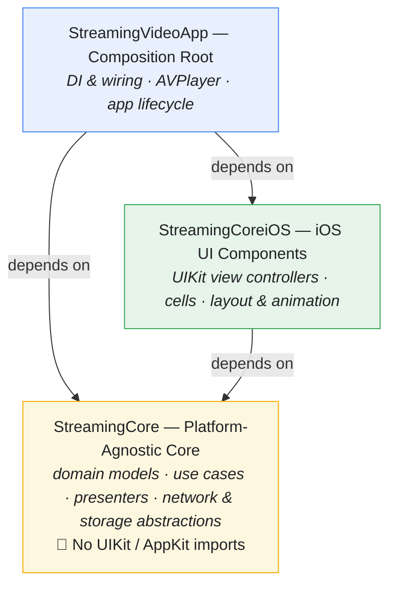
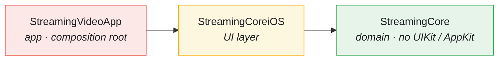
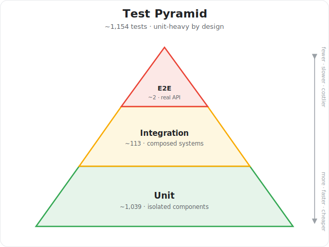

# StreamingVideoApp

<p align="center">
  <a href="https://github.com/tattva20/StreamingVideoApp/actions/workflows/ci.yml">
    
  </a>
  
  
  
  
</p>

<p align="center">
  A portfolio-grade iOS video streaming application built with <strong>Test-Driven Development (TDD)</strong>, <strong>SOLID principles</strong>, and <strong>Clean Architecture</strong>.
</p>

---

## Documentation

For a deeper understanding of the philosophies, patterns, and principles behind this codebase, explore our detailed documentation:

| Document | Description |
|----------|-------------|
| [Architecture](docs/ARCHITECTURE.md) | Clean Architecture layers, boundaries, and data flow |
| [Dependency Rejection](docs/DEPENDENCY-REJECTION.md) | Pure functions and the "Impure → Pure → Impure" sandwich |
| [TDD](docs/TDD.md) | Test-Driven Development practices and testing patterns |
| [SOLID](docs/SOLID.md) | SOLID principles with concrete code examples |
| [State Machines](docs/STATE-MACHINES.md) | Pure state machine design for video playback |
| [Design Patterns](docs/DESIGN-PATTERNS.md) | Decorator, Composite, Adapter, Strategy patterns |
| [Reactive Programming](docs/REACTIVE-PROGRAMMING.md) | Combine framework patterns and best practices |
| [Performance](docs/PERFORMANCE.md) | Bitrate adaptation, preloading, and memory management |

### Feature Documentation

Detailed documentation for each streaming feature:

| Feature | Description |
|---------|-------------|
| [Video Feed](docs/features/VIDEO-FEED.md) | Paginated video list with infinite scroll and caching |
| [Video Playback](docs/features/VIDEO-PLAYBACK.md) | Full-featured player with state machine and controls |
| [Video Comments](docs/features/VIDEO-COMMENTS.md) | Threaded comments with relative timestamps |
| [Picture-in-Picture](docs/features/PICTURE-IN-PICTURE.md) | Floating video window for multitasking |
| [Thumbnail Loading](docs/features/THUMBNAIL-LOADING.md) | Lazy image loading with shimmer and caching |
| [Offline Support](docs/features/OFFLINE-SUPPORT.md) | CoreData caching and fallback strategies |
| [Analytics](docs/features/ANALYTICS.md) | Playback tracking and engagement metrics |
| [Logging](docs/features/LOGGING.md) | Structured logging with correlation IDs |
| [Buffer Management](docs/features/BUFFER-MANAGEMENT.md) | Adaptive buffering based on network and memory |
| [Memory Management](docs/features/MEMORY-MANAGEMENT.md) | Pressure monitoring and resource cleanup |
| [Network Quality](docs/features/NETWORK-QUALITY.md) | Real-time network monitoring and bandwidth estimation |

### Advanced Streaming Features

Core streaming infrastructure for high-quality video playback:

| Feature | Description |
|---------|-------------|
| [Player State Machine](docs/features/PLAYER-STATE-MACHINE.md) | Explicit, exhaustively tested state transitions |
| [Adaptive Bitrate](docs/features/ADAPTIVE-BITRATE.md) | Quality selection based on network and buffer health |
| [Video Preloading](docs/features/VIDEO-PRELOADING.md) | Predictive loading for seamless transitions |
| [Rebuffering Detection](docs/features/REBUFFERING-DETECTION.md) | Stall monitoring and ratio tracking |
| [Startup Performance](docs/features/STARTUP-PERFORMANCE.md) | Time-to-First-Frame (TTFF) measurement |
| [Performance Alerts](docs/features/PERFORMANCE-ALERTS.md) | Threshold monitoring and severity levels |
| [Audio Session](docs/features/AUDIO-SESSION.md) | Interruption handling and category configuration |
| [AVPlayer Integration](docs/features/AVPLAYER-INTEGRATION.md) | Platform adapter bridging AVPlayer to domain |

### Infrastructure Documentation

Detailed documentation for infrastructure components and patterns:

| Document | Description |
|----------|-------------|
| [HTTP Client](docs/HTTP-CLIENT.md) | HTTPClient protocol, URLSession implementation, mappers |
| [Pagination](docs/PAGINATION.md) | Cursor-based (keyset) paging with `after_id`, load-more, and end-of-feed signalling |
| [Caching Infrastructure](docs/CACHING-INFRASTRUCTURE.md) | VideoStore, CoreData, InMemory implementations |
| [Composition Root](docs/COMPOSITION-ROOT.md) | SceneDelegate wiring, Composers, dependency graph |
| [Presenters & ViewModels](docs/PRESENTERS-VIEWMODELS.md) | LoadResourcePresenter, mappers, presentation layer |
| [Cell Controllers](docs/CELL-CONTROLLERS.md) | CellController pattern, diffable data source integration |
| [Controls Visibility](docs/CONTROLS-VISIBILITY.md) | Auto-hide controls with timer management |
| [Bandwidth Estimation](docs/BANDWIDTH-ESTIMATION.md) | Network measurement, quality monitoring, bitrate recommendations |
| [Testing Infrastructure](docs/TESTING-INFRASTRUCTURE.md) | Spy patterns, memory leak tracking, spec assertions |

---

## Overview

StreamingVideoApp demonstrates professional iOS development practices with a modular, testable architecture.

### Key Highlights

- **Test-Driven** - Features developed test-first, backed by an extensive automated test suite
- **Clean Architecture** - Clear separation of concerns across modules
- **SOLID Principles** - Maintainable, extensible codebase
- **Comprehensive Testing** - Unit, Integration, and End-to-End tests
- **CI/CD Ready** - GitHub Actions with ThreadSanitizer

---

## Features

### Video Feed
- Paginated video list with infinite scroll
- Pull-to-refresh functionality
- Lazy image loading with caching
- Error handling with retry mechanism

### Video Player
- Full-featured AVPlayer implementation
- Play/Pause with elegant UI
- Seek forward/backward (10 seconds)
- Progress bar with time display
- Volume control with mute toggle
- Playback speed (0.5x, 1x, 1.25x, 1.5x, 2x)
- Fullscreen mode with orientation support
- Picture-in-Picture (PiP) support
- Auto-hiding controls overlay

### Video Comments
- Threaded comment display
- Pull-to-refresh for latest comments
- Relative timestamp formatting

### Offline Support
- CoreData persistence for video metadata
- Image caching for offline viewing
- Cache-first loading strategy with remote fallback

---

## Architecture

StreamingVideoApp follows a **modular Clean Architecture** with strict layer boundaries:



### Module Structure

```mermaid
flowchart TD
    WS["StreamingVideoApp.xcworkspace"]

    subgraph SC["StreamingCore · framework"]
        direction TB
        SC1["Video Feature<br/><i>Domain models</i>"]
        SC2["Video API<br/><i>Remote data loading</i>"]
        SC3["Video Cache<br/><i>Local persistence</i>"]
        SC4["Video Presentation<br/><i>Presenters &amp; ViewModels</i>"]
        SC5["Video Playback Feature<br/><i>Player protocol</i>"]
        SC6["Video Comments Feature<br/><i>Comments domain</i>"]
    end

    subgraph IOS["StreamingCoreiOS · iOS UI layer"]
        direction TB
        IOS1["Video UI<br/><i>Video list components</i>"]
        IOS2["Video Player UI<br/><i>Player controls</i>"]
        IOS3["Video Comments UI<br/><i>Comments UI</i>"]
    end

    subgraph TESTS["Tests"]
        direction TB
        T1["StreamingCoreTests"]
        T2["StreamingCoreiOSTests"]
        T3["StreamingCoreAPIEndToEndTests"]
        T4["StreamingCoreCacheIntegrationTests"]
    end

    subgraph APP["StreamingVideoApp · iOS App target"]
        direction TB
        A1["SceneDelegate.swift<br/><i>Main composition</i>"]
        A2["AVPlayerVideoPlayer.swift<br/><i>AVPlayer implementation</i>"]
        A3["Composers<br/><i>Feature composers</i>"]
        A4["StreamingVideoAppTests<br/><i>Integration tests</i>"]
    end

    subgraph CI[".github/workflows · CI/CD"]
        direction TB
        CI1["ci.yml<br/><i>iOS + macOS test jobs</i>"]
    end

    WS --> SC
    WS --> IOS
    WS --> TESTS
    WS --> APP
    WS --> CI

    classDef core fill:#e6f4ea,stroke:#34a853,color:#202124;
    classDef ios fill:#fef7e0,stroke:#f9ab00,color:#202124;
    classDef app fill:#fce8e6,stroke:#ea4335,color:#202124;
    classDef neutral fill:#e8f0fe,stroke:#4285f4,color:#202124;
    class SC1,SC2,SC3,SC4,SC5,SC6 core
    class IOS1,IOS2,IOS3 ios
    class A1,A2,A3,A4 app
    class T1,T2,T3,T4 neutral
    class CI1 neutral
    class WS neutral
```





### Design Patterns

| Pattern | Usage |
|---------|-------|
| **Composition Root** | All dependencies wired in `SceneDelegate` |
| **Decorator** | `VideoLoaderCacheDecorator` adds caching |
| **Composite** | `VideoLoaderComposite` for fallback loading |
| **Adapter** | Connects domain to presentation layer |
| **Factory** | Creates complex object graphs |
| **Strategy** | Interchangeable loading strategies |

---

## Design Philosophy

### Why TDD?

Test-Driven Development is not optional in this codebase:

- **Tests document behavior** - Tests describe what the code should do, not how
- **Confidence to refactor** - Comprehensive tests enable fearless changes
- **Forces decoupled design** - Hard to test = hard to maintain
- **Catches regressions immediately** - Red tests show exactly what broke

### Why Clean Architecture?

Clean Architecture keeps the codebase maintainable as it grows:

- **Business logic survives UI changes** - Core doesn't know about UIKit
- **Platform-agnostic core enables reuse** - Same core for iOS, macOS, watchOS
- **Clear boundaries prevent coupling** - Dependencies flow inward only
- **Easy to test in isolation** - No framework dependencies in tests

### Why SOLID?

SOLID principles make code that scales:

- **Single Responsibility** - Each class is easy to understand and test
- **Open/Closed** - Add features without modifying existing code
- **Liskov Substitution** - Swap implementations freely (mocks, stubs, real)
- **Interface Segregation** - No class forced to implement unused methods
- **Dependency Inversion** - High-level modules independent of low-level details

---

## SOLID Principles in Practice

### Single Responsibility (S)

Each class has ONE reason to change:

```swift
// Good - Separate responsibilities
RemoteVideoLoader    // Only fetches from network
LocalVideoLoader     // Only fetches from cache
VideoLoaderCacheDecorator  // Only handles caching logic
```

### Open/Closed (O)

Extend behavior without modifying existing code using the Decorator pattern:

```swift
// Adding caching without changing RemoteVideoLoader
let cachedLoader = VideoLoaderCacheDecorator(
    decoratee: remoteLoader,
    cache: localCache
)
```

### Liskov Substitution (L)

Any `VideoLoader` implementation can replace another:

```swift
protocol VideoLoader {
    func load() async throws -> [Video]
}

// All these can be used interchangeably:
let loader: VideoLoader = RemoteVideoLoader(...)     // Production
let loader: VideoLoader = LocalVideoLoader(...)      // Offline
let loader: VideoLoader = VideoLoaderCacheDecorator(...) // Cached
let loader: VideoLoader = VideoLoaderSpy()           // Testing
```

### Interface Segregation (I)

Small, focused protocols instead of large ones:

```swift
// Good - Clients adopt only what they need
protocol VideoLoader { ... }
protocol VideoCache { ... }
protocol VideoImageDataLoader { ... }

// Bad - One giant protocol forces unused implementations
protocol VideoService {
    func load() async throws -> [Video]
    func cache(_ videos: [Video]) async throws
    func loadImage(for video: Video) async throws -> Data
    func validate(_ video: Video) -> Bool
    // ... 20 more methods
}
```

### Dependency Inversion (D)

High-level modules depend on abstractions, not concretions:

```swift
// StreamingCore defines protocols (abstractions)
public protocol HTTPClient {
    func get(from url: URL) async throws -> (Data, HTTPURLResponse)
}

// StreamingVideoApp provides implementations (concretions)
final class URLSessionHTTPClient: HTTPClient { ... }

// Business logic never knows about URLSession
```

---

## Getting Started

### Requirements

- **Xcode 16.0+**
- **iOS 15.0+**
- **Swift 6 toolchain** (project builds in Swift 5 language mode)

### Installation

1. **Clone the repository**
   ```bash
   git clone https://github.com/tattva20/StreamingVideoApp.git
   cd StreamingVideoApp
   ```

2. **Open the workspace**
   ```bash
   open StreamingVideoApp.xcworkspace
   ```

3. **Select scheme and run**
   - Choose `StreamingVideoApp` scheme
   - Select a simulator or device
   - Press `Cmd + R` to run

### Running Tests

```bash
# Run all tests
xcodebuild test \
  -workspace StreamingVideoApp.xcworkspace \
  -scheme StreamingVideoApp \
  -destination 'platform=iOS Simulator,name=iPhone 15'

# Run with ThreadSanitizer (CI mode)
xcodebuild clean build test \
  -workspace StreamingVideoApp.xcworkspace \
  -scheme "CI_iOS" \
  CODE_SIGN_IDENTITY="" CODE_SIGNING_REQUIRED=NO \
  -sdk iphonesimulator \
  -destination "platform=iOS Simulator,name=iPhone 15" \
  -enableThreadSanitizer YES
```

---

## Testing Strategy

### Test Pyramid

<p align="center">
  
</p>

### Test Categories

| Category | Location | Description |
|----------|----------|-------------|
| **Unit** | `StreamingCoreTests/` | Test single units with mocks |
| **iOS Unit** | `StreamingCoreiOSTests/` | Test UI components |
| **Integration** | `StreamingVideoAppTests/` | Test composed systems |
| **API E2E** | `StreamingCoreAPIEndToEndTests/` | Test against real API |
| **Cache Integration** | `StreamingCoreCacheIntegrationTests/` | Test real CoreData |

### Test Coverage Focus

- **Presenters** - Business logic and state management
- **Use Cases** - Loading, caching, validation flows
- **Mappers** - JSON parsing and data transformation
- **View Controllers** - User interaction handling
- **Composers** - Dependency wiring

---

## CI/CD

### GitHub Actions Workflow

A single workflow (`.github/workflows/ci.yml`) runs two jobs on every push and PR to `main`:

| Job | Trigger | Description |
|----------|---------|-------------|
| **build-ios** | Push/PR to main | Full test suite on the iOS Simulator (scheme `CI_iOS`) |
| **build-macos** | Push/PR to main | Platform-agnostic Core tests, no simulator (scheme `CI_macOS`) |

### CI Features

- **ThreadSanitizer** - Detects data races and threading issues
- **Two-platform jobs** - iOS Simulator and macOS run concurrently
- **Multiple Xcode Versions** - Fallback Xcode selection
- **Test result bundles** - `.xcresult` uploaded as artifacts on failure

### Branch Protection Rules

The `main` branch is protected with the following rules:

| Rule | Setting | Description |
|------|---------|-------------|
| **Require PR** | Enabled | No direct pushes to main |
| **Required Approvals** | 1 | At least one reviewer must approve |
| **Dismiss Stale Reviews** | Enabled | New commits invalidate existing approvals |
| **Required Status Checks** | `build-ios`, `build-macos` | CI must pass before merge |
| **Up-to-date Branch** | Required | Branch must be current with main |
| **Conversation Resolution** | Required | All review comments must be resolved |
| **Force Push** | Allowed (owner only) | Repository owner can force push |
| **Enforce for Admins** | Disabled | Owner can bypass rules when needed |

### Setting Up Branch Protection

Configure branch protection manually at:
`https://github.com/tattva20/StreamingVideoApp/settings/branches`

---

## API

### Backend

The app connects to a custom API deployed on Vercel, base URL `https://streaming-videos-api.vercel.app`:

| Endpoint | Description |
|----------|-------------|
| `GET /v1/videos?limit=10&after_id={id}` | Paginated video list (keyset cursor) |
| `GET /v1/videos/{id}/comments` | Video comments |

### Sample Response

```json
{
  "videos": [
    {
      "id": "550e8400-e29b-41d4-a716-446655440001",
      "title": "Big Buck Bunny",
      "description": "A large and lovable rabbit deals with three tiny bullies.",
      "url": "https://commondatastorage.googleapis.com/gtv-videos-bucket/sample/BigBuckBunny.mp4",
      "thumbnail_url": "https://upload.wikimedia.org/wikipedia/commons/thumb/c/c5/Big_buck_bunny_poster_big.jpg/330px-Big_buck_bunny_poster_big.jpg"
    }
  ]
}
```

---

## Development

### TDD Workflow

```
1. RED    → Write a failing test
2. GREEN  → Write minimum code to pass
3. REFACTOR → Clean up while tests pass
```

### Adding New Features

1. **Define Protocol** in `StreamingCore`
2. **Write Tests** for the protocol
3. **Implement** the minimum code
4. **Create UI** in `StreamingCoreiOS`
5. **Wire Up** in composition root
6. **Add Integration Tests**

### Code Style

- Swift standard naming conventions
- Protocol-oriented design
- Dependency injection over singletons
- Value types where appropriate
- Clear, descriptive naming

---

## Project History

This project was developed following TDD principles from the ground up:

1. **Foundation** - Core video loading with cache
2. **Remote API** - HTTPClient and video mapping
3. **Persistence** - CoreData integration
4. **UI Layer** - Videos list with pagination
5. **Video Player** - Full-featured playback
6. **Comments** - Video comments feature
7. **PiP** - Picture-in-Picture support
8. **CI/CD** - GitHub Actions automation

---

## Contributing

### Prerequisites

Before contributing, ensure you:

1. Read this entire README, especially [Design Philosophy](#design-philosophy) and [SOLID Principles](#solid-principles-in-practice)
2. Understand TDD, SOLID, and Clean Architecture
3. Have Xcode 16+ installed
4. Can run all tests successfully

### Contribution Workflow

#### Step 1: Create Feature Branch

```bash
git checkout -b feature/your-feature-name
```

#### Step 2: Write Failing Test FIRST (Red)

```swift
// In appropriate test target
func test_newFeature_deliversExpectedBehavior() {
    let sut = makeSUT()

    let result = sut.performAction()

    XCTAssertEqual(result, expectedValue)
}
```

#### Step 3: Implement Minimum Code (Green)

Write ONLY enough code to make the test pass. No extra features, no premature optimization.

#### Step 4: Refactor (Keep Tests Green)

Clean up while ensuring tests still pass. Extract protocols if needed. Remove duplication.

#### Step 5: Add Integration Tests

If the feature involves composition, write tests in `StreamingVideoAppTests/`.

#### Step 6: Verify All Tests Pass

```bash
xcodebuild test -scheme CI_iOS \
  -destination 'platform=iOS Simulator,name=iPhone 15'
```

#### Step 7: Submit PR

Follow the [PR Requirements](#pull-request-requirements) below.

### Code Style

- Swift standard naming conventions
- Protocol-oriented design
- Dependency injection over singletons
- Value types where appropriate
- Clear, descriptive naming
- No force unwraps unless absolutely necessary

---

## Pull Request Requirements

### Before Submitting

#### Code Quality Checklist

- [ ] All existing tests pass
- [ ] New code has corresponding tests
- [ ] No commented-out code
- [ ] No print statements or debug logs
- [ ] Clear, descriptive naming
- [ ] No force unwraps unless justified

#### Architecture Compliance

- [ ] StreamingCore has NO UIKit imports
- [ ] New protocols in Core, implementations in iOS/App
- [ ] Dependencies injected, not created internally
- [ ] No singletons or global state

#### Testing Standards

- [ ] Tests follow Given-When-Then structure
- [ ] Memory leak tracking included (`trackForMemoryLeaks`)
- [ ] UI tests have `RunLoop.current.run(until: Date())` in tearDown
- [ ] Async code has proper `await Task.yield()` patterns
- [ ] Test doubles use correct pattern (see [Testing Patterns](#testing-patterns))

#### TDD Evidence

- [ ] Can demonstrate test was written before implementation
- [ ] Tests describe behavior, not implementation details
- [ ] No tests that simply test framework code

### PR Description Template

```markdown
## Summary
[1-2 sentences describing the change]

## Motivation
[Why is this change needed?]

## Changes
- [Bullet point changes]

## Test Plan
- [How was this tested?]
- [What edge cases were considered?]

## Screenshots (if UI change)
[Before/After screenshots]
```

---

## Adding New Features

### Feature in StreamingCore (Business Logic)

#### 1. Define the Protocol

```swift
// StreamingCore/NewFeature/NewFeatureLoader.swift
public protocol NewFeatureLoader {
    func load() async throws -> [NewFeature]
}
```

#### 2. Write Tests for Expected Behavior

```swift
// StreamingCoreTests/NewFeature/RemoteNewFeatureLoaderTests.swift
func test_load_deliversItemsOnSuccess() async throws {
    let (sut, client) = makeSUT()
    let expectedItems = [makeItem(), makeItem()]

    client.complete(with: expectedItems)

    let result = try await sut.load()
    XCTAssertEqual(result, expectedItems)
}
```

#### 3. Implement the Loader

```swift
// StreamingCore/NewFeature/RemoteNewFeatureLoader.swift
public final class RemoteNewFeatureLoader: NewFeatureLoader {
    private let client: HTTPClient
    private let url: URL

    public init(client: HTTPClient, url: URL) {
        self.client = client
        self.url = url
    }

    public func load() async throws -> [NewFeature] {
        let (data, response) = try await client.get(from: url)
        return try NewFeatureMapper.map(data, from: response)
    }
}
```

#### 4. Add Caching (if needed)

Use the Decorator pattern:

```swift
public final class NewFeatureLoaderCacheDecorator: NewFeatureLoader {
    private let decoratee: NewFeatureLoader
    private let cache: NewFeatureCache

    public init(decoratee: NewFeatureLoader, cache: NewFeatureCache) {
        self.decoratee = decoratee
        self.cache = cache
    }

    public func load() async throws -> [NewFeature] {
        let items = try await decoratee.load()
        try await cache.save(items)
        return items
    }
}
```

### Feature in StreamingCoreiOS (UI)

#### 1. Create View Controller

```swift
// StreamingCoreiOS/NewFeature UI/NewFeatureViewController.swift
@MainActor
public final class NewFeatureViewController: UIViewController {
    // UI implementation
}
```

#### 2. Create Cell Controller (if list-based)

Follow the CellController pattern from existing implementations.

#### 3. Write UI Tests

```swift
// StreamingCoreiOSTests/NewFeature UI/NewFeatureViewControllerTests.swift
@MainActor
final class NewFeatureViewControllerTests: XCTestCase {
    override func tearDown() {
        super.tearDown()
        RunLoop.current.run(until: Date())  // Critical for UIKit cleanup
    }
}
```

### Wiring in Composition Root

#### 1. Create Composer

```swift
// StreamingVideoApp/NewFeatureUIComposer.swift
enum NewFeatureUIComposer {
    static func compose(
        loader: NewFeatureLoader
    ) -> NewFeatureViewController {
        let viewModel = NewFeatureViewModel()
        let controller = NewFeatureViewController(viewModel: viewModel)
        // Wire dependencies
        return controller
    }
}
```

#### 2. Add to SceneDelegate

Wire the new feature into the navigation flow.

---

## Code Review Criteria

### Automatic Rejection (Architecture Violations)

- UIKit/AppKit imports in StreamingCore
- Direct instantiation instead of injection
- Circular dependencies between modules
- Business logic in UI layer

### Requires Justification (TDD Violations)

- Code without corresponding tests
- Tests that test implementation details
- Tests that rely on timing/delays
- Skipped or disabled tests

### Requires Discussion (SOLID Violations)

- Classes with multiple responsibilities
- Concrete dependencies instead of protocols
- Large interfaces that force unused methods
- High-level modules depending on low-level details

### Must Fix (Code Quality Issues)

- Force unwraps without safety
- Retain cycles (missing `[weak self]`)
- Memory leaks in tests
- Inconsistent naming conventions
- Missing error handling

### Suggestions (Style Issues)

- Long methods (>20 lines)
- Deep nesting (>3 levels)
- Magic numbers without constants
- Missing documentation on public API

---

## Testing Patterns

### Memory Leak Detection

Always include in test helpers:

```swift
private func makeSUT(
    file: StaticString = #filePath,
    line: UInt = #line
) -> SUT {
    let sut = SUT()
    trackForMemoryLeaks(sut, file: file, line: line)
    return sut
}
```

### UI Test Cleanup

**Critical:** Prevent malloc errors with RunLoop processing:

```swift
@MainActor
final class MyUITests: XCTestCase {
    override func tearDown() {
        super.tearDown()
        RunLoop.current.run(until: Date())
    }
}
```

### Async Test Pattern

For code that spawns Tasks:

```swift
func test_action_triggersAsyncBehavior() async {
    let sut = makeSUT()

    sut.performAction()
    await Task.yield()  // Let spawned Tasks run

    // Assert on results
}
```

### Test Double Selection

| Scenario | Pattern |
|----------|---------|
| Synchronous spy in UI test | `@MainActor final class Spy` |
| Async operations | `actor Spy` |
| Cross-actor shared state | `@unchecked Sendable + NSLock` |
| Simple stub | `struct Stub` |

Example with NSLock for cross-actor access:

```swift
final class ResourceCleanerSpy: ResourceCleaner, @unchecked Sendable {
    private let lock = NSLock()
    private var _cleanupCallCount = 0

    var cleanupCallCount: Int {
        lock.lock()
        defer { lock.unlock() }
        return _cleanupCallCount
    }

    func cleanup() {
        lock.lock()
        _cleanupCallCount += 1
        lock.unlock()
    }
}
```

---

## Lessons Learned & Pitfalls to Avoid

This section documents solutions to persistent issues discovered during development.

### 1. Swift 6 @MainActor Deallocation Crash

**Problem:** malloc crash at fixed address during @MainActor class deallocation.

**Error:**
```
malloc: *** error for object 0x262c5a6f0: pointer being freed was not allocated
```

**Root Cause:** A known Swift runtime bug in deinit isolation — a `@MainActor`-isolated `deinit` can run on the wrong executor and crash inside `swift_task_deinitOnExecutorImpl` (see [swiftlang/swift#87316](https://github.com/swiftlang/swift/issues/87316)).

**Solution:**
1. Set `SWIFT_DEFAULT_ACTOR_ISOLATION = nonisolated` in build settings
2. Add explicit `@MainActor` to classes that need main thread access
3. Add `RunLoop.current.run(until: Date())` in test tearDown

**DO NOT:** Set `SWIFT_DEFAULT_ACTOR_ISOLATION = MainActor` (causes crashes)

### 2. UIKit Test Cleanup

**Problem:** Tests crash with malloc errors when running in sequence.

**Root Cause:** UIKit views and constraints deallocate asynchronously.

**Solution:**
```swift
@MainActor
final class MyUITests: XCTestCase {
    override func tearDown() {
        super.tearDown()
        RunLoop.current.run(until: Date())
    }
}
```

### 3. Mixing async/await and Combine

**Problem:** Owning the same state in both Combine and async/await — or bridging them bidirectionally — causes ownership ambiguity and race conditions.

**Solution:** Own each boundary in a single model. A *one-directional, temporary* bridge during a migration is fine — when this codebase moved its feed and comments loaders from Combine to async/await, the interim `HTTPClient`→`Future` bridge was deleted once the migration landed. What to avoid is *permanent bidirectional* mixing, or two owners of the same state across the two models.

### 4. Fire-and-Forget Analytics in Decorators

**Problem:** A `@MainActor` decorator that captured `self` inside a `Task` crashed on deallocation (the deinit-isolation runtime bug above).

**Solution:** Don't capture `self`. Hoist the `Sendable` dependency into a local and let a structured `Task` capture only that — no retain, no isolated-deinit hazard, and the task keeps its priority and context (unlike `Task.detached`, which drops them):
```swift
func play() {
    decoratee.play()
    let position = currentTime
    let logger = analyticsLogger
    Task { await logger.log(.play, position: position) }
}
```

### 5. Constraint Conflicts in Orientation Changes

**Problem:** malloc crash when constraints conflict during fullscreen.

**Solution:** Store constraints in arrays, deactivate all before activating new:
```swift
func enterFullscreen() {
    NSLayoutConstraint.deactivate(portraitConstraints)
    NSLayoutConstraint.activate(landscapeConstraints)
}
```

### 6. AVFoundation in Unit Tests

**Problem:** AVPlayer crashes in unit test environment.

**Solution:**
- Mock AVPlayerItem dependencies with protocols
- Use integration tests for real AVFoundation testing
- Stub video player in unit tests

### Anti-Patterns Summary

| Anti-Pattern | Problem | Solution |
|--------------|---------|----------|
| Permanent bidirectional async/Combine mixing | Ownership races | One model per boundary; temporary one-way bridge OK |
| Capturing self in a Task | Isolated-deinit crash | Capture the Sendable dependency, not self |
| `@MainActor` in build settings | malloc crashes | Set `nonisolated` |
| Missing tearDown RunLoop | Test crashes | Add `RunLoop.current.run` |
| Mixed constraint states | Layout crashes | Deactivate before activate |

---

## Resources

- [Essential Feed Case Study](https://github.com/essentialdevelopercom/essential-feed-case-study) - Architectural inspiration
- [Clean Architecture](https://blog.cleancoder.com/uncle-bob/2012/08/13/the-clean-architecture.html) - Robert C. Martin
- [TDD By Example](https://www.amazon.com/Test-Driven-Development-Kent-Beck/dp/0321146530) - Kent Beck
- [SOLID Principles](https://en.wikipedia.org/wiki/SOLID) - Object-Oriented Design

---

## License

This project is licensed under the MIT License - see the [LICENSE](LICENSE) file for details.

---

## Author

**Octavio Rojas**

---

<p align="center">
  Built with TDD and Clean Architecture
</p>
