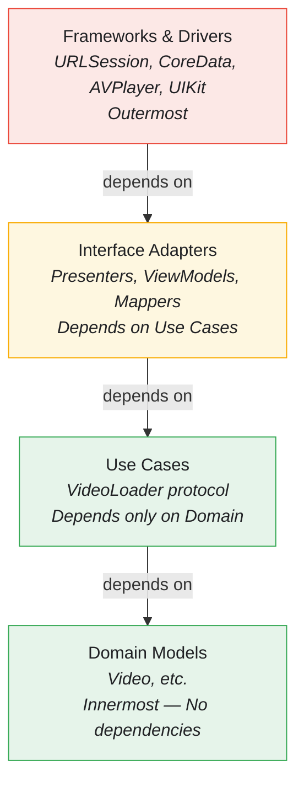
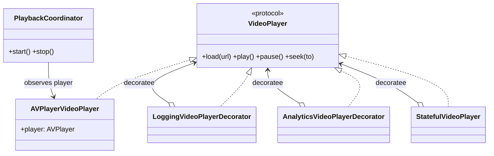
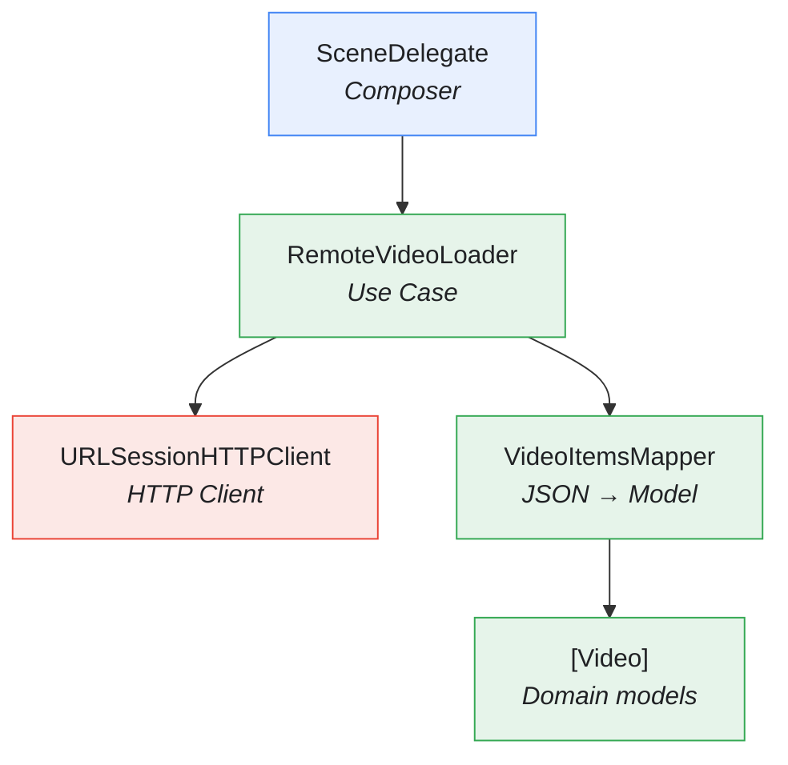
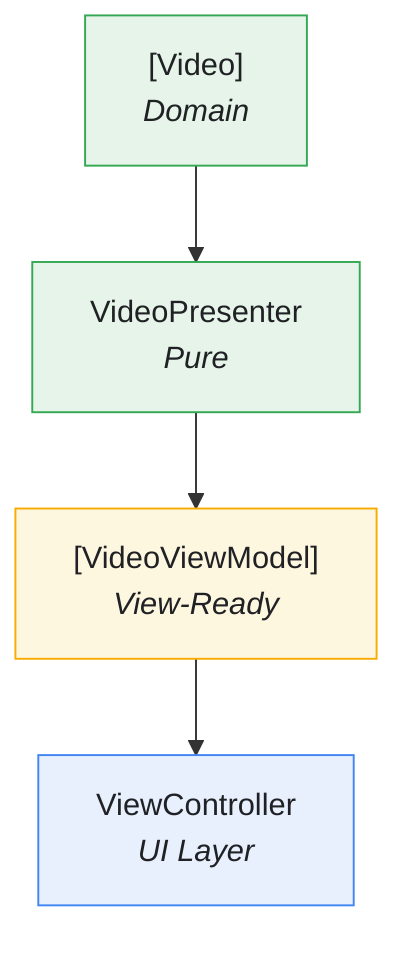

# Clean Architecture in Tattva

This document explains how Clean Architecture is implemented in Tattva, providing a platform-agnostic core that enables maximum testability and reusability.

---

## Overview

Tattva follows **Uncle Bob's Clean Architecture** with strict layer boundaries and dependency inversion. The architecture ensures that business logic is completely independent of frameworks, UI, and external agencies.

```
Tattva.xcworkspace — dependencies point inward; every arrow ends at StreamingCore

apps · composition roots (platform-specific wiring)
├── Tattva      iOS app    → StreamingCore · StreamingCoreiOS · StreamingCorePlayback
│                                        DI & wiring · AVPlayer + custom PlayerView · lifecycle
└── TattvaTV     tvOS app  → StreamingCore · StreamingCorePlayback   (not StreamingCoreiOS)
                                         DI & wiring · AVPlayerViewController (native transport)

frameworks
├── StreamingCoreiOS       UIKit          → StreamingCore    iOS feed / player / comments UI
├── StreamingCorePlayback  AVFoundation   → StreamingCore    AVPlayerVideoPlayer · logging/analytics
│                                                            decorators · StatefulVideoPlayer ·
│                                                            PlaybackCoordinator · bandwidth/perf
└── StreamingCore          Foundation · Combine · CoreData   the stable core — NO UIKit / AVKit
                                                             domain models · use cases ·
                                                             presenters/view-models · protocols
```

Both apps compose the **same** playback stack from `StreamingCorePlayback`; only the UI layer differs (custom UIKit controls on iOS, native `AVPlayerViewController` on tvOS). `StreamingCore` imports no UI framework, so it — and the tests that cover it — build on macOS with no simulator.

---

## The Dependency Rule

**Dependencies point inward only.** Nothing in an inner circle can know anything about something in an outer circle.



---

## Module Structure

### StreamingCore (Platform-Agnostic)

The core module contains ALL business logic with ZERO framework dependencies:

```
StreamingCore/  — Foundation · Combine · CoreData only (no UIKit / AppKit / AVKit)
├── Video Feature/              Video (pure value type) · VideoLoader (protocol)
├── Video API/                  HTTPClient · URLSessionHTTPClient · VideoItemsMapper · endpoints
├── Video Cache/                VideoStore (protocol) · CoreDataVideoStore · InMemoryVideoStore
│                               LocalVideoLoader · VideoCachePolicy
├── Video Presentation/         VideoPresenter · VideoViewModel
├── Video Playback Feature/     VideoPlayer (protocol) · PlaybackState · PlaybackAction
│                               DefaultPlaybackStateMachine
├── Video Comments Feature/     domain · Comments API · Comments Presentation
├── Video Analytics Feature/    PlaybackAnalyticsLogger (protocol)
├── Video Performance Feature/  PlaybackPerformanceService
├── Structured Logging Feature/ Logger (protocol)
├── Shared Presentation/        LoadResourcePresenter (generic) · resource-view protocols
├── Shared API/                 Paginated
└── Shared Combine/             CombineHelpers
```

Concrete infrastructure (`URLSessionHTTPClient`, `CoreDataVideoStore`) lives here behind its protocol — the core owns its own persistence and networking implementations; only the *frameworks* they wrap are external.

**Key Constraint:** No `import UIKit` or `import AppKit` anywhere in StreamingCore.

### StreamingCorePlayback (Shared Playback — AVFoundation)

The reused, UIKit-free playback stack. Extracted in Phase 1 so the tvOS app can import it without pulling in any iOS UI; consumed **unchanged** by both apps.

```
StreamingCorePlayback/  — AVFoundation (no UIKit)  → depends on StreamingCore
├── AVPlayerVideoPlayer            VideoPlayer over AVPlayer; exposes .player for AVPlayerViewController
├── LoggingVideoPlayerDecorator    ┐
├── AnalyticsVideoPlayerDecorator  ┤ Decorator chain — each is-a VideoPlayer and wraps a VideoPlayer
├── StatefulVideoPlayer            ┘ outer wrapper driving DefaultPlaybackStateMachine
├── PlaybackCoordinator            AVPlayer KVO + periodic time → PlaybackAction; performance wiring
├── AVPlayerStateAdapter           AVPlayer → PlaybackAction        (moved here in checkpoint 2)
├── AVPlayerBufferAdapter · AVPlayerPerformanceObserver
├── VideoPlayerPerformanceAdapter · BandwidthEstimate · BandwidthSample · NetworkBandwidthEstimator
└── VideoService                   remote-with-local-fallback loading facade
```

### StreamingCoreiOS (iOS UI Layer)

Contains all iOS-specific UI code:

```
StreamingCoreiOS/  — UIKit  → depends on StreamingCore
├── Shared UI/             ListViewController (generic list) · shimmer/animation helpers
├── Video UI/              VideoCell · PlayerView · VideoPlayerViewController ·
│                          VideoPlayerControlsView · PictureInPictureController ·
│                          ControlsVisibilityController · AVAudioSessionAdapter
├── Video Comments UI/     VideoCommentCell · VideoCommentCellController
└── Video Performance iOS/ NetworkQualityMonitor
```

`AVPlayerStateAdapter` used to live here; it was pure AVFoundation, so Phase 1 moved it into `StreamingCorePlayback` where the tvOS app can reuse it.

### Tattva (Composition Root)

Wires everything together:

```
Tattva/  (iOS composition root)  → StreamingCore · StreamingCoreiOS · StreamingCorePlayback
├── SceneDelegate                    main composition: feed → tap → player
├── AVPlayerVideoPlayer+PlayerView   iOS-only attach(to:) extension — the one UIKit coupling
├── VideoPlayerUIComposer · VideosUIComposer · VideoCommentsUIComposer
├── PerformanceMonitoringComposer · LoggingConfiguration
└── LoadResourcePresentationAdapter · VideosViewAdapter · VideoCommentsViewAdapter · WeakRefVirtualProxy
```

`AVPlayerVideoPlayer` and the logging/analytics decorators no longer live here — they moved into `StreamingCorePlayback`. The app now composes them; the one iOS-only piece it still owns is the `attach(to: PlayerView)` extension (tvOS uses `AVPlayerViewController` instead and needs no equivalent).

### TattvaTV (tvOS Composition Root)

Mirrors the iOS root, minus the custom UI. Depends on `StreamingCore` + `StreamingCorePlayback` only — **not** `StreamingCoreiOS`.

```
TattvaTV/  (tvOS composition root)  → StreamingCore · StreamingCorePlayback
├── AppDelegate · SceneDelegate   composes VideoService into the tvOS feed (TVVideosUIComposer);
│                                 presents the player on video selection
├── TVVideoFeedViewController · TVVideosUIComposer · TVVideoPosterCell ·
│   TVVideoCellController · TVFeedLoaderPresentationAdapter   feed + load-more pagination
├── TVCommentsViewController · TVCommentsUIComposer · TVCommentCell   comments beside the player
├── TVPlayerComposer              builds AVPlayerVideoPlayer → Logging → Analytics →
│                                 StatefulVideoPlayer + PlaybackCoordinator (the reused chain)
└── TVPlayerViewController        subclasses AVPlayerViewController (native 10-foot transport)
```

See [Apple TV](features/APPLE-TV.md) for the full tvOS surface.

---

## Protocol-Based Boundaries

### Network Layer Abstraction

```swift
// StreamingCore defines the abstraction
public protocol HTTPClient {
    func get(from url: URL) async throws -> (Data, HTTPURLResponse)
}

// StreamingCore provides the implementation (Video API/)
final class URLSessionHTTPClient: HTTPClient {
    private let session: URLSession

    func get(from url: URL) async throws -> (Data, HTTPURLResponse) {
        let (data, response) = try await session.data(from: url)
        // ...
    }
}
```

### Storage Layer Abstraction

```swift
// StreamingCore defines the abstraction
public protocol VideoStore {
    func deleteCachedVideos() throws
    func insert(_ videos: [LocalVideo], timestamp: Date) throws
    func retrieve() throws -> CachedVideos?
}

// StreamingCore provides the CoreData implementation (Video Cache/)
final class CoreDataVideoStore: VideoStore {
    private let container: NSPersistentContainer
    // ...
}
```

### Video Player Abstraction

```swift
// StreamingCore defines the abstraction
public protocol VideoPlayer: AnyObject {
    var isPlaying: Bool { get }
    var currentTime: TimeInterval { get }
    var duration: TimeInterval { get }
    func load(url: URL)
    func play()
    func pause()
    func seek(to time: TimeInterval)
    func setPlaybackSpeed(_ speed: Float)
    // volume, mute, seekForward/Backward … elided
}

// StreamingCorePlayback provides the AVPlayer implementation
public final class AVPlayerVideoPlayer: VideoPlayer {
    public let player: AVPlayer   // handed straight to AVPlayerViewController on tvOS
    // ...
}
```

Behaviour is layered onto that single protocol with the **Decorator** pattern — each wrapper *is* a `VideoPlayer` and *holds* a `VideoPlayer`, so features compose without the base player knowing they exist. Both apps build the same chain:



---

## Data Flow

### Loading Videos (Remote)



### Presentation Flow



---

## Why This Architecture?

### 1. Business Logic Survives UI Changes

The core business logic in `StreamingCore` knows nothing about UIKit. If Apple releases a new UI framework, only the UI layer needs to change.

### 2. Platform-Agnostic Core Enables Reuse

The same `StreamingCore` can be used for:
- iOS app (with StreamingCoreiOS)
- macOS app (with StreamingCoreMacOS)
- watchOS app (with StreamingCorewatchOS)
- Server-side Swift

### 3. Clear Boundaries Prevent Coupling

Each module has explicit dependencies. You can't accidentally use UIKit in business logic because the import isn't available.

### 4. Easy to Test in Isolation

```swift
// Test business logic without any framework
func test_load_deliversVideosOnSuccess() async throws {
    let client = HTTPClientSpy()
    let sut = RemoteVideoLoader(client: client, url: anyURL())

    client.complete(with: validJSON())

    let result = try await sut.load()
    XCTAssertEqual(result, expectedVideos)
}
```

No `XCUIApplication`, no simulators, no real network - pure unit tests.

---

## Composition Root Pattern

All dependency wiring happens in ONE place - the `SceneDelegate`:

```swift
final class SceneDelegate: UIResponder, UIWindowSceneDelegate {

    func scene(_ scene: UIScene, willConnectTo session: UISceneSession, options: UIScene.ConnectionOptions) {
        // Create implementations
        let httpClient = URLSessionHTTPClient()
        let store = CoreDataVideoStore()

        // Create use cases
        let remoteLoader = RemoteVideoLoader(client: httpClient, url: videosURL)
        let localLoader = LocalVideoLoader(store: store)

        // Compose with decorators
        let cachedLoader = VideoLoaderCacheDecorator(
            decoratee: remoteLoader,
            cache: localLoader
        )

        // Create UI
        let videosController = VideosUIComposer.compose(
            loader: cachedLoader
        )

        // Set as root
        window?.rootViewController = UINavigationController(rootViewController: videosController)
    }
}
```

**Benefits:**
- Single source of truth for object graph
- Easy to swap implementations (test vs production)
- Clear visualization of dependencies
- No singletons or service locators needed

---

## Testing at Each Layer

### Domain Tests (StreamingCoreTests)

```swift
// Pure unit tests - no mocks needed for pure functions
func test_mapper_deliversVideosOnValidJSON() throws {
    let json = makeValidJSON()

    let result = try VideoItemsMapper.map(json, from: okResponse())

    XCTAssertEqual(result, expectedVideos)
}
```

### Use Case Tests (StreamingCoreTests)

```swift
// Tests with protocol-based test doubles
func test_load_requestsDataFromURL() async {
    let client = HTTPClientSpy()
    let sut = RemoteVideoLoader(client: client, url: expectedURL)

    _ = try? await sut.load()

    XCTAssertEqual(client.requestedURLs, [expectedURL])
}
```

### UI Tests (StreamingCoreiOSTests)

```swift
// Tests with view controller lifecycle
@MainActor
func test_viewDidLoad_displaysVideos() {
    let (sut, loader) = makeSUT()

    sut.loadViewIfNeeded()
    loader.complete(with: [video1, video2])

    XCTAssertEqual(sut.numberOfRenderedVideos, 2)
}
```

### Integration Tests (TattvaTests)

```swift
// Tests with real implementations composed together
func test_videosView_loadsAndDisplaysVideos() {
    let sut = SceneDelegate()
    // Test real composition
}
```

---

## Related Documentation

- [SOLID Principles](SOLID.md) - How SOLID enables this architecture
- [Dependency Rejection](DEPENDENCY-REJECTION.md) - Pure functions at the core
- [Design Patterns](DESIGN-PATTERNS.md) - Decorator, Composite, Adapter patterns
- [TDD](TDD.md) - Testing at every layer

---

## References

- [Clean Architecture - Robert C. Martin](https://blog.cleancoder.com/uncle-bob/2012/08/13/the-clean-architecture.html)
- [Essential Feed Case Study](https://github.com/essentialdevelopercom/essential-feed-case-study)
