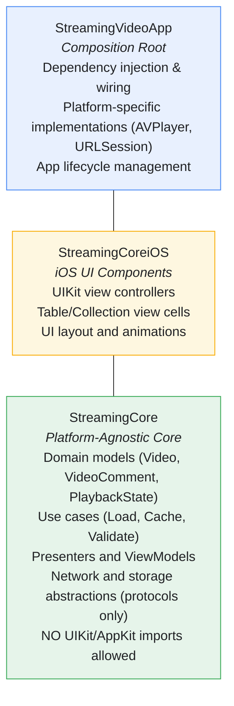
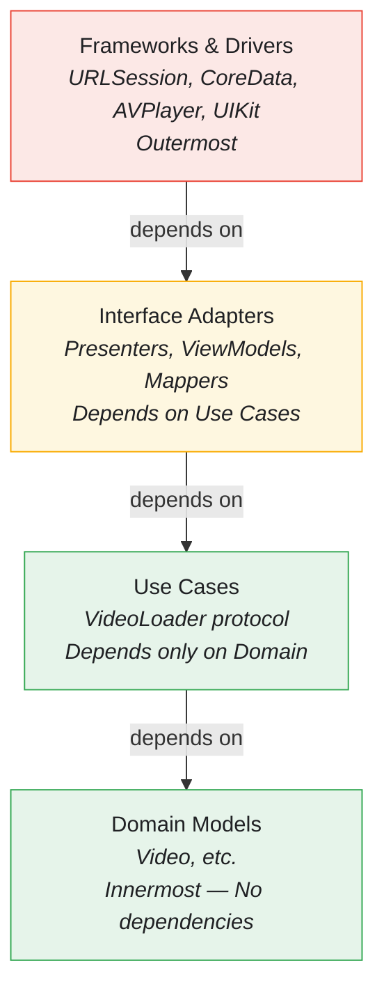
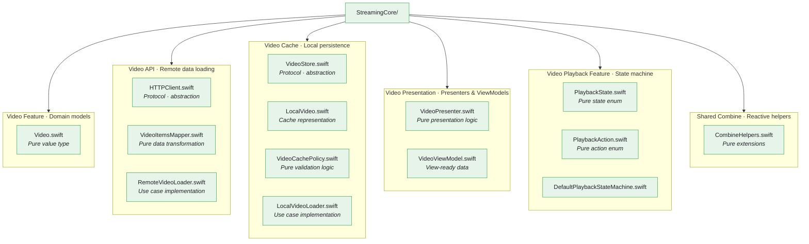
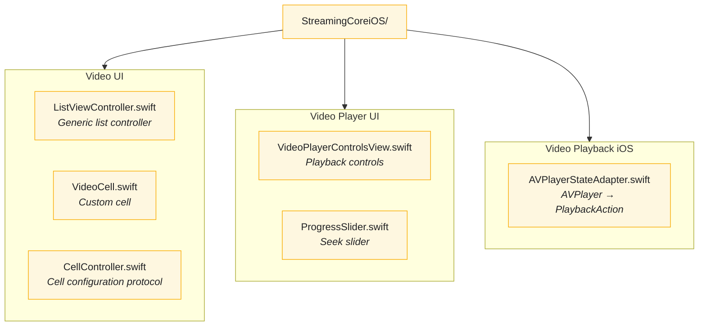
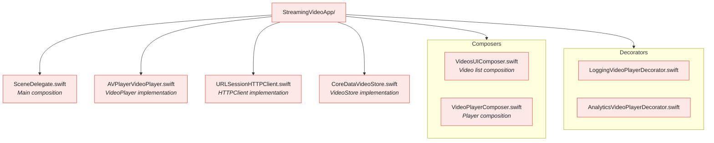
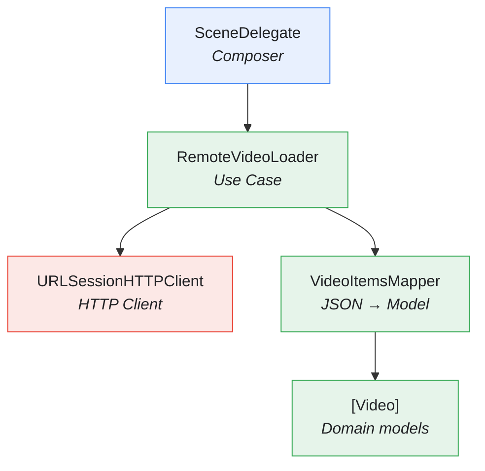
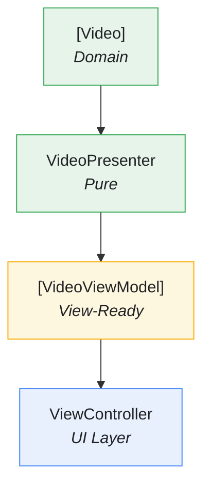

# Clean Architecture in StreamingVideoApp

This document explains how Clean Architecture is implemented in StreamingVideoApp, providing a platform-agnostic core that enables maximum testability and reusability.

---

## Overview

StreamingVideoApp follows **Uncle Bob's Clean Architecture** with strict layer boundaries and dependency inversion. The architecture ensures that business logic is completely independent of frameworks, UI, and external agencies.



---

## The Dependency Rule

**Dependencies point inward only.** Nothing in an inner circle can know anything about something in an outer circle.



---

## Module Structure

### StreamingCore (Platform-Agnostic)

The core module contains ALL business logic with ZERO framework dependencies:



**Key Constraint:** No `import UIKit` or `import AppKit` anywhere in StreamingCore.

### StreamingCoreiOS (iOS UI Layer)

Contains all iOS-specific UI code:



### StreamingVideoApp (Composition Root)

Wires everything together:



---

## Protocol-Based Boundaries

### Network Layer Abstraction

```swift
// StreamingCore defines the abstraction
public protocol HTTPClient {
    func get(from url: URL) async throws -> (Data, HTTPURLResponse)
}

// StreamingVideoApp provides the implementation
final class URLSessionHTTPClient: HTTPClient {
    private let session: URLSession

    func get(from url: URL) async throws -> (Data, HTTPURLResponse) {
        let (data, response) = try await session.data(from: url)
        // ...
    }
}
```

### Storage Layer Abstraction

```swift
// StreamingCore defines the abstraction
public protocol VideoStore {
    func deleteCachedVideos() throws
    func insert(_ videos: [LocalVideo], timestamp: Date) throws
    func retrieve() throws -> CachedVideos?
}

// StreamingVideoApp provides CoreData implementation
final class CoreDataVideoStore: VideoStore {
    private let container: NSPersistentContainer
    // ...
}
```

### Video Player Abstraction

```swift
// StreamingCore defines the abstraction
@MainActor
public protocol VideoPlayer: AnyObject {
    var statePublisher: AnyPublisher<PlaybackState, Never> { get }
    func load(url: URL)
    func play()
    func pause()
    func seek(to time: TimeInterval)
    func stop()
}

// StreamingVideoApp provides AVPlayer implementation
@MainActor
final class AVPlayerVideoPlayer: VideoPlayer {
    private let player: AVPlayer
    // ...
}
```

---

## Data Flow

### Loading Videos (Remote)



### Presentation Flow



---

## Why This Architecture?

### 1. Business Logic Survives UI Changes

The core business logic in `StreamingCore` knows nothing about UIKit. If Apple releases a new UI framework, only the UI layer needs to change.

### 2. Platform-Agnostic Core Enables Reuse

The same `StreamingCore` can be used for:
- iOS app (with StreamingCoreiOS)
- macOS app (with StreamingCoreMacOS)
- watchOS app (with StreamingCorewatchOS)
- Server-side Swift

### 3. Clear Boundaries Prevent Coupling

Each module has explicit dependencies. You can't accidentally use UIKit in business logic because the import isn't available.

### 4. Easy to Test in Isolation

```swift
// Test business logic without any framework
func test_load_deliversVideosOnSuccess() async throws {
    let client = HTTPClientSpy()
    let sut = RemoteVideoLoader(client: client, url: anyURL())

    client.complete(with: validJSON())

    let result = try await sut.load()
    XCTAssertEqual(result, expectedVideos)
}
```

No `XCUIApplication`, no simulators, no real network - pure unit tests.

---

## Composition Root Pattern

All dependency wiring happens in ONE place - the `SceneDelegate`:

```swift
final class SceneDelegate: UIResponder, UIWindowSceneDelegate {

    func scene(_ scene: UIScene, willConnectTo session: UISceneSession, options: UIScene.ConnectionOptions) {
        // Create implementations
        let httpClient = URLSessionHTTPClient()
        let store = CoreDataVideoStore()

        // Create use cases
        let remoteLoader = RemoteVideoLoader(client: httpClient, url: videosURL)
        let localLoader = LocalVideoLoader(store: store)

        // Compose with decorators
        let cachedLoader = VideoLoaderCacheDecorator(
            decoratee: remoteLoader,
            cache: localLoader
        )

        // Create UI
        let videosController = VideosUIComposer.compose(
            loader: cachedLoader
        )

        // Set as root
        window?.rootViewController = UINavigationController(rootViewController: videosController)
    }
}
```

**Benefits:**
- Single source of truth for object graph
- Easy to swap implementations (test vs production)
- Clear visualization of dependencies
- No singletons or service locators needed

---

## Testing at Each Layer

### Domain Tests (StreamingCoreTests)

```swift
// Pure unit tests - no mocks needed for pure functions
func test_mapper_deliversVideosOnValidJSON() throws {
    let json = makeValidJSON()

    let result = try VideoItemsMapper.map(json, from: okResponse())

    XCTAssertEqual(result, expectedVideos)
}
```

### Use Case Tests (StreamingCoreTests)

```swift
// Tests with protocol-based test doubles
func test_load_requestsDataFromURL() async {
    let client = HTTPClientSpy()
    let sut = RemoteVideoLoader(client: client, url: expectedURL)

    _ = try? await sut.load()

    XCTAssertEqual(client.requestedURLs, [expectedURL])
}
```

### UI Tests (StreamingCoreiOSTests)

```swift
// Tests with view controller lifecycle
@MainActor
func test_viewDidLoad_displaysVideos() {
    let (sut, loader) = makeSUT()

    sut.loadViewIfNeeded()
    loader.complete(with: [video1, video2])

    XCTAssertEqual(sut.numberOfRenderedVideos, 2)
}
```

### Integration Tests (StreamingVideoAppTests)

```swift
// Tests with real implementations composed together
func test_videosView_loadsAndDisplaysVideos() {
    let sut = SceneDelegate()
    // Test real composition
}
```

---

## Related Documentation

- [SOLID Principles](SOLID.md) - How SOLID enables this architecture
- [Dependency Rejection](DEPENDENCY-REJECTION.md) - Pure functions at the core
- [Design Patterns](DESIGN-PATTERNS.md) - Decorator, Composite, Adapter patterns
- [TDD](TDD.md) - Testing at every layer

---

## References

- [Clean Architecture - Robert C. Martin](https://blog.cleancoder.com/uncle-bob/2012/08/13/the-clean-architecture.html)
- [Essential Feed Case Study](https://github.com/essentialdevelopercom/essential-feed-case-study)
