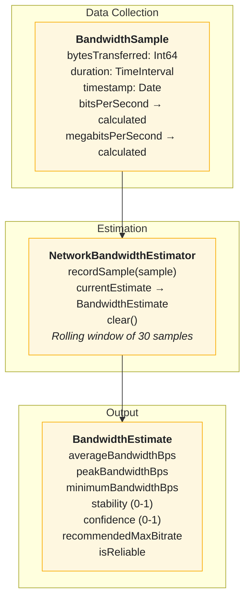
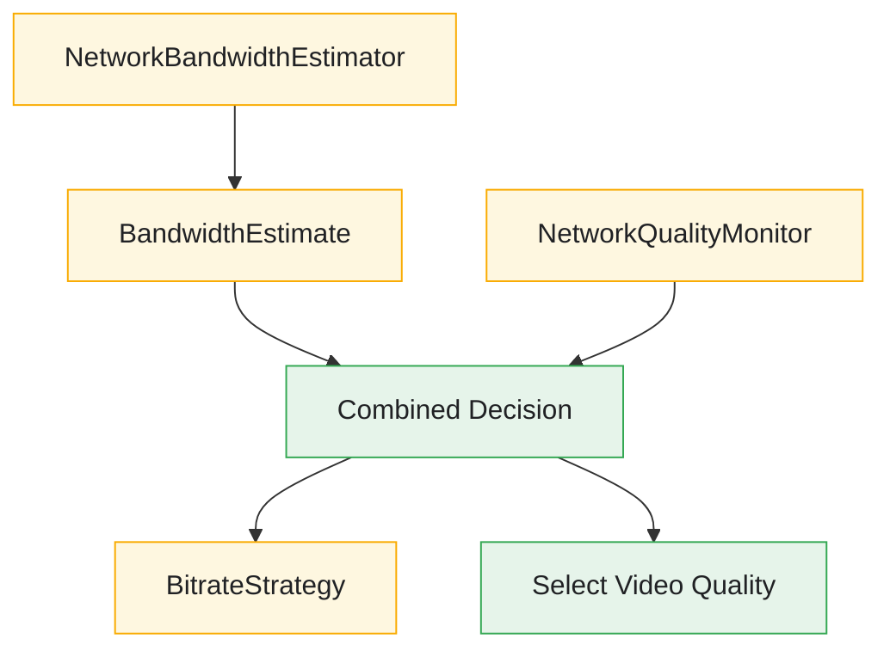

# Bandwidth Estimation

The Bandwidth Estimation system provides real-time network measurement, quality monitoring, and reliable bitrate recommendations for adaptive video streaming.

---

## Overview



---

## Features

- **Sample-Based Estimation** - Collects bytes/duration samples
- **Rolling Window** - Maintains last 30 samples (configurable)
- **Stability Calculation** - Measures bandwidth consistency
- **Confidence Scoring** - Higher with more samples
- **Conservative Recommendations** - Safe bitrate suggestions
- **Network Quality Monitoring** - Real-time connectivity status
- **Thread-Safe** - @MainActor isolation

---

## Core Components

### BandwidthSample

**File:** `StreamingCoreiOS/Video Performance iOS/BandwidthSample.swift`

Represents a single bandwidth measurement.

```swift
public struct BandwidthSample: Equatable, Sendable {
    /// Number of bytes transferred during the sample period
    public let bytesTransferred: Int64

    /// Duration of the sample period in seconds
    public let duration: TimeInterval

    /// Timestamp when the sample was recorded
    public let timestamp: Date

    public init(bytesTransferred: Int64, duration: TimeInterval, timestamp: Date) {
        self.bytesTransferred = bytesTransferred
        self.duration = duration
        self.timestamp = timestamp
    }

    /// Calculated bandwidth in bits per second
    public var bitsPerSecond: Double {
        guard duration > 0 else { return 0 }
        return Double(bytesTransferred * 8) / duration
    }

    /// Calculated bandwidth in megabits per second
    public var megabitsPerSecond: Double {
        bitsPerSecond / 1_000_000
    }
}
```

### BandwidthEstimate

**File:** `StreamingCoreiOS/Video Performance iOS/BandwidthEstimate.swift`

Calculated estimate based on multiple samples.

```swift
public struct BandwidthEstimate: Equatable, Sendable {
    /// Average bandwidth in bits per second
    public let averageBandwidthBps: Double

    /// Peak (maximum) bandwidth observed in bits per second
    public let peakBandwidthBps: Double

    /// Minimum bandwidth observed in bits per second
    public let minimumBandwidthBps: Double

    /// Bandwidth stability score (0-1, where 1 is most stable)
    public let stability: Double

    /// Confidence score in the estimate (0-1, where 1 is most confident)
    public let confidence: Double

    /// Number of samples used to calculate this estimate
    public let sampleCount: Int

    /// Conservative recommended maximum bitrate (70% of minimum observed bandwidth)
    public var recommendedMaxBitrate: Int {
        Int(minimumBandwidthBps * 0.7)
    }

    /// Average bandwidth in megabits per second
    public var averageMegabitsPerSecond: Double {
        averageBandwidthBps / 1_000_000
    }

    /// Whether this estimate is reliable enough to base decisions on
    /// Requires high confidence, good stability, and sufficient samples
    public var isReliable: Bool {
        confidence >= 0.5 && stability >= 0.5 && sampleCount >= 3
    }

    /// Empty estimate representing no bandwidth data
    public static let empty = BandwidthEstimate(
        averageBandwidthBps: 0,
        peakBandwidthBps: 0,
        minimumBandwidthBps: 0,
        stability: 0,
        confidence: 0,
        sampleCount: 0
    )
}
```

### NetworkBandwidthEstimator

**File:** `StreamingCoreiOS/Video Performance iOS/NetworkBandwidthEstimator.swift`

Thread-safe estimator that collects samples and calculates estimates.

```swift
@MainActor
public final class NetworkBandwidthEstimator {

    private let maxSamples: Int
    private var samples: [BandwidthSample] = []

    /// Number of samples currently stored
    public var sampleCount: Int {
        samples.count
    }

    /// Current bandwidth estimate based on stored samples
    public var currentEstimate: BandwidthEstimate {
        calculateEstimate()
    }

    public init(maxSamples: Int = 30) {
        self.maxSamples = maxSamples
    }

    /// Record a new bandwidth sample
    public func recordSample(_ sample: BandwidthSample) {
        // Ignore invalid samples
        guard sample.duration > 0, sample.bytesTransferred > 0 else { return }

        samples.append(sample)

        // Trim old samples if over limit
        if samples.count > maxSamples {
            samples.removeFirst(samples.count - maxSamples)
        }
    }

    /// Clear all stored samples
    public func clear() {
        samples.removeAll()
    }
}
```

---

## Calculation Methods

### Average Bandwidth

Simple arithmetic mean of all sample bandwidths:

```swift
let bandwidths = samples.map { $0.bitsPerSecond }
let average = bandwidths.reduce(0, +) / Double(bandwidths.count)
```

### Stability Score

Uses coefficient of variation (CV) to measure consistency:

```swift
private func calculateStability(bandwidths: [Double], average: Double) -> Double {
    guard bandwidths.count > 1, average > 0 else { return 1.0 }

    // Calculate standard deviation
    let squaredDiffs = bandwidths.map { pow($0 - average, 2) }
    let variance = squaredDiffs.reduce(0, +) / Double(bandwidths.count)
    let standardDeviation = sqrt(variance)

    // Coefficient of variation (CV) = standard deviation / mean
    let cv = standardDeviation / average

    // Convert CV to stability score (0-1)
    // CV of 0 = stability of 1 (perfectly stable)
    // CV of 1+ = stability approaching 0 (very unstable)
    let stability = max(0, 1.0 - cv)
    return min(1.0, stability)
}
```

### Confidence Score

Grows asymptotically with sample count:

```swift
private func calculateConfidence(sampleCount: Int) -> Double {
    // Confidence grows with sample count, approaching 1.0 asymptotically
    // 1 sample = ~0.2, 5 samples = ~0.67, 10 samples = ~0.83, 20 samples = ~0.91
    let confidence = 1.0 - exp(-Double(sampleCount) * 0.2)
    return min(1.0, confidence)
}
```

### Recommended Bitrate

Conservative estimate at 70% of minimum observed bandwidth:

```swift
public var recommendedMaxBitrate: Int {
    Int(minimumBandwidthBps * 0.7)
}
```

---

## Network Quality Monitoring

### NetworkQualityMonitor

**File:** `StreamingCoreiOS/Video Performance iOS/NetworkQualityMonitor.swift`

Real-time network connectivity and quality using NWPathMonitor.

```swift
public final class NetworkQualityMonitor: @unchecked Sendable {

    public enum ConnectionType: Sendable {
        case wifi
        case cellular
        case wiredEthernet
        case loopback
        case other
    }

    private let monitor: NWPathMonitor
    private let queue: DispatchQueue
    private var isMonitoring = false

    private let qualitySubject = CurrentValueSubject<NetworkQuality, Never>(.fair)

    public var currentQuality: NetworkQuality {
        qualitySubject.value
    }

    public var qualityPublisher: AnyPublisher<NetworkQuality, Never> {
        qualitySubject.eraseToAnyPublisher()
    }

    public func startMonitoring() async {
        guard !isMonitoring else { return }
        isMonitoring = true

        monitor.pathUpdateHandler = { [weak self] path in
            guard let self = self else { return }

            let connectionType = Self.connectionType(from: path)
            let quality = Self.determineQuality(
                status: path.status,
                isExpensive: path.isExpensive,
                isConstrained: path.isConstrained,
                connectionType: connectionType
            )

            self.qualitySubject.send(quality)
        }

        monitor.start(queue: queue)
    }

    public func stopMonitoring() async {
        guard isMonitoring else { return }
        isMonitoring = false
        monitor.cancel()
    }
}
```

### Quality Determination

```swift
public static func determineQuality(
    status: NWPath.Status,
    isExpensive: Bool,
    isConstrained: Bool,
    connectionType: ConnectionType
) -> NetworkQuality {
    // Offline check
    guard status == .satisfied else {
        return .offline
    }

    // Constrained connections are poor quality
    if isConstrained {
        return .poor
    }

    // Base quality by connection type
    var quality: NetworkQuality
    switch connectionType {
    case .wifi, .wiredEthernet:
        quality = .excellent
    case .cellular:
        quality = .good
    case .loopback:
        quality = .excellent
    case .other:
        quality = .fair
    }

    // Reduce quality if expensive (metered connection)
    if isExpensive && quality > .fair {
        quality = .fair
    }

    return quality
}
```

---

## Usage Examples

### Recording Samples

```swift
@MainActor
class VideoDownloadObserver {
    private let estimator = NetworkBandwidthEstimator()
    private var downloadStartTime: Date?

    func downloadDidStart() {
        downloadStartTime = Date()
    }

    func downloadDidComplete(bytesReceived: Int64) {
        guard let startTime = downloadStartTime else { return }

        let duration = Date().timeIntervalSince(startTime)
        let sample = BandwidthSample(
            bytesTransferred: bytesReceived,
            duration: duration,
            timestamp: Date()
        )

        estimator.recordSample(sample)
        downloadStartTime = nil
    }

    var currentEstimate: BandwidthEstimate {
        estimator.currentEstimate
    }
}
```

### Using for Bitrate Selection

```swift
@MainActor
func selectBitrate(availableBitrates: [Int], estimator: NetworkBandwidthEstimator) -> Int {
    let estimate = estimator.currentEstimate

    // Only use estimate if reliable
    guard estimate.isReliable else {
        return availableBitrates.min() ?? 0  // Default to lowest
    }

    let recommendedMax = estimate.recommendedMaxBitrate

    // Select highest bitrate that's below recommended max
    return availableBitrates
        .filter { $0 <= recommendedMax }
        .max() ?? availableBitrates.min() ?? 0
}
```

### Responding to Network Changes

```swift
@MainActor
class AdaptivePlayer {
    private let networkMonitor = NetworkQualityMonitor()
    private var cancellables = Set<AnyCancellable>()

    func setupNetworkMonitoring() {
        networkMonitor.qualityPublisher
            .sink { [weak self] quality in
                self?.handleNetworkQualityChange(quality)
            }
            .store(in: &cancellables)

        Task {
            await networkMonitor.startMonitoring()
        }
    }

    private func handleNetworkQualityChange(_ quality: NetworkQuality) {
        switch quality {
        case .excellent, .good:
            // Enable high quality playback
            enableHighQualityPlayback()
        case .fair:
            // Use moderate quality
            setMediumQualityPlayback()
        case .poor:
            // Reduce quality to prevent buffering
            setLowQualityPlayback()
        case .offline:
            // Show offline message or use cached content
            handleOfflineState()
        }
    }
}
```

---

## Reliability Criteria

An estimate is considered reliable when:

```swift
public var isReliable: Bool {
    confidence >= 0.5 &&   // At least ~5 samples worth
    stability >= 0.5 &&    // Less than 50% variation
    sampleCount >= 3       // Minimum 3 samples
}
```

### Confidence Thresholds

| Samples | Confidence |
|---------|------------|
| 1       | ~0.18      |
| 3       | ~0.45      |
| 5       | ~0.63      |
| 10      | ~0.86      |
| 20      | ~0.98      |
| 30      | ~0.998     |

### Stability Interpretation

| Stability | Meaning |
|-----------|---------|
| 1.0       | Perfectly consistent bandwidth |
| 0.8-1.0   | Very stable |
| 0.5-0.8   | Moderately stable |
| 0.3-0.5   | Variable |
| 0.0-0.3   | Highly variable |

---

## Testing

### BandwidthSample Tests

```swift
func test_bitsPerSecond_calculatesCorrectly() {
    let sample = BandwidthSample(
        bytesTransferred: 1_000_000,  // 1 MB
        duration: 1.0,                 // 1 second
        timestamp: Date()
    )

    XCTAssertEqual(sample.bitsPerSecond, 8_000_000)  // 8 Mbps
}

func test_megabitsPerSecond_calculatesCorrectly() {
    let sample = BandwidthSample(
        bytesTransferred: 1_000_000,
        duration: 1.0,
        timestamp: Date()
    )

    XCTAssertEqual(sample.megabitsPerSecond, 8.0)
}

func test_bitsPerSecond_returnsZeroForZeroDuration() {
    let sample = BandwidthSample(
        bytesTransferred: 1000,
        duration: 0,
        timestamp: Date()
    )

    XCTAssertEqual(sample.bitsPerSecond, 0)
}
```

### NetworkBandwidthEstimator Tests

```swift
@MainActor
func test_recordSample_ignoresInvalidSamples() async {
    let sut = NetworkBandwidthEstimator()

    sut.recordSample(BandwidthSample(bytesTransferred: 0, duration: 1.0, timestamp: Date()))
    sut.recordSample(BandwidthSample(bytesTransferred: 100, duration: 0, timestamp: Date()))

    XCTAssertEqual(sut.sampleCount, 0)
}

@MainActor
func test_currentEstimate_returnsEmptyWhenNoSamples() async {
    let sut = NetworkBandwidthEstimator()

    XCTAssertEqual(sut.currentEstimate, .empty)
}

@MainActor
func test_currentEstimate_calculatesAverageCorrectly() async {
    let sut = NetworkBandwidthEstimator()

    sut.recordSample(BandwidthSample(bytesTransferred: 100, duration: 1.0, timestamp: Date()))
    sut.recordSample(BandwidthSample(bytesTransferred: 200, duration: 1.0, timestamp: Date()))

    // (800 + 1600) / 2 = 1200 bps
    XCTAssertEqual(sut.currentEstimate.averageBandwidthBps, 1200)
}

@MainActor
func test_recordSample_trimsOldSamples() async {
    let sut = NetworkBandwidthEstimator(maxSamples: 3)

    for i in 1...5 {
        sut.recordSample(BandwidthSample(
            bytesTransferred: Int64(i * 100),
            duration: 1.0,
            timestamp: Date()
        ))
    }

    XCTAssertEqual(sut.sampleCount, 3)
}
```

### BandwidthEstimate Tests

```swift
func test_isReliable_requiresSufficientSamples() {
    let lowSamples = BandwidthEstimate(
        averageBandwidthBps: 1000,
        peakBandwidthBps: 1000,
        minimumBandwidthBps: 1000,
        stability: 1.0,
        confidence: 0.8,
        sampleCount: 2  // Less than 3
    )

    XCTAssertFalse(lowSamples.isReliable)
}

func test_recommendedMaxBitrate_is70PercentOfMinimum() {
    let estimate = BandwidthEstimate(
        averageBandwidthBps: 10_000_000,
        peakBandwidthBps: 15_000_000,
        minimumBandwidthBps: 8_000_000,
        stability: 0.8,
        confidence: 0.9,
        sampleCount: 10
    )

    XCTAssertEqual(estimate.recommendedMaxBitrate, 5_600_000)  // 8M * 0.7
}
```

---

## Architecture Benefits

### Separation of Concerns

```
BandwidthSample              │  NetworkBandwidthEstimator
─────────────────────────────│──────────────────────────
• Raw measurement data       │  • Sample collection
• Calculations (bps, mbps)   │  • Rolling window
• Immutable value type       │  • Estimate calculation
                             │  • Thread-safe

BandwidthEstimate            │  NetworkQualityMonitor
─────────────────────────────│──────────────────────────
• Aggregated statistics      │  • NWPathMonitor wrapper
• Reliability assessment     │  • Connection type
• Bitrate recommendations    │  • Quality determination
```

### Integration with Adaptive Bitrate



---

## Related Documentation

- [Adaptive Bitrate](features/ADAPTIVE-BITRATE.md) - Bitrate selection
- [Performance Alerts](features/PERFORMANCE-ALERTS.md) - Network warnings
- [Buffer Management](features/BUFFER-MANAGEMENT.md) - Buffer size adaptation
- [Rebuffering Detection](features/REBUFFERING-DETECTION.md) - Stall monitoring
