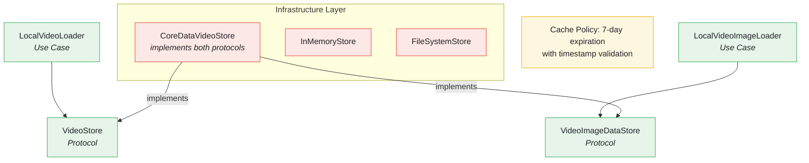

# Caching Infrastructure

The Caching Infrastructure provides a multi-layered persistence system with CoreData, InMemory, and FileSystem implementations following Clean Architecture principles.

---

## Overview



---

## Features

- **Protocol-Based Design** - VideoStore and VideoImageDataStore abstractions
- **Multiple Implementations** - CoreData (production), InMemory (testing/fallback), FileSystem
- **Cache Validation** - Timestamp-based expiration (7 days)
- **Thread Safety** - Sendable conformance with proper context handling
- **Async Support** - Modern async/await patterns

---

## Protocols

### VideoStore

**File:** `StreamingCore/StreamingCore/Video Cache/VideoStore.swift`

```swift
public typealias CachedVideos = (videos: [LocalVideo], timestamp: Date)

public protocol VideoStore {
    func deleteCachedVideos() throws
    func insert(_ videos: [LocalVideo], timestamp: Date) throws
    func retrieve() throws -> CachedVideos?
}
```

### VideoImageDataStore

**File:** `StreamingCore/StreamingCore/Video Cache/VideoImageDataStore.swift`

```swift
public protocol VideoImageDataStore {
    func insert(_ data: Data, for url: URL) throws
    func retrieve(dataForURL url: URL) throws -> Data?
}
```

---

## Local Models

### LocalVideo

**File:** `StreamingCore/StreamingCore/Video Cache/LocalVideo.swift`

```swift
public struct LocalVideo: Equatable {
    public let id: UUID
    public let title: String
    public let description: String?
    public let url: URL
    public let thumbnailURL: URL
    public let duration: TimeInterval
}
```

Separates cache representation from domain `Video` model.

---

## Cache Policy

### VideoCachePolicy

**File:** `StreamingCore/StreamingCore/Video Cache/VideoCachePolicy.swift`

```swift
final class VideoCachePolicy {
    private init() {}

    private static let calendar = Calendar(identifier: .gregorian)
    private static var maxCacheAgeInDays: Int { 7 }

    static func validate(_ timestamp: Date, against date: Date) -> Bool {
        guard let maxCacheAge = calendar.date(byAdding: .day, value: maxCacheAgeInDays, to: timestamp) else {
            return false
        }
        return date < maxCacheAge
    }
}
```

Cache validation rules:
- Maximum age: 7 days
- Timestamp comparison against current date
- Invalid cache triggers deletion

---

## Use Cases

### LocalVideoLoader

**File:** `StreamingCore/StreamingCore/Video Cache/LocalVideoLoader.swift`

```swift
public final class LocalVideoLoader {
    private let store: VideoStore
    private let currentDate: () -> Date

    public init(store: VideoStore, currentDate: @escaping () -> Date) {
        self.store = store
        self.currentDate = currentDate
    }
}

// VideoCache conformance - Save
extension LocalVideoLoader: VideoCache {
    public func save(_ videos: [Video]) throws {
        try store.deleteCachedVideos()
        let localVideos = videos.map { video in
            LocalVideo(
                id: video.id,
                title: video.title,
                description: video.description,
                url: video.url,
                thumbnailURL: video.thumbnailURL,
                duration: video.duration
            )
        }
        try store.insert(localVideos, timestamp: currentDate())
    }
}

// Load with validation
extension LocalVideoLoader {
    public func load() throws -> [Video] {
        if let cache = try store.retrieve(),
           VideoCachePolicy.validate(cache.timestamp, against: currentDate()) {
            return cache.videos.map { localVideo in
                Video(
                    id: localVideo.id,
                    title: localVideo.title,
                    description: localVideo.description,
                    url: localVideo.url,
                    thumbnailURL: localVideo.thumbnailURL,
                    duration: localVideo.duration
                )
            }
        }
        return []
    }
}

// Validation
extension LocalVideoLoader {
    public func validateCache() throws {
        do {
            if let cache = try store.retrieve(),
               !VideoCachePolicy.validate(cache.timestamp, against: currentDate()) {
                try store.deleteCachedVideos()
            }
        } catch {
            try store.deleteCachedVideos()
        }
    }
}
```

---

## CoreData Implementation

### CoreDataVideoStore

**File:** `StreamingCore/StreamingCore/Video Cache/Infrastructure/CoreData/CoreDataVideoStore.swift`

```swift
public final class CoreDataVideoStore: Sendable {
    private static let modelName = "VideoStore"

    @MainActor
    private static let model = NSManagedObjectModel.with(name: modelName, in: Bundle(for: CoreDataVideoStore.self))

    private let container: NSPersistentContainer
    let context: NSManagedObjectContext

    public enum StoreError: Error {
        case modelNotFound
        case failedToLoadPersistentContainer(Error)
    }

    public enum ContextQueue {
        case main
        case background
    }

    @MainActor
    public convenience init(storeURL: URL, contextQueue: ContextQueue = .background) throws {
        guard let model = CoreDataVideoStore.model else {
            throw StoreError.modelNotFound
        }
        try self.init(storeURL: storeURL, contextQueue: contextQueue, model: model)
    }

    public func perform<T>(_ action: @escaping @Sendable () throws -> T) async rethrows -> T {
        try await context.perform(action)
    }
}
```

### Managed Objects

**ManagedCache:**
```swift
@objc(ManagedCache)
class ManagedCache: NSManagedObject {
    @NSManaged var timestamp: Date
    @NSManaged var videos: NSOrderedSet
}
```

**ManagedVideo:**
```swift
@objc(ManagedVideo)
class ManagedVideo: NSManagedObject {
    @NSManaged var id: UUID
    @NSManaged var title: String
    @NSManaged var videoDescription: String?
    @NSManaged var url: URL
    @NSManaged var thumbnailURL: URL
    @NSManaged var duration: Double
    @NSManaged var data: Data?
    @NSManaged var cache: ManagedCache
}
```

---

## InMemory Implementation

### InMemoryVideoStore

**File:** `StreamingCore/StreamingCore/Video Cache/Infrastructure/InMemory/InMemoryVideoStore.swift`

```swift
public final class InMemoryVideoStore: VideoStore, VideoImageDataStore, @unchecked Sendable {
    private var cache: CachedVideos?
    private var imageDataStore: [URL: Data] = [:]

    public init() {}

    public func deleteCachedVideos() throws {
        cache = nil
    }

    public func insert(_ videos: [LocalVideo], timestamp: Date) throws {
        cache = (videos, timestamp)
    }

    public func retrieve() throws -> CachedVideos? {
        return cache
    }

    public func insert(_ data: Data, for url: URL) throws {
        imageDataStore[url] = data
    }

    public func retrieve(dataForURL url: URL) throws -> Data? {
        return imageDataStore[url]
    }
}
```

Used for:
- Unit testing
- Fallback when CoreData fails to initialize
- Preview/development environments

---

## FileSystem Implementation

### FileSystemVideoImageDataStore

**File:** `StreamingCore/StreamingCore/Video Cache/Infrastructure/FileSystem/FileSystemVideoImageDataStore.swift`

```swift
public final class FileSystemVideoImageDataStore: VideoImageDataStore {
    private let storeURL: URL

    public init(storeURL: URL) {
        self.storeURL = storeURL
    }

    public func insert(_ data: Data, for url: URL) throws {
        let fileURL = cacheURL(for: url)
        try data.write(to: fileURL)
    }

    public func retrieve(dataForURL url: URL) throws -> Data? {
        let fileURL = cacheURL(for: url)
        return try? Data(contentsOf: fileURL)
    }

    private func cacheURL(for url: URL) -> URL {
        let filename = url.absoluteString.data(using: .utf8)!.base64EncodedString()
        return storeURL.appendingPathComponent(filename)
    }
}
```

---

## Usage in Composition Root

```swift
// SceneDelegate.swift
private lazy var store: VideoStore & VideoImageDataStore & StoreScheduler & Sendable = {
    do {
        return try CoreDataVideoStore(
            storeURL: NSPersistentContainer
                .defaultDirectoryURL()
                .appendingPathComponent("video-store.sqlite"))
    } catch {
        assertionFailure("Failed to instantiate CoreData store")
        return InMemoryVideoStore()  // Fallback
    }
}()

private lazy var localVideoLoader: LocalVideoLoader = {
    LocalVideoLoader(store: store, currentDate: Date.init)
}()
```

---

## Cache-First Strategy

The composition root implements cache-first with remote fallback:

```swift
private func makeRemoteVideoLoaderWithLocalFallback() async throws -> Paginated<Video> {
    do {
        let items = try await makeRemoteVideoLoader()
        try? localVideoLoader.save(items)
        return makeFirstPage(items: items)
    } catch {
        return makeFirstPage(items: try localVideoLoader.load())
    }
}
```

Flow:
1. Try remote load
2. On success: cache results, return data
3. On failure: fallback to cached data

---

## Testing

### VideoStoreSpy

```swift
class VideoStoreSpy: VideoStore {
    enum ReceivedMessage: Equatable {
        case deleteCachedVideos
        case insert([LocalVideo], Date)
        case retrieve
    }

    private(set) var receivedMessages = [ReceivedMessage]()
    private var retrievalResult: Result<CachedVideos?, Error>?

    func deleteCachedVideos() throws {
        receivedMessages.append(.deleteCachedVideos)
    }

    func insert(_ videos: [LocalVideo], timestamp: Date) throws {
        receivedMessages.append(.insert(videos, timestamp))
    }

    func retrieve() throws -> CachedVideos? {
        receivedMessages.append(.retrieve)
        return try retrievalResult?.get()
    }

    func completeRetrieval(with videos: [LocalVideo], timestamp: Date) {
        retrievalResult = .success((videos, timestamp))
    }
}
```

### Cache Tests

```swift
func test_load_deliversCachedVideosOnNonExpiredCache() throws {
    let videos = uniqueVideos()
    let fixedCurrentDate = Date()
    let nonExpiredTimestamp = fixedCurrentDate.minusDays(VideoCachePolicy.maxCacheAgeInDays - 1)
    let (sut, store) = makeSUT(currentDate: { fixedCurrentDate })

    store.completeRetrieval(with: videos.local, timestamp: nonExpiredTimestamp)

    let result = try sut.load()

    XCTAssertEqual(result, videos.models)
}

func test_load_deliversNoVideosOnExpiredCache() throws {
    let videos = uniqueVideos()
    let fixedCurrentDate = Date()
    let expiredTimestamp = fixedCurrentDate.minusDays(VideoCachePolicy.maxCacheAgeInDays + 1)
    let (sut, store) = makeSUT(currentDate: { fixedCurrentDate })

    store.completeRetrieval(with: videos.local, timestamp: expiredTimestamp)

    let result = try sut.load()

    XCTAssertEqual(result, [])
}
```

---

## Architecture Benefits

### Separation of Concerns

```mermaid
flowchart TD
    subgraph DL["Domain Layer · StreamingCore"]
        direction TB
        DL1["LocalVideo<br/><i>Cache model</i>"]
        DL2["VideoStore<br/><i>Protocol</i>"]
        DL3["VideoImageDataStore<br/><i>Protocol</i>"]
        DL4["LocalVideoLoader<br/><i>Use case</i>"]
        DL5["VideoCachePolicy<br/><i>Business rule</i>"]
    end

    subgraph IL["Infrastructure Layer · StreamingCore/Infrastructure"]
        direction TB
        IL1["CoreDataVideoStore<br/><i>Production</i>"]
        IL2["InMemoryVideoStore<br/><i>Testing / Fallback</i>"]
        IL3["FileSystemVideoImageDataStore<br/><i>File storage</i>"]
    end

    classDef core fill:#e6f4ea,stroke:#34a853,color:#202124;
    classDef impure fill:#fce8e6,stroke:#ea4335,color:#202124;
    class DL1,DL2,DL3,DL4,DL5 core
    class IL1,IL2,IL3 impure
```



### Testability

- Store protocols enable complete unit testing
- InMemory implementation for fast tests
- No CoreData or file system in unit tests

---

## Related Documentation

- [HTTP Client](HTTP-CLIENT.md) - Network layer
- [Composition Root](COMPOSITION-ROOT.md) - Wiring cache and remote
- [Offline Support](features/OFFLINE-SUPPORT.md) - Offline fallback strategy
- [Architecture](ARCHITECTURE.md) - Layer boundaries
