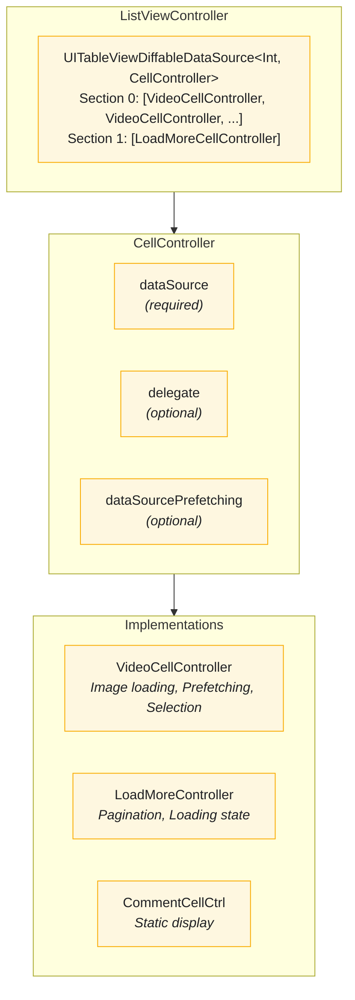
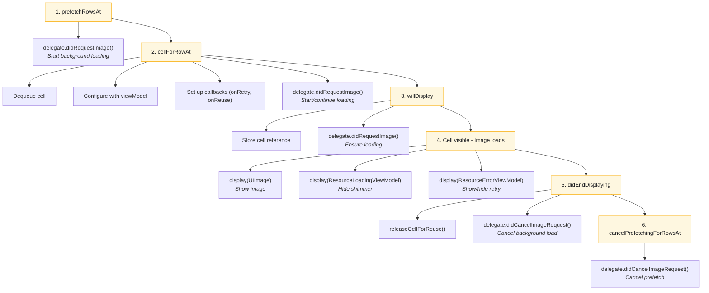

# Cell Controllers

The Cell Controller pattern provides a clean way to manage UITableView cells with isolated logic, proper lifecycle handling, and integration with the diffable data source.

---

## Overview



---

## Features

- **Protocol-Based** - Each cell controller conforms to UITableView protocols
- **Self-Contained** - Each controller manages its own cell lifecycle
- **Hashable Identity** - Enables diffable data source integration
- **Prefetching Support** - Built-in prefetch/cancel operations
- **Memory Safe** - Proper cell release on reuse
- **Testable** - Isolated logic for each cell type

---

## Core Components

### CellController

**File:** `StreamingCoreiOS/Shared UI/Controllers/CellController.swift`

Wrapper struct that provides a uniform interface for all cell types.

```swift
public struct CellController {
    let id: any Hashable & Sendable
    let dataSource: UITableViewDataSource
    let delegate: UITableViewDelegate?
    let dataSourcePrefetching: UITableViewDataSourcePrefetching?

    public init(id: any Hashable & Sendable, _ dataSource: UITableViewDataSource) {
        self.id = id
        self.dataSource = dataSource
        self.delegate = dataSource as? UITableViewDelegate
        self.dataSourcePrefetching = dataSource as? UITableViewDataSourcePrefetching
    }
}

extension CellController: nonisolated Equatable {
    public nonisolated static func == (lhs: CellController, rhs: CellController) -> Bool {
        AnyHashable(lhs.id) == AnyHashable(rhs.id)
    }
}

extension CellController: nonisolated Hashable {
    public nonisolated func hash(into hasher: inout Hasher) {
        let id = AnyHashable(self.id)
        hasher.combine(id)
    }
}
```

Key design decisions:
- `id` enables diffable data source to track cell identity
- Optional `delegate` and `dataSourcePrefetching` extracted via protocol conformance
- `Hashable` and `Equatable` enable snapshot diffing

---

## Cell Controller Types

### VideoCellController

**File:** `StreamingCoreiOS/Video UI/Controllers/VideoCellController.swift`

Manages video list cells with image loading, prefetching, and selection.

```swift
public protocol VideoCellControllerDelegate {
    func didRequestImage()
    func didCancelImageRequest()
}

public final class VideoCellController: NSObject {
    public typealias ResourceViewModel = UIImage

    private let viewModel: VideoViewModel
    private let delegate: VideoCellControllerDelegate
    private let selection: () -> Void
    private var cell: VideoCell?

    public init(viewModel: VideoViewModel, delegate: VideoCellControllerDelegate, selection: @escaping () -> Void) {
        self.viewModel = viewModel
        self.delegate = delegate
        self.selection = selection
    }
}
```

#### UITableViewDataSource & Delegate

```swift
extension VideoCellController: UITableViewDataSource, UITableViewDelegate, UITableViewDataSourcePrefetching {

    public func tableView(_ tableView: UITableView, numberOfRowsInSection section: Int) -> Int {
        1
    }

    public func tableView(_ tableView: UITableView, cellForRowAt indexPath: IndexPath) -> UITableViewCell {
        cell = tableView.dequeueReusableCell()
        cell?.titleLabel.text = viewModel.title
        cell?.descriptionLabel.text = viewModel.description
        cell?.videoImageView.image = nil
        cell?.videoImageContainer.isShimmering = true
        cell?.videoImageRetryButton.isHidden = true
        cell?.onRetry = { [weak self] in
            self?.delegate.didRequestImage()
        }
        cell?.onReuse = { [weak self] in
            self?.releaseCellForReuse()
        }
        delegate.didRequestImage()
        return cell!
    }

    public func tableView(_ tableView: UITableView, didSelectRowAt indexPath: IndexPath) {
        selection()
    }

    public func tableView(_ tableView: UITableView, willDisplay cell: UITableViewCell, forRowAt indexPath: IndexPath) {
        self.cell = cell as? VideoCell
        delegate.didRequestImage()
    }

    public func tableView(_ tableView: UITableView, didEndDisplaying cell: UITableViewCell, forRowAt indexPath: IndexPath) {
        cancelLoad()
    }

    public func tableView(_ tableView: UITableView, prefetchRowsAt indexPaths: [IndexPath]) {
        delegate.didRequestImage()
    }

    public func tableView(_ tableView: UITableView, cancelPrefetchingForRowsAt indexPaths: [IndexPath]) {
        cancelLoad()
    }

    private func cancelLoad() {
        releaseCellForReuse()
        delegate.didCancelImageRequest()
    }

    private func releaseCellForReuse() {
        cell?.onReuse = nil
        cell = nil
    }
}
```

#### ResourceView Conformance

```swift
extension VideoCellController: ResourceView, ResourceLoadingView, ResourceErrorView {
    public func display(_ viewModel: UIImage) {
        cell?.videoImageView.setImageAnimated(viewModel)
    }

    public func display(_ viewModel: ResourceLoadingViewModel) {
        cell?.videoImageContainer.isShimmering = viewModel.isLoading
    }

    public func display(_ viewModel: ResourceErrorViewModel) {
        cell?.videoImageRetryButton.isHidden = viewModel.message == nil
    }
}
```

### LoadMoreCellController

**File:** `StreamingCoreiOS/Video UI/Controllers/LoadMoreCellController.swift`

Manages pagination cell with scroll-based loading.

```swift
public class LoadMoreCellController: NSObject, UITableViewDataSource, UITableViewDelegate {
    private let cell = LoadMoreCell()
    private let callback: () -> Void
    private var offsetObserver: NSKeyValueObservation?

    public init(callback: @escaping () -> Void) {
        self.callback = callback
    }

    public func tableView(_ tableView: UITableView, numberOfRowsInSection section: Int) -> Int {
        1
    }

    public func tableView(_ tableView: UITableView, cellForRowAt indexPath: IndexPath) -> UITableViewCell {
        cell.selectionStyle = .none
        return cell
    }

    public func tableView(_ tableView: UITableView, willDisplay: UITableViewCell, forRowAt indexPath: IndexPath) {
        reloadIfNeeded()

        offsetObserver = tableView.observe(\.contentOffset, options: .new) { [weak self] (tableView, _) in
            MainActor.assumeIsolated {
                guard tableView.isDragging else { return }
                self?.reloadIfNeeded()
            }
        }
    }

    public func tableView(_ tableView: UITableView, didEndDisplaying cell: UITableViewCell, forRowAt indexPath: IndexPath) {
        offsetObserver = nil
    }

    public func tableView(_ tableView: UITableView, didSelectRowAt indexPath: IndexPath) {
        reloadIfNeeded()
    }

    private func reloadIfNeeded() {
        guard !cell.isLoading else { return }
        callback()
    }
}

extension LoadMoreCellController: ResourceLoadingView, ResourceErrorView {
    public func display(_ viewModel: ResourceErrorViewModel) {
        cell.message = viewModel.message
    }

    public func display(_ viewModel: ResourceLoadingViewModel) {
        cell.isLoading = viewModel.isLoading
    }
}
```

### VideoCommentCellController

**File:** `StreamingCoreiOS/Video Comments UI/Controllers/VideoCommentCellController.swift`

Simple cell controller for static comment display.

```swift
public class VideoCommentCellController: NSObject, UITableViewDataSource {
    private let model: VideoCommentViewModel

    public init(model: VideoCommentViewModel) {
        self.model = model
    }

    public func tableView(_ tableView: UITableView, numberOfRowsInSection section: Int) -> Int {
        1
    }

    public func tableView(_ tableView: UITableView, cellForRowAt indexPath: IndexPath) -> UITableViewCell {
        let cell: VideoCommentCell = tableView.dequeueReusableCell()
        cell.messageLabel.text = model.message
        cell.usernameLabel.text = model.username
        cell.dateLabel.text = model.date
        return cell
    }
}
```

---

## ListViewController Integration

**File:** `StreamingCoreiOS/Shared UI/Controllers/ListViewController.swift`

Uses `UITableViewDiffableDataSource` with `CellController` as the item type.

```swift
public final class ListViewController: UITableViewController, UITableViewDataSourcePrefetching, ResourceLoadingView, ResourceErrorView {
    private(set) public var errorView = ErrorView()

    private lazy var dataSource: UITableViewDiffableDataSource<Int, CellController> = {
        .init(tableView: tableView) { (tableView, index, controller) in
            controller.dataSource.tableView(tableView, cellForRowAt: index)
        }
    }()

    public var onRefresh: (() -> Void)?

    public func display(_ sections: [CellController]...) {
        var snapshot = NSDiffableDataSourceSnapshot<Int, CellController>()
        sections.enumerated().forEach { section, cellControllers in
            snapshot.appendSections([section])
            snapshot.appendItems(cellControllers, toSection: section)
        }
        dataSource.apply(snapshot)
    }
}
```

### Delegate Forwarding

ListViewController forwards delegate calls to individual cell controllers:

```swift
public override func tableView(_ tableView: UITableView, didSelectRowAt indexPath: IndexPath) {
    let dl = cellController(at: indexPath)?.delegate
    dl?.tableView?(tableView, didSelectRowAt: indexPath)
}

public override func tableView(_ tableView: UITableView, willDisplay cell: UITableViewCell, forRowAt indexPath: IndexPath) {
    let dl = cellController(at: indexPath)?.delegate
    dl?.tableView?(tableView, willDisplay: cell, forRowAt: indexPath)
}

public override func tableView(_ tableView: UITableView, didEndDisplaying cell: UITableViewCell, forRowAt indexPath: IndexPath) {
    let dl = cellController(at: indexPath)?.delegate
    dl?.tableView?(tableView, didEndDisplaying: cell, forRowAt: indexPath)
}

public func tableView(_ tableView: UITableView, prefetchRowsAt indexPaths: [IndexPath]) {
    indexPaths.forEach { indexPath in
        let dsp = cellController(at: indexPath)?.dataSourcePrefetching
        dsp?.tableView(tableView, prefetchRowsAt: [indexPath])
    }
}

public func tableView(_ tableView: UITableView, cancelPrefetchingForRowsAt indexPaths: [IndexPath]) {
    indexPaths.forEach { indexPath in
        let dsp = cellController(at: indexPath)?.dataSourcePrefetching
        dsp?.tableView?(tableView, cancelPrefetchingForRowsAt: [indexPath])
    }
}

private func cellController(at indexPath: IndexPath) -> CellController? {
    dataSource.itemIdentifier(for: indexPath)
}
```

---

## Cell Lifecycle



---

## Usage Example

### Creating Cell Controllers in Composer

```swift
// VideosViewAdapter.swift
@MainActor
func display(_ viewModel: Paginated<Video>) {
    let videos = viewModel.items.map { video in
        let adapter = AsyncLoadResourcePresentationAdapter<Data, WeakRefVirtualProxy<VideoCellController>>(loader: { [imageLoader] in
            try await imageLoader(video.thumbnailURL)
        })

        let controller = VideoCellController(
            viewModel: VideoImagePresenter.map(video),
            delegate: adapter,
            selection: { [selection] in
                selection(video)
            }
        )

        adapter.presenter = LoadResourcePresenter(
            resourceView: WeakRefVirtualProxy(controller),
            loadingView: WeakRefVirtualProxy(controller),
            errorView: WeakRefVirtualProxy(controller),
            mapper: UIImage.init(data:)
        )

        return CellController(id: video, controller)
    }

    let loadMore = viewModel.loadMore.map { loadMore in
        let adapter = AsyncLoadResourcePresentationAdapter(loader: loadMore)
        let loadMoreController = LoadMoreCellController(callback: adapter.loadResource)
        adapter.presenter = LoadResourcePresenter(
            resourceView: controller,
            loadingView: WeakRefVirtualProxy(loadMoreController),
            errorView: WeakRefVirtualProxy(loadMoreController)
        )
        return CellController(id: UUID(), loadMoreController)
    }

    controller.display(videos, loadMore.map { [$0] } ?? [])
}
```

---

## Testing

### CellController Tests

```swift
func test_cellController_usesIdForEquality() {
    let id1 = UUID()
    let id2 = UUID()

    let controller1a = CellController(id: id1, FakeDataSource())
    let controller1b = CellController(id: id1, FakeDataSource())
    let controller2 = CellController(id: id2, FakeDataSource())

    XCTAssertEqual(controller1a, controller1b)
    XCTAssertNotEqual(controller1a, controller2)
}

func test_cellController_hashesById() {
    let id = UUID()
    let controller1 = CellController(id: id, FakeDataSource())
    let controller2 = CellController(id: id, FakeDataSource())

    var set = Set<CellController>()
    set.insert(controller1)
    set.insert(controller2)

    XCTAssertEqual(set.count, 1)
}
```

### VideoCellController Tests

```swift
func test_cellForRow_configuresCellWithViewModel() {
    let viewModel = VideoViewModel(title: "Test", description: "Desc")
    let (sut, _) = makeSUT(viewModel: viewModel)

    let cell = sut.tableView(tableView, cellForRowAt: anyIndexPath) as? VideoCell

    XCTAssertEqual(cell?.titleLabel.text, "Test")
    XCTAssertEqual(cell?.descriptionLabel.text, "Desc")
}

func test_cellForRow_requestsImage() {
    let (sut, delegate) = makeSUT()

    _ = sut.tableView(tableView, cellForRowAt: anyIndexPath)

    XCTAssertEqual(delegate.requestCount, 1)
}

func test_didEndDisplaying_cancelsImageRequest() {
    let (sut, delegate) = makeSUT()
    let cell = sut.tableView(tableView, cellForRowAt: anyIndexPath)

    sut.tableView(tableView, didEndDisplaying: cell, forRowAt: anyIndexPath)

    XCTAssertEqual(delegate.cancelCount, 1)
}
```

---

## Architecture Benefits

### Single Responsibility

Each cell controller handles only its cell type:
- `VideoCellController` - Video cells with images
- `LoadMoreCellController` - Pagination
- `VideoCommentCellController` - Comment cells

### Open/Closed Principle

Add new cell types without modifying `ListViewController`:

```swift
// New cell type
class BannerCellController: NSObject, UITableViewDataSource {
    // Implementation
}

// Usage - no changes to ListViewController
let bannerController = CellController(id: "banner", BannerCellController())
controller.display([bannerController] + videoControllers)
```

### Memory Management

```swift
private func releaseCellForReuse() {
    cell?.onReuse = nil  // Break retain cycle
    cell = nil           // Release cell reference
}
```

---

## tvOS Variant (UICollectionView)

The tvOS app realizes the same pattern over `UICollectionView` instead of `UITableView`. `TVCellController` (`Tattva/TattvaTV/TVCellController.swift`) is a struct with the same `id` / `Equatable` / `Hashable` design as `CellController`, wrapping `UICollectionViewDataSource` and extracting optional `UICollectionViewDelegate` / `UICollectionViewDataSourcePrefetching` via protocol conformance.

`TVVideoCellController` (`Tattva/TattvaTV/TVVideoCellController.swift`) is the `UICollectionView` analogue of `VideoCellController`, implementing `collectionView(_:cellForItemAt:)` and driving image loading. `TVCommentsViewController` uses a `UICollectionViewDiffableDataSource` for comment display.

See [Apple TV](features/APPLE-TV.md) for the full tvOS composition.

---

## Related Documentation

- [Presenters and ViewModels](PRESENTERS-VIEWMODELS.md) - ViewModel patterns
- [Composition Root](COMPOSITION-ROOT.md) - Cell controller creation
- [Design Patterns](DESIGN-PATTERNS.md) - Adapter pattern usage
- [Testing Infrastructure](TESTING-INFRASTRUCTURE.md) - Cell testing helpers
- [Apple TV](features/APPLE-TV.md) - tvOS UICollectionView variant of this pattern
