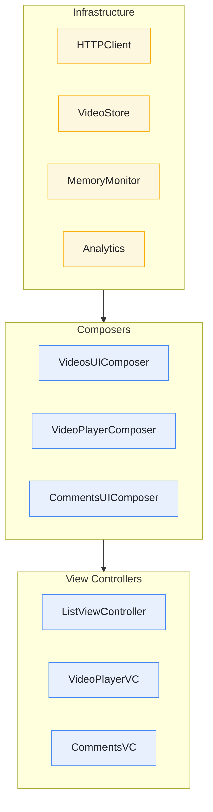
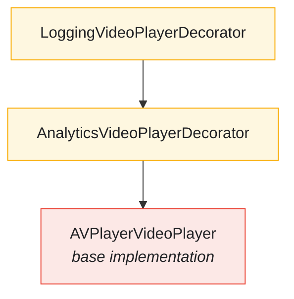

# Composition Root

The Composition Root is where all dependencies are wired together, following the principle that object construction should be separated from object use.

---

## Overview



---

## Features

- **Single Composition Point** - All wiring in SceneDelegate
- **Lazy Initialization** - Resources created on first access
- **Dependency Injection** - No hidden dependencies or singletons
- **Decorator Chains** - Layered functionality via decoration
- **Testable Design** - Convenience init for test injection

---

## SceneDelegate Structure

### Infrastructure Dependencies

```swift
class SceneDelegate: UIResponder, UIWindowSceneDelegate {
    var window: UIWindow?
    private var cancellables = Set<AnyCancellable>()

    // MARK: - HTTP Layer
    private lazy var httpClient: HTTPClient = {
        URLSessionHTTPClient(session: URLSession(configuration: .ephemeral))
    }()

    // MARK: - Persistence Layer
    private lazy var store: VideoStore & VideoImageDataStore & StoreScheduler & Sendable = {
        do {
            return try CoreDataVideoStore(
                storeURL: NSPersistentContainer
                    .defaultDirectoryURL()
                    .appendingPathComponent("video-store.sqlite"))
        } catch {
            assertionFailure("Failed to instantiate CoreData store")
            return InMemoryVideoStore()
        }
    }()

    // MARK: - Cache Layer
    private lazy var localVideoLoader: LocalVideoLoader = {
        LocalVideoLoader(store: store, currentDate: Date.init)
    }()

    // MARK: - Memory Management
    lazy var memoryMonitor: PollingMemoryMonitor = {
        MemoryMonitorFactory.makeSystemMemoryMonitor()
    }()

    lazy var resourceCleanupCoordinator: ResourceCleanupCoordinator = {
        let videoCleaner = VideoCacheCleaner(deleteAction: { [store] in
            try store.deleteCachedVideos()
        })
        let imageCleaner = ImageCacheCleaner(clearAction: { return 0 })
        return ResourceCleanupCoordinator(
            cleaners: [videoCleaner, imageCleaner],
            memoryMonitor: memoryMonitor
        )
    }()

    // MARK: - Buffer Management
    lazy var bufferManager: AdaptiveBufferManager = {
        AdaptiveBufferManager()
    }()

    // MARK: - Analytics & Logging
    private lazy var analyticsStore: AnalyticsStore = {
        InMemoryAnalyticsStore()
    }()

    private lazy var analyticsLogger: PlaybackAnalyticsLogger = {
        PlaybackAnalyticsService(store: analyticsStore)
    }()

    private lazy var structuredLogger: any StreamingCore.Logger = {
        LoggingConfiguration.makeLogger()
    }()

    // MARK: - Scheduling
    private lazy var scheduler: AnyDispatchQueueScheduler = {
        if let store = store as? CoreDataVideoStore {
            return .scheduler(for: store)
        }
        return DispatchQueue(label: "com.streamingvideoapp.infra.queue", qos: .userInitiated)
            .eraseToAnyScheduler()
    }()
}
```

---

## Composer Pattern

### VideosUIComposer

**File:** `StreamingVideoApp/VideosUIComposer.swift`

```swift
@MainActor
public final class VideosUIComposer {
    private init() {}

    private typealias VideosPresentationAdapter =
        AsyncLoadResourcePresentationAdapter<Paginated<Video>, VideosViewAdapter>

    public static func videosComposedWith(
        videoLoader: @MainActor @escaping () async throws -> Paginated<Video>,
        imageLoader: @MainActor @escaping (URL) async throws -> Data,
        selection: @MainActor @escaping (Video) -> Void = { _ in }
    ) -> ListViewController {
        let presentationAdapter = VideosPresentationAdapter(loader: videoLoader)

        let videosController = makeVideosViewController()
        videosController.onRefresh = presentationAdapter.loadResource

        presentationAdapter.presenter = LoadResourcePresenter(
            resourceView: VideosViewAdapter(
                controller: videosController,
                imageLoader: imageLoader,
                selection: selection),
            loadingView: WeakRefVirtualProxy(videosController),
            errorView: WeakRefVirtualProxy(videosController))

        return videosController
    }

    private static func makeVideosViewController() -> ListViewController {
        let bundle = Bundle(for: ListViewController.self)
        let storyboard = UIStoryboard(name: "Videos", bundle: bundle)
        let videosController = storyboard.instantiateInitialViewController() as! ListViewController
        videosController.title = VideosPresenter.title
        return videosController
    }
}
```

### VideoPlayerUIComposer

```swift
@MainActor
public final class VideoPlayerUIComposer {
    private init() {}

    public static func videoPlayerComposedWith(
        video: Video,
        player: VideoPlayer? = nil,
        commentsController: UIViewController,
        analyticsLogger: PlaybackAnalyticsLogger,
        structuredLogger: any StreamingCore.Logger
    ) -> VideoPlayerViewController {
        let viewModel = VideoPlayerViewModel(video: video)

        // Create base player or use injected one
        let basePlayer = player ?? AVPlayerVideoPlayer()

        // Decorate with analytics
        let analyticsDecorator = AnalyticsVideoPlayerDecorator(
            decoratee: basePlayer,
            analyticsLogger: analyticsLogger
        )

        // Decorate with structured logging
        let loggingDecorator = LoggingVideoPlayerDecorator(
            decoratee: analyticsDecorator,
            logger: structuredLogger
        )

        let controller = VideoPlayerViewController(
            viewModel: viewModel,
            player: loggingDecorator
        )
        controller.commentsController = commentsController

        return controller
    }
}
```

---

## Navigation & Selection

### Showing Video Player

```swift
private func showVideoPlayer(for video: Video) {
    // Compose comments controller
    let commentsController = VideoCommentsUIComposer.commentsComposedWith(
        commentsLoader: { [httpClient, baseURL] in
            let url = VideoCommentsEndpoint.get(video.id).url(baseURL: baseURL)
            let (data, response) = try await httpClient.get(from: url)
            return try VideoCommentsMapper.map(data, from: response)
        })

    // Compose video player controller
    let videoPlayerController = VideoPlayerUIComposer.videoPlayerComposedWith(
        video: video,
        player: videoPlayerFactory?(video),
        commentsController: commentsController,
        analyticsLogger: analyticsLogger,
        structuredLogger: structuredLogger)

    navigationController.pushViewController(videoPlayerController, animated: true)
}
```

---

## Data Loading Composition

### Remote with Local Fallback

```swift
private func makeRemoteVideoLoaderWithLocalFallback() async throws -> Paginated<Video> {
    do {
        let items = try await makeRemoteVideoLoader()
        try? localVideoLoader.save(items)
        return makeFirstPage(items: items)
    } catch {
        return makeFirstPage(items: try localVideoLoader.load())
    }
}

private func makeRemoteVideoLoader(after: Video? = nil) async throws -> [Video] {
    let url = VideoEndpoint.get(after: after).url(baseURL: baseURL)
    let (data, response) = try await httpClient.get(from: url)
    return try VideoItemsMapper.map(data, from: response)
}
```

### Pagination

```swift
private func makeRemoteLoadMoreLoader(last: Video?) async throws -> Paginated<Video> {
    async let remote = makeRemoteVideoLoader(after: last)
    let cachedItems = try localVideoLoader.load()
    let newItems = try await remote
    let items = cachedItems + newItems
    try? localVideoLoader.save(items)
    return makePage(items: items, last: newItems.last)
}

private func makeFirstPage(items: [Video]) -> Paginated<Video> {
    makePage(items: items, last: items.last)
}

private func makePage(items: [Video], last: Video?) -> Paginated<Video> {
    Paginated(items: items, loadMore: last.map { last in
        { @MainActor @Sendable in try await self.makeRemoteLoadMoreLoader(last: last) }
    })
}
```

### Image Loading

```swift
private func loadLocalImageWithRemoteFallback(url: URL) async throws -> Data {
    do {
        return try await loadLocalImage(url: url)
    } catch {
        return try await loadAndCacheRemoteImage(url: url)
    }
}

private func loadLocalImage(url: URL) async throws -> Data {
    try await store.schedule { [store] in
        let localImageLoader = LocalVideoImageDataLoader(store: store)
        return try localImageLoader.loadImageData(from: url)
    }
}

private func loadAndCacheRemoteImage(url: URL) async throws -> Data {
    let (data, response) = try await httpClient.get(from: url)
    let imageData = try VideoImageDataMapper.map(data, from: response)
    await store.schedule { [store] in
        let localImageLoader = LocalVideoImageDataLoader(store: store)
        try? localImageLoader.save(data, for: url)
    }
    return imageData
}
```

---

## Lifecycle Management

### Scene Lifecycle

```swift
func scene(_ scene: UIScene, willConnectTo session: UISceneSession, options: UIScene.ConnectionOptions) {
    guard let scene = (scene as? UIWindowScene) else { return }

    configureAudioSession()
    window = UIWindow(windowScene: scene)
    configureWindow()
}

func configureWindow() {
    window?.rootViewController = navigationController
    window?.makeKeyAndVisible()
    enableAutoCleanup()  // Start memory monitoring
}

func sceneWillResignActive(_ scene: UIScene) {
    scheduler.schedule { [localVideoLoader, logger] in
        do {
            try localVideoLoader.validateCache()
        } catch {
            logger.error("Failed to validate cache: \(error.localizedDescription)")
        }
    }
}
```

---

## Test Injection

### Convenience Initializer

```swift
convenience init(
    httpClient: HTTPClient,
    store: VideoStore & VideoImageDataStore & StoreScheduler & Sendable,
    videoPlayerFactory: ((Video) -> VideoPlayer)? = nil
) {
    self.init()
    self.httpClient = httpClient
    self.store = store
    self.videoPlayerFactory = videoPlayerFactory
}
```

Usage in tests:
```swift
func test_showVideoPlayer_createsPlayerWithInjectedDependencies() {
    let httpClient = HTTPClientSpy()
    let store = InMemoryVideoStore()
    let playerSpy = VideoPlayerSpy()
    let sut = SceneDelegate(
        httpClient: httpClient,
        store: store,
        videoPlayerFactory: { _ in playerSpy }
    )

    // Test composition...
}
```

---

## Decorator Chain

The video player uses a decorator chain for cross-cutting concerns:



---

## WeakRefVirtualProxy

Prevents retain cycles in presenter-view relationships:

```swift
final class WeakRefVirtualProxy<T: AnyObject> {
    private weak var object: T?

    init(_ object: T) {
        self.object = object
    }
}

extension WeakRefVirtualProxy: ResourceLoadingView where T: ResourceLoadingView {
    func display(_ viewModel: ResourceLoadingViewModel) {
        object?.display(viewModel)
    }
}

extension WeakRefVirtualProxy: ResourceErrorView where T: ResourceErrorView {
    func display(_ viewModel: ResourceErrorViewModel) {
        object?.display(viewModel)
    }
}
```

---

## Benefits

1. **Single Source of Truth** - All dependencies defined in one place
2. **No Hidden Dependencies** - Everything is explicit
3. **Easy Testing** - Inject test doubles via convenience init
4. **Flexible Configuration** - Different compositions for different environments
5. **Clear Ownership** - SceneDelegate owns all long-lived dependencies

---

## Related Documentation

- [Architecture](ARCHITECTURE.md) - Layer boundaries
- [Design Patterns](DESIGN-PATTERNS.md) - Decorator, Composite patterns
- [HTTP Client](HTTP-CLIENT.md) - Network infrastructure
- [Caching Infrastructure](CACHING-INFRASTRUCTURE.md) - Storage layer
