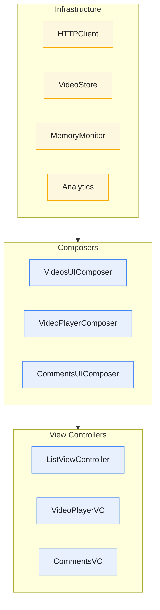
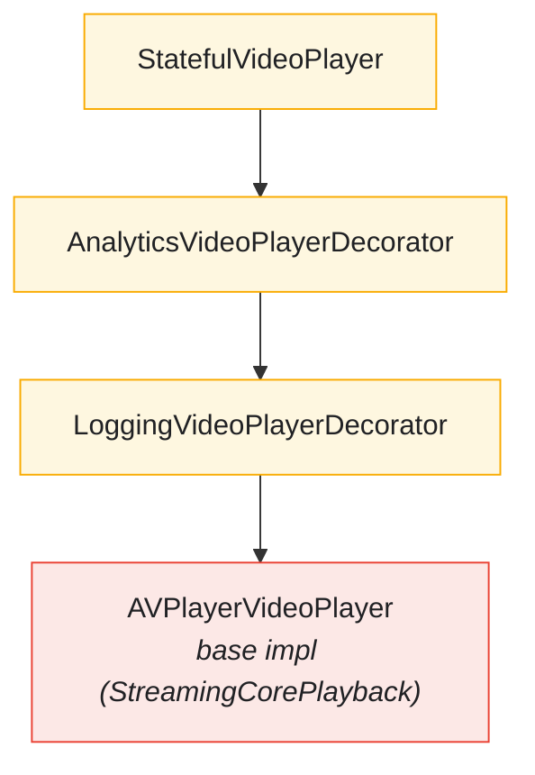

# Composition Root

The Composition Root is where all dependencies are wired together, following the principle that object construction should be separated from object use.

---

## Overview



---

## Features

- **Single Composition Point** - All wiring in SceneDelegate
- **Lazy Initialization** - Resources created on first access
- **Dependency Injection** - No hidden dependencies or singletons
- **Decorator Chains** - Layered functionality via decoration
- **Testable Design** - Convenience init for test injection

> The iOS `SceneDelegate` described here has a parallel composition root in the
> `StreamingVideoAppTV` target (its own `SceneDelegate` plus `TVVideosUIComposer`,
> `TVPlayerComposer`, and `TVCommentsUIComposer`). See [Apple TV](features/APPLE-TV.md).

---

## SceneDelegate Structure

### Infrastructure Dependencies

```swift
class SceneDelegate: UIResponder, UIWindowSceneDelegate {
    var window: UIWindow?

    // MARK: - HTTP Layer
    private lazy var httpClient: HTTPClient = {
        URLSessionHTTPClient(session: URLSession(configuration: .ephemeral))
    }()

    // MARK: - Persistence Layer
    private lazy var store: VideoStore & VideoImageDataStore & StoreScheduler & Sendable = {
        do {
            return try CoreDataVideoStore(
                storeURL: NSPersistentContainer
                    .defaultDirectoryURL()
                    .appendingPathComponent("video-store.sqlite"))
        } catch {
            assertionFailure("Failed to instantiate CoreData store")
            return InMemoryVideoStore()
        }
    }()

    // MARK: - Memory Management
    lazy var memoryMonitor: PollingMemoryMonitor = {
        MemoryMonitorFactory.makeSystemMemoryMonitor()
    }()

    lazy var resourceCleanupCoordinator: ResourceCleanupCoordinator = {
        let videoCleaner = VideoCacheCleaner(deleteAction: { [store] in
            try store.deleteCachedVideos()
        })
        let imageCleaner = ImageCacheCleaner(clearAction: { return 0 })
        return ResourceCleanupCoordinator(
            cleaners: [videoCleaner, imageCleaner],
            memoryMonitor: memoryMonitor
        )
    }()

    // MARK: - Buffer Management
    lazy var bufferManager: AdaptiveBufferManager = {
        AdaptiveBufferManager()
    }()

    // MARK: - Analytics & Logging
    private lazy var analyticsStore: AnalyticsStore = {
        InMemoryAnalyticsStore()
    }()

    private lazy var analyticsLogger: PlaybackAnalyticsLogger = {
        PlaybackAnalyticsService(store: analyticsStore)
    }()

    private lazy var structuredLogger: any StreamingCore.Logger = {
        LoggingConfiguration.makeLogger()
    }()

    // MARK: - Data Loading
    private lazy var videoService = VideoService(
        httpClient: httpClient,
        store: store,
        logger: logger
    )
}
```

---

## Composer Pattern

### VideosUIComposer

**File:** `StreamingVideoApp/StreamingVideoApp/VideosUIComposer.swift`

```swift
@MainActor
public final class VideosUIComposer {
    private init() {}

    private typealias VideosPresentationAdapter =
        AsyncLoadResourcePresentationAdapter<Paginated<Video>, VideosViewAdapter>

    public static func videosComposedWith(
        videoLoader: @MainActor @escaping () async throws -> Paginated<Video>,
        imageLoader: @MainActor @escaping (URL) async throws -> Data,
        selection: @MainActor @escaping (Video) -> Void = { _ in }
    ) -> ListViewController {
        let presentationAdapter = VideosPresentationAdapter(loader: videoLoader)

        let videosController = makeVideosViewController()
        videosController.onRefresh = presentationAdapter.loadResource

        presentationAdapter.presenter = LoadResourcePresenter(
            resourceView: VideosViewAdapter(
                controller: videosController,
                imageLoader: imageLoader,
                selection: selection),
            loadingView: WeakRefVirtualProxy(videosController),
            errorView: WeakRefVirtualProxy(videosController))

        return videosController
    }

    private static func makeVideosViewController() -> ListViewController {
        let bundle = Bundle(for: ListViewController.self)
        let storyboard = UIStoryboard(name: "Videos", bundle: bundle)
        let videosController = storyboard.instantiateInitialViewController() as! ListViewController
        videosController.title = VideosPresenter.title
        return videosController
    }
}
```

**File:** `StreamingVideoApp/StreamingVideoApp/VideoPlayerUIComposer.swift`

`AVPlayerVideoPlayer` and the playback stack (decorators, `StatefulVideoPlayer`,
`PlaybackCoordinator`, `NetworkBandwidthEstimator`, `VideoPlayerPerformanceAdapter`,
`PictureInPictureController`) live in the `StreamingCorePlayback` framework, which the
composer imports.

```swift
@MainActor
public enum VideoPlayerUIComposer {
    public static func videoPlayerComposedWith(
        video: Video,
        player: VideoPlayer? = nil,
        commentsController: UIViewController? = nil,
        analyticsLogger: PlaybackAnalyticsLogger? = nil,
        structuredLogger: (any StreamingCore.Logger)? = nil
    ) -> VideoPlayerViewController {
        let viewModel = VideoPlayerPresenter.map(video)
        let basePlayer = player ?? AVPlayerVideoPlayer()

        // Decorator chain: base -> logging -> analytics (each optional)
        var videoPlayer: VideoPlayer = basePlayer
        if let logger = structuredLogger {
            videoPlayer = LoggingVideoPlayerDecorator(decoratee: videoPlayer, logger: logger)
        }
        if let analytics = analyticsLogger {
            videoPlayer = AnalyticsVideoPlayerDecorator(decoratee: videoPlayer, analyticsLogger: analytics)
        }

        // Wrap the chain in a state-machine-driven player
        let stateMachine = DefaultPlaybackStateMachine()
        let statefulPlayer = StatefulVideoPlayer(decoratee: videoPlayer, stateMachine: stateMachine)

        let controller = VideoPlayerViewController(viewModel: viewModel, player: statefulPlayer)
        controller.statefulPlayer = statefulPlayer

        // Wire performance monitoring, a PlaybackCoordinator, and PiP
        let performanceAdapter = VideoPlayerPerformanceAdapter(
            performanceService: PlaybackPerformanceService(),
            bandwidthEstimator: NetworkBandwidthEstimator()
        )
        performanceAdapter.startMonitoring(sessionID: UUID())
        controller.performanceAdapter = performanceAdapter

        if let commentsController {
            controller.setCommentsController(commentsController)
        }

        // ...fullscreen wiring, PlaybackCoordinator.start(), PictureInPictureController setup...

        return controller
    }
}
```

---

## Navigation & Selection

### Showing Video Player

```swift
private func showVideoPlayer(for video: Video) {
    // Compose comments controller (loader supplied by VideoService)
    let commentsController = VideoCommentsUIComposer.commentsComposedWith(
        commentsLoader: videoService.loadComments(for: video))

    // Compose video player controller
    let player = videoPlayerFactory?(video)
    let videoPlayerController = VideoPlayerUIComposer.videoPlayerComposedWith(
        video: video,
        player: player,
        commentsController: commentsController,
        analyticsLogger: analyticsLogger,
        structuredLogger: structuredLogger)

    navigationController.pushViewController(videoPlayerController, animated: true)
}
```

---

## Data Loading Composition

Remote/local fallback, pagination, image loading, comments loading, and cache
validation are no longer methods on `SceneDelegate`. They live in `VideoService`
(`StreamingCore/StreamingCorePlayback/VideoService.swift`), which the composition
root constructs (`private lazy var videoService = VideoService(...)`) and delegates
to when wiring the composers.

```swift
// SceneDelegate wires the videos list to VideoService methods:
VideosUIComposer.videosComposedWith(
    videoLoader: videoService.loadRemoteVideosWithLocalFallback,
    imageLoader: videoService.loadLocalImageWithRemoteFallback,
    selection: showVideoPlayer)
```

`VideoService` owns `httpClient`, `store`, the `LocalVideoLoader`, and `baseURL`, and
exposes `loadRemoteVideosWithLocalFallback()`, `loadLocalImageWithRemoteFallback(url:)`,
`loadComments(for:)`, and `validateCache()`. Pagination (`makeFirstPage` / `makePage`
and the remote load-more loader) is internal to `VideoService`.

---

## Lifecycle Management

### Scene Lifecycle

```swift
func scene(_ scene: UIScene, willConnectTo session: UISceneSession, options: UIScene.ConnectionOptions) {
    guard let scene = (scene as? UIWindowScene) else { return }

    configureAudioSession()
    window = UIWindow(windowScene: scene)
    configureWindow()
}

func configureWindow() {
    window?.rootViewController = navigationController
    window?.makeKeyAndVisible()
    enableAutoCleanup()  // Start memory monitoring
}

func sceneWillResignActive(_ scene: UIScene) {
    videoService.validateCache()
}
```

---

## Test Injection

### Convenience Initializer

```swift
convenience init(
    httpClient: HTTPClient,
    store: VideoStore & VideoImageDataStore & StoreScheduler & Sendable,
    videoPlayerFactory: ((Video) -> VideoPlayer)? = nil
) {
    self.init()
    self.httpClient = httpClient
    self.store = store
    self.videoPlayerFactory = videoPlayerFactory
}
```

Usage in tests:
```swift
func test_showVideoPlayer_createsPlayerWithInjectedDependencies() {
    let httpClient = HTTPClientSpy()
    let store = InMemoryVideoStore()
    let playerSpy = VideoPlayerSpy()
    let sut = SceneDelegate(
        httpClient: httpClient,
        store: store,
        videoPlayerFactory: { _ in playerSpy }
    )

    // Test composition...
}
```

---

## Decorator Chain

The video player uses a decorator chain for cross-cutting concerns:



---

## WeakRefVirtualProxy

Prevents retain cycles in presenter-view relationships:

```swift
final class WeakRefVirtualProxy<T: AnyObject> {
    private weak var object: T?

    init(_ object: T) {
        self.object = object
    }
}

extension WeakRefVirtualProxy: ResourceLoadingView where T: ResourceLoadingView {
    func display(_ viewModel: ResourceLoadingViewModel) {
        object?.display(viewModel)
    }
}

extension WeakRefVirtualProxy: ResourceErrorView where T: ResourceErrorView {
    func display(_ viewModel: ResourceErrorViewModel) {
        object?.display(viewModel)
    }
}
```

---

## Benefits

1. **Single Source of Truth** - All dependencies defined in one place
2. **No Hidden Dependencies** - Everything is explicit
3. **Easy Testing** - Inject test doubles via convenience init
4. **Flexible Configuration** - Different compositions for different environments
5. **Clear Ownership** - SceneDelegate owns all long-lived dependencies

---

## Related Documentation

- [Architecture](ARCHITECTURE.md) - Layer boundaries
- [Design Patterns](DESIGN-PATTERNS.md) - Decorator, Composite patterns
- [HTTP Client](HTTP-CLIENT.md) - Network infrastructure
- [Caching Infrastructure](CACHING-INFRASTRUCTURE.md) - Storage layer
