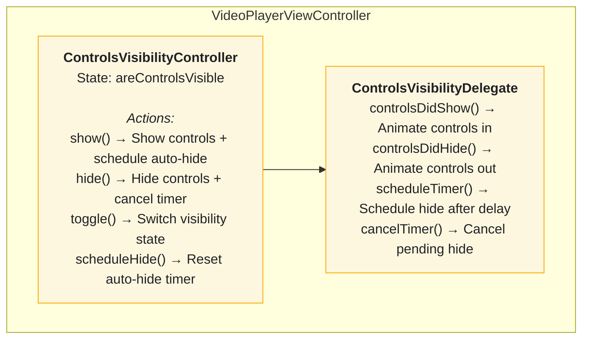
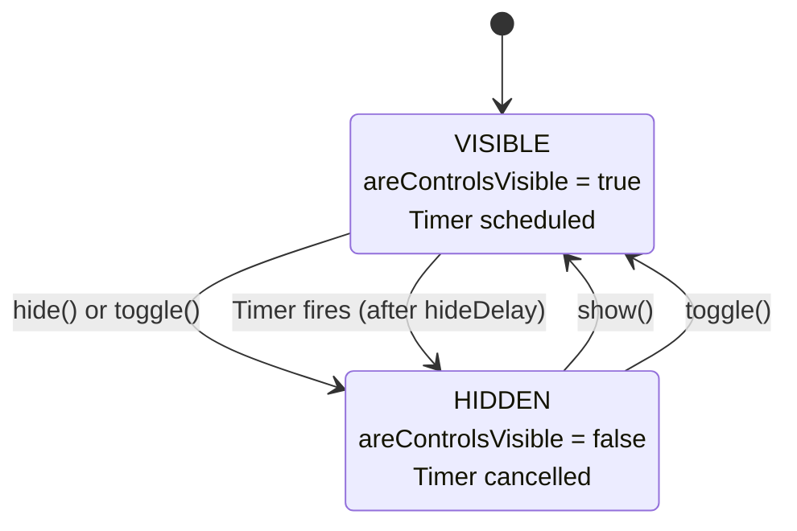

# Controls Visibility

The Controls Visibility feature provides automatic show/hide behavior for video player controls with configurable timing and state management.

---

## Overview



---

## Features

- **Auto-Hide** - Controls automatically hide after configurable delay
- **Timer Management** - Proper timer cancellation prevents stale callbacks
- **Toggle Support** - Tap-to-toggle visibility pattern
- **Delegate Pattern** - Clean separation from UI animation logic
- **State Tracking** - `areControlsVisible` property for external queries
- **VoiceOver-Aware** - Auto-hide is suppressed while VoiceOver is running so controls stay visible for assistive-technology users
- **Testable** - No direct Timer dependency, delegate-based timing, injectable VoiceOver check

---

## Architecture

### ControlsVisibilityController

**File:** `StreamingCoreiOS/Video UI/Controllers/ControlsVisibilityController.swift`

Pure logic controller that manages visibility state and timer scheduling.

```swift
public protocol ControlsVisibilityDelegate: AnyObject {
    func controlsDidShow()
    func controlsDidHide()
    func scheduleTimer(withDelay delay: TimeInterval, callback: @escaping () -> Void)
    func cancelTimer()
}

public final class ControlsVisibilityController {
    public private(set) var areControlsVisible: Bool = true

    private let hideDelay: TimeInterval
    private weak var delegate: ControlsVisibilityDelegate?
    private let isVoiceOverRunning: () -> Bool

    public init(hideDelay: TimeInterval, delegate: ControlsVisibilityDelegate, isVoiceOverRunning: @escaping () -> Bool = { false }) {
        self.hideDelay = hideDelay
        self.delegate = delegate
        self.isVoiceOverRunning = isVoiceOverRunning
    }

    public func show() {
        areControlsVisible = true
        delegate?.controlsDidShow()
        scheduleHide()
    }

    public func hide() {
        areControlsVisible = false
        delegate?.cancelTimer()
        delegate?.controlsDidHide()
    }

    public func toggle() {
        if areControlsVisible {
            hide()
        } else {
            show()
        }
    }

    public func scheduleHide() {
        delegate?.cancelTimer()
        guard !isVoiceOverRunning() else { return }
        delegate?.scheduleTimer(withDelay: hideDelay) { [weak self] in
            self?.hide()
        }
    }

    public func cancelTimer() {
        delegate?.cancelTimer()
    }
}
```

---

## State Flow



---

## Behavior Details

### show()

1. Sets `areControlsVisible = true`
2. Notifies delegate via `controlsDidShow()`
3. Schedules auto-hide via `scheduleHide()`

```swift
public func show() {
    areControlsVisible = true
    delegate?.controlsDidShow()
    scheduleHide()
}
```

### hide()

1. Sets `areControlsVisible = false`
2. Cancels any pending timer
3. Notifies delegate via `controlsDidHide()`

```swift
public func hide() {
    areControlsVisible = false
    delegate?.cancelTimer()
    delegate?.controlsDidHide()
}
```

### toggle()

Toggles between show and hide based on current state:

```swift
public func toggle() {
    if areControlsVisible {
        hide()
    } else {
        show()
    }
}
```

### scheduleHide()

1. Cancels any existing timer
2. Skips scheduling while VoiceOver is running (controls stay visible for assistive-technology users)
3. Otherwise schedules new timer with configured delay
4. Timer callback calls `hide()`

```swift
public func scheduleHide() {
    delegate?.cancelTimer()
    guard !isVoiceOverRunning() else { return }
    delegate?.scheduleTimer(withDelay: hideDelay) { [weak self] in
        self?.hide()
    }
}
```

---

## Usage Example

### VideoPlayerViewController Integration

```swift
class VideoPlayerViewController: UIViewController {
    private var controlsVisibilityController: ControlsVisibilityController!
    private var hideTimer: Timer?

    override func viewDidLoad() {
        super.viewDidLoad()

        controlsVisibilityController = ControlsVisibilityController(
            hideDelay: 3.0,
            delegate: self
        )

        setupTapGesture()
    }

    private func setupTapGesture() {
        let tap = UITapGestureRecognizer(target: self, action: #selector(handleTap))
        view.addGestureRecognizer(tap)
    }

    @objc private func handleTap() {
        controlsVisibilityController.toggle()
    }

    // Called when user interacts (scrubbing, button press)
    private func handleUserInteraction() {
        if controlsVisibilityController.areControlsVisible {
            controlsVisibilityController.scheduleHide()
        }
    }
}

extension VideoPlayerViewController: ControlsVisibilityDelegate {
    func controlsDidShow() {
        UIView.animate(withDuration: 0.3) {
            self.controlsContainerView.alpha = 1.0
        }
    }

    func controlsDidHide() {
        UIView.animate(withDuration: 0.3) {
            self.controlsContainerView.alpha = 0.0
        }
    }

    func scheduleTimer(withDelay delay: TimeInterval, callback: @escaping () -> Void) {
        hideTimer = Timer.scheduledTimer(withTimeInterval: delay, repeats: false) { _ in
            callback()
        }
    }

    func cancelTimer() {
        hideTimer?.invalidate()
        hideTimer = nil
    }
}
```

---

## Interaction Patterns

### Tap to Toggle

```swift
@objc private func handleTap() {
    controlsVisibilityController.toggle()
}
```

### Keep Visible During Interaction

```swift
@objc private func sliderValueChanged(_ slider: UISlider) {
    // Reset the auto-hide timer while user is scrubbing
    controlsVisibilityController.scheduleHide()
}

@objc private func sliderTouchDown(_ slider: UISlider) {
    // Cancel auto-hide while dragging
    controlsVisibilityController.cancelTimer()
}

@objc private func sliderTouchUp(_ slider: UISlider) {
    // Resume auto-hide countdown
    controlsVisibilityController.scheduleHide()
}
```

### Show on Video Start

```swift
func player(_ player: VideoPlayer, didStartPlayingVideo video: Video) {
    controlsVisibilityController.show()
}
```

### Hide on Fullscreen

```swift
func enterFullscreen() {
    controlsVisibilityController.hide()
}
```

---

## Testing

### Test Setup

```swift
private func makeSUT(
    delay: TimeInterval = 5.0
) -> (sut: ControlsVisibilityController, delegate: ControlsVisibilityDelegateSpy) {
    let delegate = ControlsVisibilityDelegateSpy()
    let sut = ControlsVisibilityController(hideDelay: delay, delegate: delegate)
    trackForMemoryLeaks(sut)
    trackForMemoryLeaks(delegate)
    return (sut, delegate)
}

private class ControlsVisibilityDelegateSpy: ControlsVisibilityDelegate {
    enum Message: Equatable {
        case didShow
        case didHide
        case didScheduleTimer(TimeInterval)
    }

    var messages = [Message]()
    private(set) var cancelTimerCallCount = 0
    var timerCallback: (() -> Void)?

    func controlsDidShow() {
        messages.append(.didShow)
    }

    func controlsDidHide() {
        messages.append(.didHide)
    }

    func scheduleTimer(withDelay delay: TimeInterval, callback: @escaping () -> Void) {
        messages.append(.didScheduleTimer(delay))
        timerCallback = callback
    }

    func cancelTimer() {
        cancelTimerCallCount += 1
    }
}
```

### Test Cases

```swift
func test_init_controlsAreVisible() {
    let (sut, _) = makeSUT()

    XCTAssertTrue(sut.areControlsVisible)
}

func test_hide_setsControlsToNotVisible() {
    let (sut, _) = makeSUT()

    sut.hide()

    XCTAssertFalse(sut.areControlsVisible)
}

func test_show_setsControlsToVisible() {
    let (sut, _) = makeSUT()
    sut.hide()

    sut.show()

    XCTAssertTrue(sut.areControlsVisible)
}

func test_toggle_hidesControlsWhenVisible() {
    let (sut, _) = makeSUT()

    sut.toggle()

    XCTAssertFalse(sut.areControlsVisible)
}

func test_toggle_showsControlsWhenHidden() {
    let (sut, _) = makeSUT()
    sut.hide()

    sut.toggle()

    XCTAssertTrue(sut.areControlsVisible)
}

func test_show_schedulesAutoHide() {
    let (sut, delegate) = makeSUT()
    sut.hide()
    delegate.messages.removeAll()

    sut.show()

    XCTAssertTrue(delegate.messages.contains(.didScheduleTimer(5.0)))
}

func test_scheduleHide_hidesAfterDelay() {
    let (sut, delegate) = makeSUT()

    sut.scheduleHide()
    delegate.timerCallback?()  // Simulate timer firing

    XCTAssertFalse(sut.areControlsVisible)
}

func test_scheduleHide_cancelsExistingTimer() {
    let (sut, delegate) = makeSUT()

    sut.scheduleHide()
    sut.scheduleHide()

    XCTAssertEqual(delegate.cancelTimerCallCount, 2)
}

func test_hide_cancelsTimer() {
    let (sut, delegate) = makeSUT()
    sut.scheduleHide()

    sut.hide()

    XCTAssertEqual(delegate.cancelTimerCallCount, 2) // Once from scheduleHide, once from hide
}

func test_scheduleHide_doesNotScheduleWhenVoiceOverIsRunning() {
    let delegate = ControlsVisibilityDelegateSpy()
    let sut = ControlsVisibilityController(hideDelay: 5.0, delegate: delegate, isVoiceOverRunning: { true })

    sut.scheduleHide()

    XCTAssertFalse(delegate.messages.contains(.didScheduleTimer(5.0)))
}
```

---

## Design Benefits

### Separation of Concerns

| ControlsVisibilityController | VideoPlayerViewController |
|---|---|
| State management | Timer implementation |
| Business logic | UI animation |
| Event coordination | User interaction |
| No UIKit dependencies | UIKit-specific code |

### Testability

- No `Timer` dependency in controller
- Delegate spy enables synchronous testing
- Timer callback can be triggered manually in tests
- `isVoiceOverRunning` is injected as a closure (default `{ false }`), so tests drive VoiceOver on/off without a device

### Flexibility

- Configurable hide delay
- Works with any timing mechanism
- UI agnostic - can animate any way

---

## Related Documentation

- [Video Playback](features/VIDEO-PLAYBACK.md) - Player integration
- [AVPLAYER Integration](features/AVPLAYER-INTEGRATION.md) - Platform integration
- [Design Patterns](DESIGN-PATTERNS.md) - Delegate pattern
