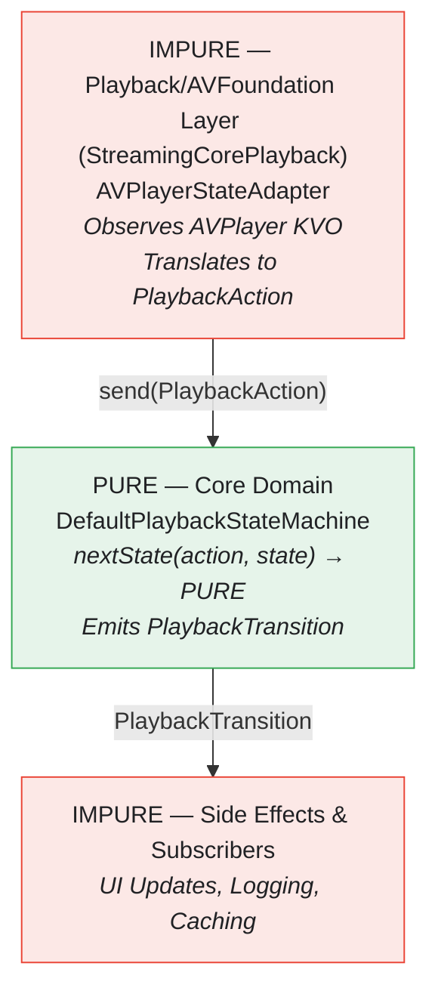
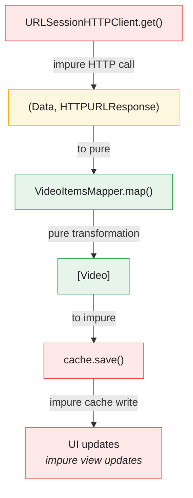

# Dependency Rejection Pattern in StreamingVideoApp

This document explains how StreamingVideoApp implements **Mark Seemann's Dependency Rejection pattern** - a functional programming approach that eliminates dependency injection in favor of pure functions.

---

## What is Dependency Rejection?

**Dependency Rejection** is a pattern where instead of injecting dependencies into classes, you use pure functions that:

1. **Take all needed data as input parameters**
2. **Return data as output**
3. **Have no side effects**
4. **Push impure operations to the edges**

This creates the "**Impure → Pure → Impure**" sandwich architecture.

---

## The Sandwich Architecture



---

## 1. Pure Mappers - Data Transformation Layer

### VideoItemsMapper

**File:** `StreamingCore/StreamingCore/Video API/VideoItemsMapper.swift`

```swift
public final class VideoItemsMapper {
    public static func map(_ data: Data, from response: HTTPURLResponse) throws -> [Video] {
        guard response.isOK, let root = try? JSONDecoder().decode(Root.self, from: data) else {
            throw Error.invalidData
        }
        return root.items
    }
}
```

**Why It's Pure:**
- **No dependencies injected** - entirely static
- **All data as input parameters** (`Data`, `HTTPURLResponse`)
- **Pure transformation** - JSON → domain model
- **No side effects** - doesn't touch cache, network, or external systems
- **Deterministic** - same input always produces same output

**Testability Without Mocks:**
```swift
func test_map_deliversItemsOn200HTTPResponseWithJSONItems() throws {
    let json = makeItemsJSON([item1.json])

    let result = try VideoItemsMapper.map(json, from: HTTPURLResponse(statusCode: 200))

    XCTAssertEqual(result, [item1.model])  // No mocks needed!
}
```

### VideoCommentsMapper

**File:** `StreamingCore/StreamingCore/Video Comments API/VideoCommentsMapper.swift`

```swift
public static func map(_ data: Data, from response: HTTPURLResponse) throws -> [VideoComment] {
    let decoder = JSONDecoder()
    decoder.dateDecodingStrategy = .iso8601

    guard isOK(response), let root = try? decoder.decode(Root.self, from: data) else {
        throw Error.invalidData
    }
    return root.comments
}

private static func isOK(_ response: HTTPURLResponse) -> Bool {
    (200...299).contains(response.statusCode)
}
```

Same pattern - pure static function with no dependencies.

---

## 2. Pure Presenters - Presentation Logic

### VideoPlayerPresenter

**File:** `StreamingCore/StreamingCore/Video Presentation/VideoPlayerPresenter.swift`

```swift
public final class VideoPlayerPresenter {
    public static func map(_ video: Video) -> VideoPlayerViewModel {
        VideoPlayerViewModel(title: video.title, videoURL: video.url)
    }

    public static func formatTime(_ time: TimeInterval) -> String {
        guard time.isFinite && !time.isNaN else { return "0:00" }

        let totalSeconds = Int(time)
        let hours = totalSeconds / 3600
        let minutes = (totalSeconds % 3600) / 60
        let seconds = totalSeconds % 60

        if hours > 0 {
            return String(format: "%d:%02d:%02d", hours, minutes, seconds)
        } else {
            return String(format: "%d:%02d", minutes, seconds)
        }
    }
}
```

**Why It's Pure:**
- Zero dependencies
- All data as parameters
- Pure computation for time formatting
- Testable without any mocks

### VideoCommentsPresenter - Parameters Instead of Injection

**File:** `StreamingCore/StreamingCore/Video Comments Presentation/VideoCommentsPresenter.swift`

```swift
public static func map(
    _ comments: [VideoComment],
    currentDate: Date = Date(),        // Parameter with default
    calendar: Calendar = .current,      // Parameter with default
    locale: Locale = .current           // Parameter with default
) -> VideoCommentsViewModel
```

**Key Insight:** Instead of injecting `Calendar` and `Locale` as dependencies, they're **explicit parameters with defaults**. This enables testing with custom values without a dependency injection framework.

---

## 3. Pure State Machine - Core Business Logic

### PlaybackState

**File:** `StreamingCore/StreamingCore/Video Playback Feature/PlaybackState.swift`

```swift
public enum PlaybackState: Equatable, Sendable {
    case idle
    case loading(URL)
    case ready
    case playing
    case paused
    case buffering(previousState: ResumableState)
    case seeking(to: TimeInterval, previousState: ResumableState)
    case ended
    case failed(PlaybackError)

    // Pure computed properties
    public var isActive: Bool {
        switch self {
        case .playing:
            return true
        case .buffering(let previousState), .seeking(_, let previousState):
            return previousState == .playing
        default:
            return false
        }
    }

    public var canPlay: Bool {
        switch self {
        case .ready, .paused, .ended:
            return true
        default:
            return false
        }
    }
}
```

### DefaultPlaybackStateMachine

**File:** `StreamingCore/StreamingCore/Video Playback Feature/DefaultPlaybackStateMachine.swift`

```swift
@MainActor
public final class DefaultPlaybackStateMachine {
    private let currentDate: () -> Date  // Function parameter, not protocol!

    public init(currentDate: @escaping () -> Date = { Date() }) {
        self.currentDate = currentDate
    }

    // PURE state transition function
    private func nextState(for action: PlaybackAction, from state: PlaybackState) -> PlaybackState? {
        switch (state, action) {
        case (.idle, .load(let url)):
            return .loading(url)
        case (.loading, .didBecomeReady):
            return .ready
        case (.playing, .pause):
            return .paused
        case (.playing, .didStartBuffering):
            return .buffering(previousState: .playing)
        // ... 60+ pure transitions
        default:
            return nil
        }
    }
}
```

**Dependency Rejection in Action:**
- `currentDate` is a **function parameter**, not an injected protocol
- `nextState()` is a **pure function** with no side effects
- Tests can inject any time function for deterministic testing

```swift
func test_transition_containsCorrectTimestamp() {
    let fixedDate = Date()
    let sut = makeSUT(currentDate: { fixedDate })  // Inject time function

    let transition = sut.send(.load(anyURL()))

    XCTAssertEqual(transition?.timestamp, fixedDate)
}
```

---

## 4. Pure Strategies - Business Rules

### ConservativeBitrateStrategy

**File:** `StreamingCore/StreamingCore/Video Performance Feature/ConservativeBitrateStrategy.swift`

```swift
public struct ConservativeBitrateStrategy: BitrateStrategy, Sendable {
    // PURE: Takes parameters, returns bitrate, no side effects
    public func initialBitrate(
        for networkQuality: NetworkQuality,
        availableLevels: [BitrateLevel]
    ) -> Int {
        guard !availableLevels.isEmpty else { return 0 }

        let sortedLevels = availableLevels.sorted()
        let index: Int

        switch networkQuality {
        case .offline, .poor: index = 0
        case .fair: index = sortedLevels.count / 3
        case .good: index = min(sortedLevels.count * 2 / 3, sortedLevels.count - 1)
        case .excellent: index = sortedLevels.count - 1
        }

        return sortedLevels[index].bitrate
    }
}
```

**Why It's Pure:**
- Stateless struct
- All inputs as parameters
- Pure decision logic
- No hidden dependencies

### VideoCachePolicy

**File:** `StreamingCore/StreamingCore/Video Cache/VideoCachePolicy.swift`

```swift
final class VideoCachePolicy {
    static func validate(_ timestamp: Date, against date: Date) -> Bool {
        guard let maxCacheAge = calendar.date(byAdding: .day, value: 7, to: timestamp) else {
            return false
        }
        return date < maxCacheAge
    }
}
```

Pure validation - compares dates based on business rules with no side effects.

---

## 5. The Complete Data Flow

### RemoteVideoLoader Flow

```swift
let (data, response) = try await client.get(from: url)      // IMPURE: HTTP request
let videos = try VideoItemsMapper.map(data, from: response) // PURE: Transform data
try? cache.save(videos)                                     // IMPURE: Cache write
return videos                                               // to caller (UI update)
```



---

## 6. Dependency Injection vs Dependency Rejection

### Traditional DI (NOT used):

```swift
// Anti-pattern - Don't do this:
class VideoCommentsPresenter {
    let calendar: Calendar  // Injected dependency
    let locale: Locale      // Injected dependency

    init(calendar: Calendar = .current, locale: Locale = .current) {
        self.calendar = calendar
        self.locale = locale
    }

    func map(_ comments: [VideoComment], currentDate: Date) -> ViewModel {
        // Use self.calendar, self.locale
    }
}
```

### Dependency Rejection (Used in StreamingVideoApp):

```swift
// Better - Reject dependencies, accept parameters:
class VideoCommentsPresenter {
    static func map(
        _ comments: [VideoComment],
        currentDate: Date = Date(),
        calendar: Calendar = .current,
        locale: Locale = .current
    ) -> ViewModel {
        // Accept as parameters with defaults
    }
}
```

**Benefits of Rejection:**
- No instance state needed
- Parameters explicit at call site
- Easy to override for testing
- Pure function composition
- No factory boilerplate

---

## 7. Where Impurity Is Localized

| Component | Type | Reason |
|-----------|------|--------|
| `URLSessionHTTPClient` | Impure | Must perform network I/O |
| `CoreDataVideoStore` | Impure | Must access database |
| `AVPlayerStateAdapter` | Impure | Must observe system events |
| `dispatchOnMainThread()` | Impure | Must coordinate threads |
| View Controllers | Impure | Must update UI |

---

## 8. Testability Benefits

### Pure Mappers - Zero Mocks

```swift
let result = try VideoItemsMapper.map(json, from: response)
// Just raw data and assertions - no HTTP client mock needed
```

### Pure Presenters - Fast Tests

```swift
XCTAssertEqual(VideoPlayerPresenter.formatTime(3600), "1:00:00")
// No setup, no mocks, runs in microseconds
```

### Pure State Machine - Time Control

```swift
let sut = makeSUT(currentDate: { fixedDate })
let transition = sut.send(.load(url))
XCTAssertEqual(transition?.timestamp, fixedDate)  // Deterministic
```

---

## 9. Pattern Summary

| Pattern | Location | Benefit |
|---------|----------|---------|
| Pure Mappers | `VideoItemsMapper` | Zero dependencies, fully testable |
| Pure Presenters | `VideoPlayerPresenter` | Deterministic, fast tests |
| Pure State Machine | `DefaultPlaybackStateMachine` | Exhaustively testable transitions |
| Pure Strategies | `ConservativeBitrateStrategy` | Swappable algorithms |
| Function Injection | `currentDate: () -> Date` | Better than protocol injection |
| Protocol Boundaries | `VideoLoader`, `VideoCache` | Decouple impure from pure |

---

## Key Takeaways

1. **Pure Domain Core** - Business logic has zero framework dependencies
2. **Impure Boundaries** - I/O operations are clearly marked and localized
3. **No DI Container Needed** - Simple function parameters replace complex factories
4. **Testability Without Mocks** - Pure functions tested with raw data
5. **Time Travel** - Tests control time via function parameters
6. **Composability** - Pure functions compose easily
7. **Type Safety** - Swift's type system enforces purity

---

## Related Documentation

- [Architecture](ARCHITECTURE.md) - Clean Architecture layers
- [SOLID Principles](SOLID.md) - Supporting principles
- [State Machines](STATE-MACHINES.md) - Pure state transition logic
- [TDD](TDD.md) - Testing pure functions

---

## References

- [Dependency Rejection - Mark Seemann](https://blog.ploeh.dk/2017/02/02/dependency-rejection/)
- [Impureim Sandwich](https://blog.ploeh.dk/2020/03/02/impureim-sandwich/)
- [From Dependency Injection to Dependency Rejection](https://fsharpforfunandprofit.com/posts/dependency-injection-1/)
