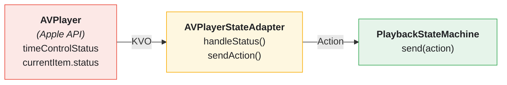
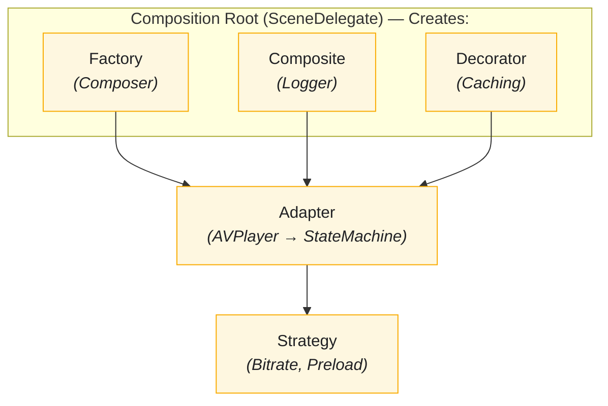

# Design Patterns in StreamingVideoApp

This document explains the key design patterns used throughout the StreamingVideoApp codebase with concrete implementation examples.

---

## Pattern Overview

| Pattern | Purpose | Example |
|---------|---------|---------|
| **Decorator** | Add behavior without modifying existing code | `LoggingVideoPlayerDecorator` |
| **Composite** | Treat groups uniformly with individuals | `CompositeLogger` |
| **Adapter** | Convert one interface to another | `AVPlayerStateAdapter` |
| **Factory** | Encapsulate object creation | `VideosUIComposer` |
| **Strategy** | Interchangeable algorithms | `BitrateStrategy` |
| **Composition Root** | Centralize dependency wiring | `SceneDelegate` |

---

## 1. Decorator Pattern

> *"Attach additional responsibilities to an object dynamically."*

The Decorator pattern is extensively used to add cross-cutting concerns without modifying existing classes. The concrete player decorators below live in the `StreamingCorePlayback` framework.

### LoggingVideoPlayerDecorator

Adds logging to any `VideoPlayer`:

```swift
@MainActor
public final class LoggingVideoPlayerDecorator: VideoPlayer {
    private let decoratee: VideoPlayer
    private let logger: Logger
    private let correlationID: UUID

    public func play() {
        log("Play requested")
        decoratee.play()
    }

    public func pause() {
        log("Pause requested")
        decoratee.pause()
    }

    public func seek(to time: TimeInterval) {
        log("Seek requested to \(time)s")
        decoratee.seek(to: time)
    }

    private func log(_ message: String) {
        let entry = LogEntry(
            level: .info,
            message: message,
            context: LogContext(
                subsystem: "VideoPlayer",
                category: "Playback",
                correlationID: correlationID,
                metadata: [:]
            )
        )
        logger.log(entry)
    }
}
```

### AnalyticsVideoPlayerDecorator

Adds analytics tracking:

```swift
@MainActor
public final class AnalyticsVideoPlayerDecorator: VideoPlayer {
    private let decoratee: VideoPlayer
    private let analyticsLogger: PlaybackAnalyticsLogger

    public func play() {
        Task { [weak self] in
            await self?.analyticsLogger.log(.play, position: 0)
        }
        decoratee.play()
    }

    public func pause() {
        Task { [weak self] in
            await self?.analyticsLogger.log(.pause, position: 0)
        }
        decoratee.pause()
    }
}
```

### Stacking Decorators

Decorators can be stacked for multiple behaviors:

```swift
let player = LoggingVideoPlayerDecorator(
    decoratee: AnalyticsVideoPlayerDecorator(
        decoratee: AVPlayerVideoPlayer(player: avPlayer),
        analyticsLogger: analyticsService
    ),
    logger: compositeLogger,
    correlationID: UUID()
)
// Now player has logging AND analytics
```

---

## 2. Composite Pattern

> *"Compose objects into tree structures and treat them uniformly."*

### CompositeLogger

Forwards logs to multiple destinations:

```swift
public final class CompositeLogger: Logger, @unchecked Sendable {
    private let loggers: [any Logger]

    public init(loggers: [any Logger]) {
        self.loggers = loggers
    }

    public func log(_ entry: LogEntry) {
        for logger in loggers {
            logger.log(entry)
        }
    }
}
```

**Usage:**
```swift
let compositeLogger = CompositeLogger(loggers: [
    ConsoleLogger(),
    OSLogLogger(subsystem: "com.app", category: "General"),
    RemoteLogger(endpoint: analyticsURL)
])

// Single call logs to console, os_log, AND remote server
compositeLogger.log(entry)
```

---

## 3. Adapter Pattern

> *"Convert the interface of a class into another interface clients expect."*

### AVPlayerStateAdapter

Converts AVPlayer observations to `PlaybackAction`:

```swift
public final class AVPlayerStateAdapter: @unchecked Sendable {
    private weak var player: AVPlayer?
    private let actionHandler: @Sendable (PlaybackAction) -> Void
    private var observers: [NSKeyValueObservation] = []
    private var cancellables = Set<AnyCancellable>()

    public init(player: AVPlayer, onAction: @escaping @Sendable (PlaybackAction) -> Void) {
        self.player = player
        self.actionHandler = onAction
    }

    public func startObserving() {
        // Observe timeControlStatus
        let timeControlObserver = player?.observe(\.timeControlStatus) { [weak self] player, _ in
            self?.handleTimeControlStatusChange(player.timeControlStatus)
        }
        observers.append(timeControlObserver!)

        // Observe currentItem status
        let statusObserver = player?.observe(\.currentItem?.status) { [weak self] player, _ in
            self?.handleItemStatusChange(player.currentItem?.status)
        }
        observers.append(statusObserver!)

        // Observe playback end
        NotificationCenter.default.publisher(for: .AVPlayerItemDidPlayToEndTime)
            .sink { [weak self] _ in
                self?.sendAction(.didReachEnd)
            }
            .store(in: &cancellables)
    }

    private func handleTimeControlStatusChange(_ status: AVPlayer.TimeControlStatus) {
        switch status {
        case .playing:
            sendAction(.didStartPlaying)
        case .paused:
            sendAction(.didPause)
        case .waitingToPlayAtSpecifiedRate:
            sendAction(.didStartBuffering)
        @unknown default:
            break
        }
    }

    private func handleItemStatusChange(_ status: AVPlayerItem.Status?) {
        switch status {
        case .readyToPlay:
            sendAction(.didBecomeReady)
        case .failed:
            sendAction(.didFail(.loadFailed(reason: "Item failed to load")))
        default:
            break
        }
    }

    private func sendAction(_ action: PlaybackAction) {
        actionHandler(action)
    }
}
```

**Bridge Diagram:**


### AVAudioSessionAdapter

Wraps AVAudioSession for testability:

```swift
public protocol AudioSessionProtocol {
    func setCategory(_ category: AVAudioSession.Category, mode: AVAudioSession.Mode) throws
    func setActive(_ active: Bool) throws
}

public final class AVAudioSessionAdapter: AudioSessionProtocol {
    private let session: AVAudioSession

    public init(session: AVAudioSession = .sharedInstance()) {
        self.session = session
    }

    public func setCategory(_ category: AVAudioSession.Category, mode: AVAudioSession.Mode) throws {
        try session.setCategory(category, mode: mode)
    }

    public func setActive(_ active: Bool) throws {
        try session.setActive(active)
    }
}
```

---

## 4. Factory Pattern (Composers)

> *"Define an interface for creating objects, but let subclasses decide which class to instantiate."*

### VideosUIComposer

Creates the complete video list UI with all dependencies:

```swift
public enum VideosUIComposer {
    public static func videosComposedWith(
        videoLoader: @MainActor @escaping () async throws -> Paginated<Video>,
        imageLoader: @MainActor @escaping (URL) async throws -> Data,
        selection: @escaping (Video) -> Void
    ) -> ListViewController {
        let presentationAdapter = AsyncLoadResourcePresentationAdapter<Paginated<Video>, VideosViewAdapter>(
            loader: videoLoader
        )

        let controller = makeVideosViewController(title: VideosPresenter.title)
        controller.onRefresh = presentationAdapter.loadResource

        presentationAdapter.presenter = LoadResourcePresenter(
            resourceView: VideosViewAdapter(
                controller: controller,
                imageLoader: imageLoader,
                selection: selection
            ),
            loadingView: WeakRefVirtualProxy(controller),
            errorView: WeakRefVirtualProxy(controller),
            mapper: { $0 }
        )

        return controller
    }

    private static func makeVideosViewController(title: String) -> ListViewController {
        let controller = ListViewController()
        controller.title = title
        return controller
    }
}
```

### VideoPlayerUIComposer

Creates the complete video player, stacking decorators over the base player and wrapping the result in a `StatefulVideoPlayer` for state-machine control. The tvOS target has a parallel `TVPlayerComposer.playerComposedWith(...)`.

```swift
public enum VideoPlayerUIComposer {
    public static func videoPlayerComposedWith(
        video: Video,
        player: VideoPlayer? = nil,
        commentsController: UIViewController? = nil,
        analyticsLogger: PlaybackAnalyticsLogger? = nil,
        structuredLogger: (any StreamingCore.Logger)? = nil
    ) -> VideoPlayerViewController {
        let viewModel = VideoPlayerPresenter.map(video)
        let basePlayer = player ?? AVPlayerVideoPlayer()

        // Decorator chain: base player -> logging -> analytics
        var videoPlayer: VideoPlayer = basePlayer

        if let logger = structuredLogger {
            videoPlayer = LoggingVideoPlayerDecorator(decoratee: videoPlayer, logger: logger)
        }

        if let analytics = analyticsLogger {
            videoPlayer = AnalyticsVideoPlayerDecorator(decoratee: videoPlayer, analyticsLogger: analytics)
        }

        // Wrap with stateful player for state machine control
        let stateMachine = DefaultPlaybackStateMachine()
        let statefulPlayer = StatefulVideoPlayer(decoratee: videoPlayer, stateMachine: stateMachine)

        let controller = VideoPlayerViewController(viewModel: viewModel, player: statefulPlayer)
        controller.statefulPlayer = statefulPlayer

        return controller
    }
}
```

---

## 5. Strategy Pattern

> *"Define a family of algorithms, encapsulate each one, and make them interchangeable."*

### BitrateStrategy

Defines interface for bitrate selection algorithms:

```swift
public protocol BitrateStrategy: Sendable {
    func initialBitrate(for networkQuality: NetworkQuality,
                       availableLevels: [BitrateLevel]) -> Int

    func shouldUpgrade(currentBitrate: Int, bufferHealth: Double,
                      networkQuality: NetworkQuality,
                      availableLevels: [BitrateLevel]) -> Int?

    func shouldDowngrade(currentBitrate: Int, rebufferingRatio: Double,
                        networkQuality: NetworkQuality,
                        availableLevels: [BitrateLevel]) -> Int?
}
```

### ConservativeBitrateStrategy

One implementation - prioritizes stability:

```swift
public struct ConservativeBitrateStrategy: BitrateStrategy, Sendable {
    private let bufferHealthThreshold: Double
    private let rebufferingThreshold: Double

    public init(
        bufferHealthThreshold: Double = 0.7,
        rebufferingThreshold: Double = 0.05
    ) {
        self.bufferHealthThreshold = bufferHealthThreshold
        self.rebufferingThreshold = rebufferingThreshold
    }

    public func initialBitrate(
        for networkQuality: NetworkQuality,
        availableLevels: [BitrateLevel]
    ) -> Int {
        guard !availableLevels.isEmpty else { return 0 }

        let sortedLevels = availableLevels.sorted()
        let index: Int

        switch networkQuality {
        case .offline, .poor: index = 0
        case .fair: index = sortedLevels.count / 3
        case .good: index = min(sortedLevels.count * 2 / 3, sortedLevels.count - 1)
        case .excellent: index = sortedLevels.count - 1
        }

        return sortedLevels[index].bitrate
    }

    public func shouldDowngrade(
        currentBitrate: Int,
        rebufferingRatio: Double,
        networkQuality: NetworkQuality,
        availableLevels: [BitrateLevel]
    ) -> Int? {
        // Downgrade on rebuffering or poor network
        if rebufferingRatio >= rebufferingThreshold || networkQuality <= .poor {
            // Return next lower bitrate
        }
        return nil
    }
}
```

**Usage - Swappable at runtime:**
```swift
class AdaptiveBitrateManager {
    var strategy: BitrateStrategy

    init(strategy: BitrateStrategy = ConservativeBitrateStrategy()) {
        self.strategy = strategy
    }

    func selectBitrate(networkQuality: NetworkQuality, levels: [BitrateLevel]) -> Int {
        return strategy.initialBitrate(for: networkQuality, availableLevels: levels)
    }
}

// Switch strategy based on user preference
if userPrefersHighQuality {
    manager.strategy = AggressiveBitrateStrategy()
} else {
    manager.strategy = ConservativeBitrateStrategy()
}
```

### PredictivePreloadStrategy

Another strategy family for video preloading:

```swift
public protocol PredictivePreloadStrategy: Sendable {
    func videosToPreload(
        currentVideoIndex: Int,
        playlist: [PreloadableVideo],
        networkQuality: NetworkQuality
    ) -> [PreloadableVideo]
}

// Adjacent video preloading
public struct AdjacentVideoPreloadStrategy: PredictivePreloadStrategy, Sendable {
    public func videosToPreload(...) -> [PreloadableVideo] {
        // Preload next 1-2 videos based on network
    }
}
```

---

## 6. Composition Root Pattern

> *"Compose the object graph in a single location near the entry point."*

There are two composition roots — the iOS `StreamingVideoApp/SceneDelegate.swift` and the tvOS `StreamingVideoAppTV/SceneDelegate.swift`. Both wire their object graph through a `VideoService`, which encapsulates the remote-then-local fallback and cache behavior:

```swift
final class SceneDelegate: UIResponder, UIWindowSceneDelegate {
    private lazy var logger = CompositeLogger(loggers: [ConsoleLogger(), OSLogLogger()])
    private lazy var videoService = VideoService(httpClient: httpClient, store: store, logger: logger)

    private lazy var navigationController = UINavigationController(
        rootViewController: VideosUIComposer.videosComposedWith(
            videoLoader: videoService.loadRemoteVideosWithLocalFallback,
            imageLoader: videoService.loadLocalImageWithRemoteFallback,
            selection: showVideoPlayer))

    func scene(_ scene: UIScene, willConnectTo session: UISceneSession, options: UIScene.ConnectionOptions) {
        guard let windowScene = scene as? UIWindowScene else { return }
        window = UIWindow(windowScene: windowScene)
        window?.rootViewController = navigationController
        window?.makeKeyAndVisible()
    }
}
```

The tvOS `SceneDelegate` mirrors this, wiring the same `VideoService` through the dedicated `TVVideosUIComposer`, `TVPlayerComposer`, and `TVCommentsUIComposer` (see [Apple TV](features/APPLE-TV.md)).

**Benefits:**
- Single source of truth for object graph
- Easy to swap implementations
- Clear visualization of dependencies
- No singletons or service locators

---

## Pattern Relationships



---

## Related Documentation

- [Architecture](ARCHITECTURE.md) - Where patterns fit in layers
- [SOLID Principles](SOLID.md) - Principles that enable patterns
- [Dependency Rejection](DEPENDENCY-REJECTION.md) - Pure functions vs patterns
- [State Machines](STATE-MACHINES.md) - State pattern implementation

---

## References

- [Design Patterns - Gang of Four](https://www.amazon.com/Design-Patterns-Elements-Reusable-Object-Oriented/dp/0201633612)
- [Head First Design Patterns](https://www.amazon.com/Head-First-Design-Patterns-Brain-Friendly/dp/0596007124)
- [Refactoring Guru - Design Patterns](https://refactoring.guru/design-patterns)
