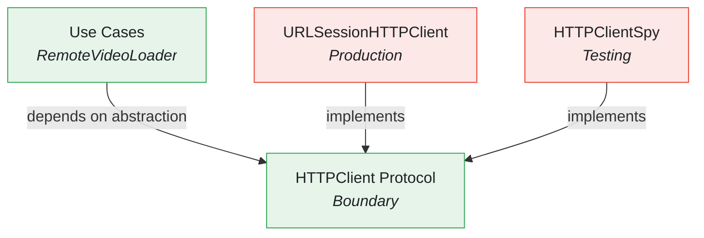
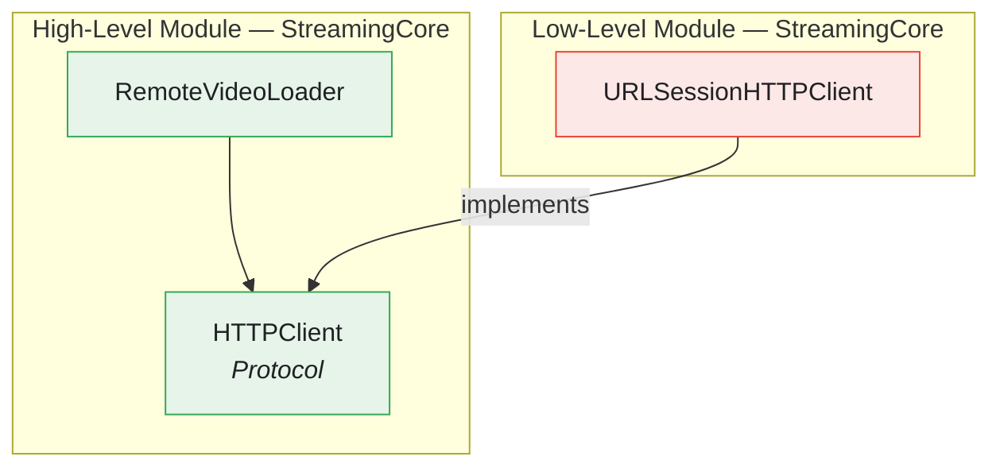

# HTTP Client Infrastructure

The HTTP Client infrastructure provides a clean abstraction over network operations, enabling testability, flexibility, and separation of concerns.

---

## Overview



---

## Features

- **Protocol-Based Abstraction** - Business logic depends on abstraction, not URLSession
- **Async/Await Support** - Modern concurrency with async/await
- **Testability** - Easy to mock, spy, or stub in tests
- **Error Handling** - Clear error types for connectivity and data issues

---

## Architecture

### HTTPClient Protocol

**File:** `StreamingCore/StreamingCore/Video API/HTTPClient.swift`

```swift
public protocol HTTPClient {
    func get(from url: URL) async throws -> (Data, HTTPURLResponse)
}
```

This minimal protocol defines the only operation needed:
- Takes a URL
- Returns raw Data and HTTPURLResponse
- Throws on network errors

### URLSessionHTTPClient

**File:** `StreamingCore/StreamingCore/Video API/URLSessionHTTPClient.swift`

```swift
public final class URLSessionHTTPClient: HTTPClient {
    private let session: URLSession

    public init(session: URLSession = .shared) {
        self.session = session
    }

    public func get(from url: URL) async throws -> (Data, HTTPURLResponse) {
        let (data, response) = try await session.data(from: url)

        guard let httpResponse = response as? HTTPURLResponse else {
            throw NSError(domain: "URLSessionHTTPClient", code: 0,
                userInfo: [NSLocalizedDescriptionKey: "Invalid response type"])
        }

        return (data, httpResponse)
    }
}
```

---

## Endpoint Pattern

### VideoEndpoint

**File:** `StreamingCore/StreamingCore/Video API/VideoEndpoint.swift`

```swift
public enum VideoEndpoint {
    case get(after: Video? = nil)

    public func url(baseURL: URL) -> URL {
        switch self {
        case let .get(video):
            var components = URLComponents()
            components.scheme = baseURL.scheme
            components.host = baseURL.host
            components.path = baseURL.path + "/v1/videos"
            components.queryItems = [
                URLQueryItem(name: "limit", value: "10"),
                video.map { URLQueryItem(name: "after_id", value: $0.id.uuidString) },
            ].compactMap { $0 }
            return components.url!
        }
    }
}
```

Benefits:
- Type-safe endpoint construction
- Pagination support via `after` parameter
- Base URL injection for environment flexibility

---

## Mapper Pattern

### VideoItemsMapper

**File:** `StreamingCore/StreamingCore/Video API/VideoItemsMapper.swift`

```swift
public final class VideoItemsMapper {
    private struct Root: Decodable {
        private let videos: [RemoteVideo]

        private struct RemoteVideo: Decodable {
            let id: UUID
            let title: String
            let description: String?
            let url: URL
            let thumbnailURL: URL
            let duration: TimeInterval

            enum CodingKeys: String, CodingKey {
                case id, title, description, url, duration
                case thumbnailURL = "thumbnail_url"
            }
        }

        var items: [Video] {
            videos.map { Video(id: $0.id, ...) }
        }
    }

    public enum Error: Swift.Error {
        case invalidData
    }

    public static func map(_ data: Data, from response: HTTPURLResponse) throws -> [Video] {
        guard response.isOK, let root = try? JSONDecoder().decode(Root.self, from: data) else {
            throw Error.invalidData
        }
        return root.items
    }
}
```

Key points:
- Private `RemoteVideo` struct isolates API contract from domain
- `Root` struct handles JSON structure
- Maps to domain `Video` model
- Validates HTTP status code

---

## Remote Loader Pattern

### RemoteVideoLoader

**File:** `StreamingCore/StreamingCore/Video API/RemoteVideoLoader.swift`

```swift
public final class RemoteVideoLoader {
    private let url: URL
    private let client: HTTPClient

    public enum Error: Swift.Error, Equatable {
        case connectivity
        case invalidData
    }

    public init(url: URL, client: HTTPClient) {
        self.url = url
        self.client = client
    }
}

extension RemoteVideoLoader: VideoLoader {
    public func load() async throws -> [Video] {
        let data: Data
        let response: HTTPURLResponse
        do {
            (data, response) = try await client.get(from: url)
        } catch {
            throw Error.connectivity
        }
        do {
            return try VideoItemsMapper.map(data, from: response)
        } catch {
            throw Error.invalidData
        }
    }
}
```

Error handling strategy:
- `connectivity` - Network failures (no response)
- `invalidData` - Response received but invalid (bad JSON, wrong status)

---

## Direct Async Usage

Loaders call `get(from:)` directly with async/await — no Combine bridge:

```swift
let (data, response) = try await client.get(from: url)
return try VideoItemsMapper.map(data, from: response)
```

---

## HTTP Response Validation

### HTTPURLResponse Extension

```swift
extension HTTPURLResponse {
    private static var OK_200: Int { 200 }

    var isOK: Bool {
        statusCode == HTTPURLResponse.OK_200
    }
}
```

---

## Usage in Composition Root

```swift
// SceneDelegate.swift
private lazy var httpClient: HTTPClient = {
    URLSessionHTTPClient(session: URLSession(configuration: .ephemeral))
}()

private func makeRemoteVideoLoader(after: Video? = nil) async throws -> [Video] {
    let url = VideoEndpoint.get(after: after).url(baseURL: baseURL)
    let (data, response) = try await httpClient.get(from: url)
    return try VideoItemsMapper.map(data, from: response)
}
```

---

## Testing

### HTTPClientSpy

```swift
final class HTTPClientSpy: HTTPClient {
    private(set) var requestedURLs: [URL] = []
    private var completions: [(Result<(Data, HTTPURLResponse), Error>)] = []

    func get(from url: URL) async throws -> (Data, HTTPURLResponse) {
        requestedURLs.append(url)
        // Return stubbed result or throw
    }

    func complete(with data: Data, response: HTTPURLResponse, at index: Int = 0) {
        completions[index] = .success((data, response))
    }

    func complete(with error: Error, at index: Int = 0) {
        completions[index] = .failure(error)
    }
}
```

### RemoteVideoLoader Tests

```swift
func test_load_requestsDataFromURL() async {
    let url = URL(string: "https://example.com/videos")!
    let (sut, client) = makeSUT(url: url)

    _ = try? await sut.load()

    XCTAssertEqual(client.requestedURLs, [url])
}

func test_load_deliversConnectivityErrorOnClientError() async {
    let (sut, client) = makeSUT()
    client.complete(with: NSError(domain: "test", code: 0))

    do {
        _ = try await sut.load()
        XCTFail("Expected error")
    } catch {
        XCTAssertEqual(error as? RemoteVideoLoader.Error, .connectivity)
    }
}

func test_load_deliversInvalidDataErrorOnNon200HTTPResponse() async {
    let (sut, client) = makeSUT()
    let response = HTTPURLResponse(url: anyURL(), statusCode: 400, httpVersion: nil, headerFields: nil)!
    client.complete(with: Data(), response: response)

    do {
        _ = try await sut.load()
        XCTFail("Expected error")
    } catch {
        XCTAssertEqual(error as? RemoteVideoLoader.Error, .invalidData)
    }
}
```

---

## Dependency Inversion

The HTTPClient follows the Dependency Inversion Principle:



- High-level business logic defines the protocol
- Low-level infrastructure implements it
- Business logic never imports URLSession

---

## Related Documentation

- [Caching Infrastructure](CACHING-INFRASTRUCTURE.md) - Local storage layer
- [Composition Root](COMPOSITION-ROOT.md) - Dependency wiring
- [SOLID](SOLID.md) - Dependency Inversion Principle
- [Architecture](ARCHITECTURE.md) - Layer boundaries
