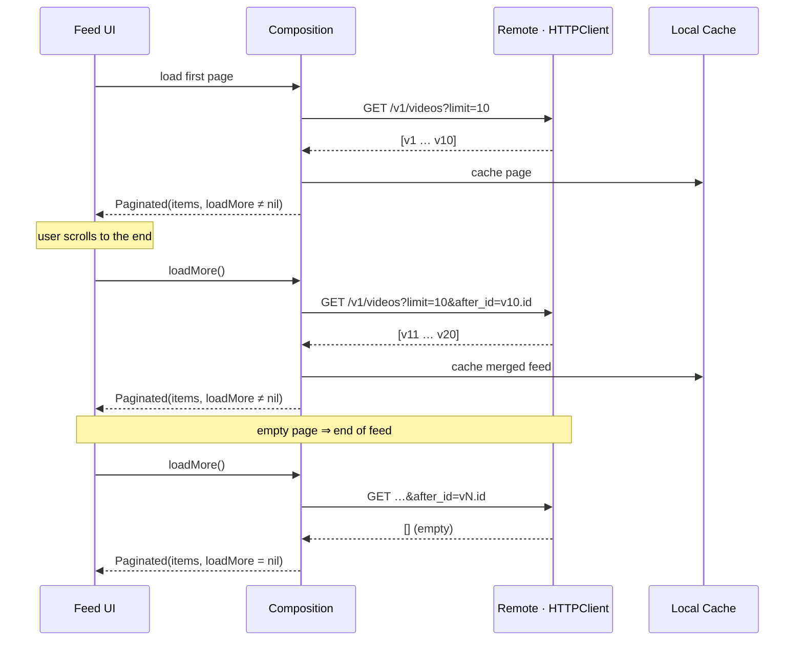

# Pagination

The video feed is paginated with a **keyset (cursor-based) strategy**. Each request asks for a
fixed-size page anchored to the last item the client has already seen, rather than a numeric
offset or page index.

---

## Why cursor-based (keyset) instead of offset

| | Offset / page number | Keyset cursor (`after_id`) |
|---|---|---|
| Request | `?page=3` / `?offset=20` | `?after_id=<last-item-id>` |
| Stability under inserts | Items shift between pages when new rows are inserted at the head | Anchored to a specific item, so new inserts never duplicate or skip rows |
| Server cost | `OFFSET` scans and discards preceding rows | Seeks directly to the anchor via an indexed column |
| Trade-off | Can jump to an arbitrary page | Sequential only (no "jump to page N") |

An infinite-scroll feed only ever needs "the next page after what I have", so keyset is the right
fit and avoids the classic offset bug where an insertion at the top shifts every subsequent page.

---

## The wire contract

```
GET <base>/v1/videos?limit=10                    # first page
GET <base>/v1/videos?limit=10&after_id=<uuid>    # subsequent pages
```

- `limit` — page size, currently fixed at `10`.
- `after_id` — the cursor: the `id` (a `UUID`) of the **last video** in the page the client
  currently holds. Omitted on the first request.

The URL is built by `VideoEndpoint`, the single source of truth for the request shape:

```swift
// StreamingCore/Video API/VideoEndpoint.swift
public enum VideoEndpoint {
    case get(after: Video? = nil)

    public func url(baseURL: URL) -> URL {
        switch self {
        case let .get(video):
            var components = URLComponents()
            components.scheme = baseURL.scheme
            components.host = baseURL.host
            components.path = baseURL.path + "/v1/videos"
            components.queryItems = [
                URLQueryItem(name: "limit", value: "10"),
                video.map { URLQueryItem(name: "after_id", value: $0.id.uuidString) },
            ].compactMap { $0 }
            return components.url!
        }
    }
}
```

`video.map { ... }` combined with `.compactMap { $0 }` is what makes `after_id` conditional:
`nil` video → no `after_id` → first page.

## Request flow



---

## The `Paginated` value type

Pages are carried by a generic value type that couples the items with the capability to fetch the
next page:

```swift
// StreamingCore/Shared API/Paginated.swift
public struct Paginated<Item: Sendable>: Sendable {
    public let items: [Item]
    public let loadMore: (@Sendable () async throws -> Self)?

    public init(items: [Item], loadMore: (@Sendable () async throws -> Self)? = nil) {
        self.items = items
        self.loadMore = loadMore
    }
}
```

The presence or absence of `loadMore` **is** the end-of-feed signal:

- `loadMore != nil` → more pages may exist; calling it fetches the next `Paginated<Item>`.
- `loadMore == nil` → last page reached; the UI stops requesting.

The next page is a *whole new* `Paginated` — including its own `loadMore` — so pagination is a
self-perpetuating chain: each page knows how to produce the next one, and the last page produces
`nil`.

---

## How "load more" is composed

The load-more composition lives in the shared `VideoService` (StreamingCorePlayback framework),
which each composition root — both the iOS and tvOS `SceneDelegate` — merely instantiates. It wires
the cursor into a fresh remote request and merges it with the cache, using structured concurrency:

```swift
// StreamingCore/StreamingCorePlayback/VideoService.swift (abridged)
private func loadMoreRemoteVideos(last: Video?) async throws -> Paginated<Video> {
    async let remote = loadRemoteVideos(after: last)        // next remote page…
    let cachedItems = try localVideoLoader.load()           // …concurrent with the cache read
    let newItems = try await remote
    let items = cachedItems + newItems
    try? localVideoLoader.save(items)
    return makePage(items: items, last: newItems.last)      // cursor = last NEW item
}

private func loadRemoteVideos(after: Video? = nil) async throws -> [Video] {
    let url = VideoEndpoint.get(after: after).url(baseURL: baseURL)
    let (data, response) = try await httpClient.get(from: url)
    return try VideoItemsMapper.map(data, from: response)
}

private func makePage(items: [Video], last: Video?) -> Paginated<Video> {
    Paginated(items: items, loadMore: last.map { last in
        { @MainActor @Sendable in try await self.loadMoreRemoteVideos(last: last) }
    })
}
```

The same `VideoService` and `Paginated` chain drive pagination on both platforms: the iOS feed and
the tvOS feed (whose `TVFeedLoaderPresentationAdapter.loadMoreIfAvailable()` is wired through
`TVVideosUIComposer.onLoadMore`). See [Apple TV](features/APPLE-TV.md) for the tvOS surface.

Key points:
- The cursor threaded into the next page is `newItems.last` — the last item of the **newly fetched**
  remote page, not the merged list. This keeps the `after_id` advancing by one real page each time.
- When a remote page comes back empty, `newItems.last` is `nil`, so `last.map { ... }` yields `nil`,
  `loadMore` becomes `nil`, and pagination terminates.
- The cache read and the remote fetch run concurrently via `async let`; the merged page is re-saved,
  so the local fallback always holds the full scrolled-through feed for offline use.

---

## Testing

Integration tests drive pagination through an `AsyncThrowingStream`-backed `LoaderSpy`, awaited from
`async` test methods:

```swift
// StreamingVideoAppTests/Helpers/VideosUIIntegrationTests+LoaderSpy.swift (abridged)
@MainActor
final class LoaderSpy {
    var loadCallCount: Int { /* pending first-load requests */ }
    var loadMoreCallCount: Int { /* pending load-more requests */ }

    func load() async throws -> Paginated<Video> { /* suspends until completed */ }

    func completeLoadMore(with videos: [Video] = [], lastPage: Bool = false, at index: Int = 0) async {
        // yields a page whose `loadMore` is nil when lastPage == true
    }
}
```

"No more pages" is asserted by completing a load-more with `lastPage: true` (a page whose `loadMore`
is `nil`), then verifying a subsequent load-more action produces **no** new request.

---

## Concurrency

Pagination runs on **structured concurrency**. `Paginated.loadMore` is an
`(@Sendable () async throws -> Self)?`:

```swift
public struct Paginated<Item: Sendable>: Sendable {
    public let items: [Item]
    public let loadMore: (@Sendable () async throws -> Self)?
}
```

`loadMoreRemoteVideos` is an `async throws` method that fetches the cache and the next remote
page concurrently with `async let`; cancellation is owned by the presentation adapter's stored
`Task`, cancelled in `deinit`. The **cursor scheme (`after_id` + `limit`) is orthogonal to
concurrency** — it is the same keyset design used by the Essential Feed reference in its async form.
