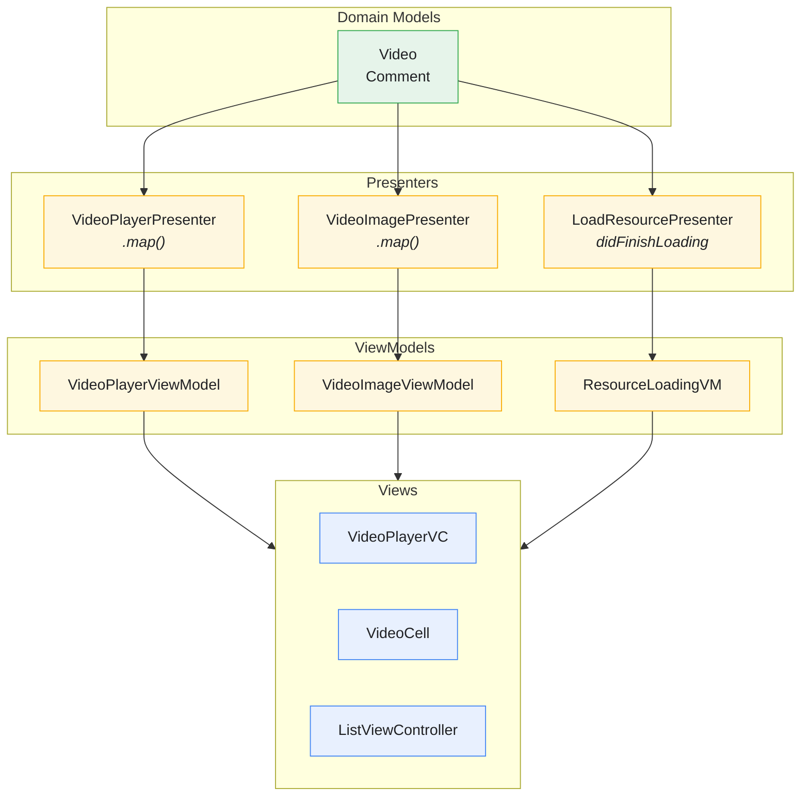
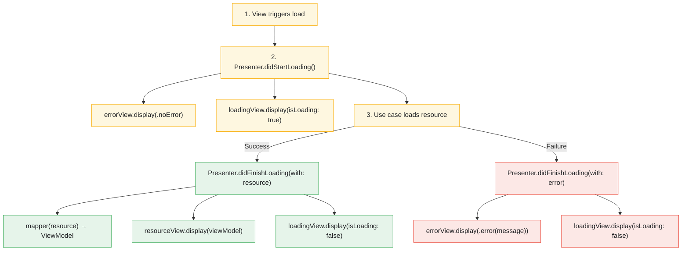
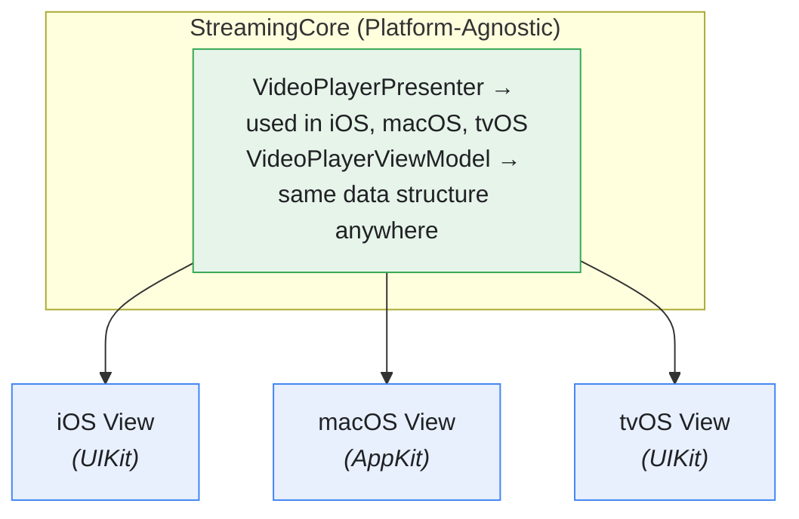

# Presenters and ViewModels

The Presentation layer provides clean separation between domain logic and UI, using Presenters for transformation logic and ViewModels as simple data structures for view consumption.

---

## Overview



---

## Features

- **Dumb ViewModels** - Pure data structures with no logic
- **Smart Presenters** - Transformation and formatting logic
- **Generic ResourcePresenter** - Reusable loading/error handling
- **Protocol-Based Views** - Views conform to display protocols
- **Localized Strings** - Presenters handle localization
- **Testable Logic** - Presentation logic easily unit tested

---

## Shared Presentation

### LoadResourcePresenter

**File:** `StreamingCore/StreamingCore/Shared Presentation/LoadResourcePresenter.swift`

Generic presenter for loading any resource with consistent loading/error states.

```swift
public protocol ResourceView {
    associatedtype ResourceViewModel
    func display(_ viewModel: ResourceViewModel)
}

public final class LoadResourcePresenter<Resource, View: ResourceView> {
    public typealias Mapper = (Resource) throws -> View.ResourceViewModel

    private let resourceView: View
    private let loadingView: ResourceLoadingView
    private let errorView: ResourceErrorView
    private let mapper: Mapper

    public static var loadError: String {
        NSLocalizedString("GENERIC_CONNECTION_ERROR",
                          tableName: "Shared",
                          bundle: Bundle(for: Self.self),
                          comment: "Error message displayed when we can't load the resource from the server")
    }

    public init(resourceView: View, loadingView: ResourceLoadingView, errorView: ResourceErrorView, mapper: @escaping Mapper) {
        self.resourceView = resourceView
        self.loadingView = loadingView
        self.errorView = errorView
        self.mapper = mapper
    }

    // Convenience initializer when Resource == ViewModel (no mapping needed)
    public init(resourceView: View, loadingView: ResourceLoadingView, errorView: ResourceErrorView) where Resource == View.ResourceViewModel {
        self.resourceView = resourceView
        self.loadingView = loadingView
        self.errorView = errorView
        self.mapper = { $0 }
    }

    public func didStartLoading() {
        errorView.display(.noError)
        loadingView.display(ResourceLoadingViewModel(isLoading: true))
    }

    public func didFinishLoading(with resource: Resource) {
        do {
            resourceView.display(try mapper(resource))
            loadingView.display(ResourceLoadingViewModel(isLoading: false))
        } catch {
            didFinishLoading(with: error)
        }
    }

    public func didFinishLoading(with error: Error) {
        errorView.display(.error(message: Self.loadError))
        loadingView.display(ResourceLoadingViewModel(isLoading: false))
    }
}
```

### View Protocols

**ResourceLoadingView:**
```swift
public protocol ResourceLoadingView {
    func display(_ viewModel: ResourceLoadingViewModel)
}
```

**ResourceErrorView:**
```swift
public protocol ResourceErrorView {
    func display(_ viewModel: ResourceErrorViewModel)
}
```

### Shared ViewModels

**ResourceLoadingViewModel:**
```swift
public struct ResourceLoadingViewModel {
    public let isLoading: Bool
}
```

**ResourceErrorViewModel:**
```swift
public struct ResourceErrorViewModel {
    public let message: String?

    static var noError: ResourceErrorViewModel {
        return ResourceErrorViewModel(message: nil)
    }

    static func error(message: String) -> ResourceErrorViewModel {
        return ResourceErrorViewModel(message: message)
    }
}
```

---

## Video Presentation

### VideoPlayerPresenter

**File:** `StreamingCore/StreamingCore/Video Presentation/VideoPlayerPresenter.swift`

Maps Video domain model to VideoPlayerViewModel and provides time formatting.

```swift
public final class VideoPlayerPresenter {
    public static var title: String {
        NSLocalizedString(
            "VIDEO_PLAYER_VIEW_TITLE",
            tableName: "VideoPlayer",
            bundle: Bundle(for: VideoPlayerPresenter.self),
            comment: "Title for the video player view")
    }

    public static func map(_ video: Video) -> VideoPlayerViewModel {
        VideoPlayerViewModel(
            title: video.title,
            videoURL: video.url
        )
    }

    public static func formatTime(_ time: TimeInterval) -> String {
        guard time.isFinite && !time.isNaN else { return "0:00" }

        let totalSeconds = Int(time)
        let hours = totalSeconds / 3600
        let minutes = (totalSeconds % 3600) / 60
        let seconds = totalSeconds % 60

        if hours > 0 {
            return String(format: "%d:%02d:%02d", hours, minutes, seconds)
        } else {
            return String(format: "%d:%02d", minutes, seconds)
        }
    }
}
```

### VideoPlayerViewModel

**File:** `StreamingCore/StreamingCore/Video Presentation/VideoPlayerViewModel.swift`

```swift
public struct VideoPlayerViewModel {
    public let title: String
    public let videoURL: URL

    public init(title: String, videoURL: URL) {
        self.title = title
        self.videoURL = videoURL
    }
}
```

### VideoImagePresenter

**File:** `StreamingCore/StreamingCore/Video Presentation/VideoImagePresenter.swift`

Maps Video to VideoImageViewModel for cell display.

```swift
public final class VideoImagePresenter {
    public static func map(_ video: Video) -> VideoImageViewModel {
        VideoImageViewModel(
            title: video.title,
            description: video.description)
    }
}
```

### VideoImageViewModel

**File:** `StreamingCore/StreamingCore/Video Presentation/VideoImageViewModel.swift`

```swift
public struct VideoImageViewModel {
    public let title: String
    public let description: String?

    public var hasDescription: Bool {
        return description != nil
    }
}
```

### VideosPresenter

**File:** `StreamingCore/StreamingCore/Video Presentation/VideosPresenter.swift`

Provides localized title for videos list.

```swift
public final class VideosPresenter {
    public static var title: String {
        NSLocalizedString("VIDEO_VIEW_TITLE",
            tableName: "Video",
            bundle: Bundle(for: VideosPresenter.self),
            comment: "Title for the video view")
    }
}
```

### VideoViewModel

**File:** `StreamingCore/StreamingCore/Video Presentation/VideoViewModel.swift`

```swift
public struct VideoViewModel {
    public let title: String?
    public let description: String?

    public init(title: String?, description: String?) {
        self.title = title
        self.description = description
    }

    public var hasTitle: Bool {
        return title != nil
    }
}
```

---

## Data Flow



---

## Usage Examples

### Using LoadResourcePresenter with Videos

```swift
typealias VideosPresentationAdapter = AsyncLoadResourcePresentationAdapter<Paginated<Video>, VideosViewAdapter>

let presentationAdapter = VideosPresentationAdapter(loader: videoLoader)

let videosController = makeVideosViewController()
videosController.onRefresh = presentationAdapter.loadResource

presentationAdapter.presenter = LoadResourcePresenter(
    resourceView: VideosViewAdapter(
        controller: videosController,
        imageLoader: imageLoader,
        selection: selection),
    loadingView: WeakRefVirtualProxy(videosController),
    errorView: WeakRefVirtualProxy(videosController))
```

### Using VideoPlayerPresenter

```swift
let video: Video = ...
let viewModel = VideoPlayerPresenter.map(video)

// Format playback time
let currentTime: TimeInterval = 125  // 2:05
let formattedTime = VideoPlayerPresenter.formatTime(currentTime)
// Result: "2:05"

let longVideo: TimeInterval = 3725  // 1:02:05
let formattedLongTime = VideoPlayerPresenter.formatTime(longVideo)
// Result: "1:02:05"
```

### Using VideoImagePresenter for Cells

```swift
func cellController(for video: Video) -> CellController {
    let viewModel = VideoImagePresenter.map(video)
    // Use viewModel to configure cell
}
```

---

## Testing

### LoadResourcePresenter Tests

```swift
func test_didStartLoading_displaysLoadingAndNoError() {
    let (sut, view) = makeSUT()

    sut.didStartLoading()

    XCTAssertEqual(view.messages, [
        .display(errorMessage: nil),
        .display(isLoading: true)
    ])
}

func test_didFinishLoadingWithResource_displaysResourceAndStopsLoading() {
    let (sut, view) = makeSUT(mapper: { "\($0) view model" })

    sut.didFinishLoading(with: "resource")

    XCTAssertEqual(view.messages, [
        .display(resourceViewModel: "resource view model"),
        .display(isLoading: false)
    ])
}

func test_didFinishLoadingWithError_displaysErrorAndStopsLoading() {
    let (sut, view) = makeSUT()

    sut.didFinishLoading(with: anyNSError())

    XCTAssertEqual(view.messages, [
        .display(errorMessage: localized("GENERIC_CONNECTION_ERROR")),
        .display(isLoading: false)
    ])
}
```

### VideoPlayerPresenter Tests

```swift
func test_map_createsViewModelFromVideo() {
    let video = makeVideo(title: "Test", url: anyURL())

    let viewModel = VideoPlayerPresenter.map(video)

    XCTAssertEqual(viewModel.title, "Test")
    XCTAssertEqual(viewModel.videoURL, video.url)
}

func test_formatTime_formatsSecondsCorrectly() {
    XCTAssertEqual(VideoPlayerPresenter.formatTime(0), "0:00")
    XCTAssertEqual(VideoPlayerPresenter.formatTime(5), "0:05")
    XCTAssertEqual(VideoPlayerPresenter.formatTime(65), "1:05")
    XCTAssertEqual(VideoPlayerPresenter.formatTime(3665), "1:01:05")
}

func test_formatTime_handlesInvalidInput() {
    XCTAssertEqual(VideoPlayerPresenter.formatTime(.nan), "0:00")
    XCTAssertEqual(VideoPlayerPresenter.formatTime(.infinity), "0:00")
}
```

---

## Design Patterns

### Mapper Pattern

Presenters use static `map` functions to transform domain models:

```swift
// Domain → ViewModel transformation
public static func map(_ video: Video) -> VideoPlayerViewModel
```

Benefits:
- Pure functions, easy to test
- No state, no side effects
- Clear input/output contract

### Generic Presenter Pattern

`LoadResourcePresenter<Resource, View>` handles any resource type:

```swift
// Videos
LoadResourcePresenter<Paginated<Video>, VideosViewAdapter>

// Comments
LoadResourcePresenter<[VideoComment], CommentsViewAdapter>

// Image Data
LoadResourcePresenter<Data, ImageViewAdapter>
```

### View Protocol Pattern

Views conform to specific protocols:

```swift
class ListViewController: UITableViewController, ResourceLoadingView, ResourceErrorView {
    func display(_ viewModel: ResourceLoadingViewModel) {
        refreshControl?.update(viewModel.isLoading)
    }

    func display(_ viewModel: ResourceErrorViewModel) {
        errorView?.message = viewModel.message
    }
}
```

---

## Architecture Benefits

### Separation of Concerns

```
Presenter                          ViewModel                     View
─────────                          ─────────                     ────
• Transforms data                  • Holds display data          • Renders UI
• Formats strings                  • No logic                    • Binds to ViewModel
• Handles localization             • Immutable                   • User interaction
• Contains presentation logic      • Value type                  • UIKit/SwiftUI
```

### Testability

- ViewModels are simple structs - easy to construct in tests
- Presenters have no UI dependencies - pure unit tests
- View protocols enable test doubles

### Platform Independence



---

## Related Documentation

- [Composition Root](COMPOSITION-ROOT.md) - Wiring presenters to views
- [Cell Controllers](CELL-CONTROLLERS.md) - Cell-level presentation
- [SOLID Principles](SOLID.md) - Single Responsibility in presentation
- [Design Patterns](DESIGN-PATTERNS.md) - MVP pattern details
