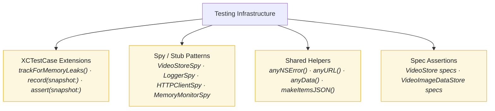

# Testing Infrastructure

The Testing Infrastructure provides reusable patterns, helpers, and extensions for writing maintainable, reliable tests across all modules.

---

## Overview



---

## Features

- **Memory Leak Detection** - Automatic teardown checks
- **Snapshot Testing** - UI screenshot comparison
- **Message-Based Spies** - Record interactions, not counts
- **Spec Assertions** - Reusable protocol behavior validation
- **Shared Test Helpers** - Common test data factories
- **Date Manipulation** - Calendar-safe date arithmetic

---

## XCTestCase Extensions

### Memory Leak Tracking

**File:** `StreamingCoreTests/Helpers/XCTestCase+MemoryLeakTracking.swift`

Detects memory leaks by asserting objects are deallocated after test completion.

```swift
extension XCTestCase {
    @MainActor
    func trackForMemoryLeaks(_ instance: AnyObject, file: StaticString = #filePath, line: UInt = #line) {
        addTeardownBlock { [weak instance] in
            XCTAssertNil(instance, "Instance should have been deallocated. Potential memory leak.", file: file, line: line)
        }
    }
}
```

**Usage:**

```swift
func test_example() {
    let sut = makeSUT()
    trackForMemoryLeaks(sut)

    // Test code...
}

private func makeSUT(file: StaticString = #filePath, line: UInt = #line) -> SomeClass {
    let sut = SomeClass()
    trackForMemoryLeaks(sut, file: file, line: line)
    return sut
}
```

### Snapshot Testing

**File:** `StreamingCoreiOSTests/Helpers/XCTestCase+Snapshot.swift`

Record and compare UI snapshots for visual regression testing.

```swift
extension XCTestCase {

    func assert(snapshot: UIImage, named name: String, file: StaticString = #filePath, line: UInt = #line) {
        let snapshotURL = makeSnapshotURL(named: name, file: file)
        let snapshotData = makeSnapshotData(for: snapshot, file: file, line: line)

        guard let storedSnapshotData = try? Data(contentsOf: snapshotURL) else {
            XCTFail("Failed to load stored snapshot at URL: \(snapshotURL). Use the `record` method to store a snapshot before asserting.", file: file, line: line)
            return
        }

        if snapshotData != storedSnapshotData {
            let temporarySnapshotURL = URL(fileURLWithPath: NSTemporaryDirectory(), isDirectory: true)
                .appendingPathComponent(snapshotURL.lastPathComponent)

            try? snapshotData?.write(to: temporarySnapshotURL)

            XCTFail("New snapshot does not match stored snapshot. New snapshot URL: \(temporarySnapshotURL), Stored snapshot URL: \(snapshotURL)", file: file, line: line)
        }
    }

    func record(snapshot: UIImage, named name: String, file: StaticString = #filePath, line: UInt = #line) {
        let snapshotURL = makeSnapshotURL(named: name, file: file)
        let snapshotData = makeSnapshotData(for: snapshot, file: file, line: line)

        do {
            try FileManager.default.createDirectory(
                at: snapshotURL.deletingLastPathComponent(),
                withIntermediateDirectories: true
            )

            try snapshotData?.write(to: snapshotURL)
            XCTFail("Record succeeded - use `assert` to compare the snapshot from now on.", file: file, line: line)
        } catch {
            XCTFail("Failed to record snapshot with error: \(error)", file: file, line: line)
        }
    }

    private func makeSnapshotURL(named name: String, file: StaticString) -> URL {
        return URL(fileURLWithPath: String(describing: file))
            .deletingLastPathComponent()
            .appendingPathComponent("snapshots")
            .appendingPathComponent("\(name).png")
    }

    private func makeSnapshotData(for snapshot: UIImage, file: StaticString, line: UInt) -> Data? {
        guard let data = snapshot.pngData() else {
            XCTFail("Failed to generate PNG data representation from snapshot", file: file, line: line)
            return nil
        }
        return data
    }
}
```

**Usage:**

```swift
// First time: Record the snapshot
func test_videoCell_rendersCorrectly() {
    let sut = makeVideoCell()

    // record(snapshot: sut.snapshot(), named: "VIDEO_CELL")  // Run once to record
    assert(snapshot: sut.snapshot(), named: "VIDEO_CELL")     // Then compare
}
```

---

## Spy Pattern

### Message-Based Spy Structure

Spies record messages (not counts) to verify both the action and its order.

```swift
class VideoStoreSpy: VideoStore {
    enum ReceivedMessage: Equatable {
        case deleteCachedVideos
        case insert([LocalVideo], Date)
        case retrieve
    }

    // Message accumulation pattern (not counters!)
    private(set) var receivedMessages = [ReceivedMessage]()

    private var deletionResult: Result<Void, Error>?
    private var insertionResult: Result<Void, Error>?
    private var retrievalResult: Result<CachedVideos?, Error>?

    func deleteCachedVideos() throws {
        receivedMessages.append(.deleteCachedVideos)
        try deletionResult?.get()
    }

    func insert(_ videos: [LocalVideo], timestamp: Date) throws {
        receivedMessages.append(.insert(videos, timestamp))
        try insertionResult?.get()
    }

    func retrieve() throws -> CachedVideos? {
        receivedMessages.append(.retrieve)
        return try retrievalResult?.get()
    }

    // MARK: - Completion Helpers

    func completeDeletion(with error: Error) {
        deletionResult = .failure(error)
    }

    func completeDeletionSuccessfully() {
        deletionResult = .success(())
    }

    func completeInsertion(with error: Error) {
        insertionResult = .failure(error)
    }

    func completeInsertionSuccessfully() {
        insertionResult = .success(())
    }

    func completeRetrieval(with error: Error) {
        retrievalResult = .failure(error)
    }

    func completeRetrievalWithEmptyCache() {
        retrievalResult = .success(.none)
    }

    func completeRetrieval(with videos: [LocalVideo], timestamp: Date) {
        retrievalResult = .success((videos, timestamp))
    }
}
```

**Usage:**

```swift
func test_save_deletesCacheBeforeInserting() throws {
    let (sut, store) = makeSUT()
    let videos = uniqueVideos()

    try sut.save(videos.models)

    XCTAssertEqual(store.receivedMessages, [
        .deleteCachedVideos,
        .insert(videos.local, currentDate)
    ])
}
```

### Logger Spy

```swift
final class LoggerSpy: Logger, @unchecked Sendable {
    private(set) var loggedEntries: [LogEntry] = []
    let minimumLevel: LogLevel

    var loggedMessages: [String] {
        loggedEntries.map(\.message)
    }

    var loggedLevels: [LogLevel] {
        loggedEntries.map(\.level)
    }

    init(minimumLevel: LogLevel = .debug) {
        self.minimumLevel = minimumLevel
    }

    func log(_ entry: LogEntry) {
        guard entry.level >= minimumLevel else { return }
        loggedEntries.append(entry)
    }

    func reset() {
        loggedEntries.removeAll()
    }
}
```

---

## Shared Test Helpers

**File:** `StreamingCoreTests/Helpers/SharedTestHelpers.swift`

### Generic Test Data

```swift
func anyNSError() -> NSError {
    return NSError(domain: "any error", code: 0)
}

func anyURL() -> URL {
    return URL(string: "https://any-url.com")!
}

func anyData() -> Data {
    return Data("any data".utf8)
}

func anyVideoURL() -> URL {
    return URL(string: "https://example.com/video.mp4")!
}
```

### JSON Construction

```swift
func makeItemsJSON(_ items: [[String: Any]]) -> Data {
    let json = ["items": items]
    return try! JSONSerialization.data(withJSONObject: json)
}
```

### HTTP Response Convenience

```swift
extension HTTPURLResponse {
    convenience init(statusCode: Int) {
        self.init(url: anyURL(), statusCode: statusCode, httpVersion: nil, headerFields: nil)!
    }
}
```

### Date Arithmetic

```swift
extension Date {
    func adding(seconds: TimeInterval) -> Date {
        return self + seconds
    }

    func adding(minutes: Int, calendar: Calendar = Calendar(identifier: .gregorian)) -> Date {
        return calendar.date(byAdding: .minute, value: minutes, to: self)!
    }

    func adding(days: Int, calendar: Calendar = Calendar(identifier: .gregorian)) -> Date {
        return calendar.date(byAdding: .day, value: days, to: self)!
    }
}
```

---

## Spec Assertions

### VideoStore Specs

**File:** `StreamingCoreTests/Video Cache/VideoStoreSpecs/XCTestCase+VideoStoreSpecs.swift`

Reusable assertions for any `VideoStore` implementation.

```swift
func assertThatRetrieveDeliversEmptyOnEmptyCache(on sut: VideoStore, file: StaticString = #filePath, line: UInt = #line) {
    expect(sut, toRetrieve: .success(.none), file: file, line: line)
}

func assertThatRetrieveHasNoSideEffectsOnEmptyCache(on sut: VideoStore, file: StaticString = #filePath, line: UInt = #line) {
    expect(sut, toRetrieveTwice: .success(.none), file: file, line: line)
}

func assertThatRetrieveDeliversFoundValuesOnNonEmptyCache(on sut: VideoStore, file: StaticString = #filePath, line: UInt = #line) {
    let videos = uniqueVideoList().local
    let timestamp = Date()

    insert((videos, timestamp), to: sut)

    expect(sut, toRetrieve: .success(CachedVideos(videos: videos, timestamp: timestamp)), file: file, line: line)
}

func assertThatInsertDeliversNoErrorOnEmptyCache(on sut: VideoStore, file: StaticString = #filePath, line: UInt = #line) {
    let insertionError = insert((uniqueVideoList().local, Date()), to: sut)

    XCTAssertNil(insertionError, "Expected to insert cache successfully", file: file, line: line)
}

func assertThatInsertOverridesPreviouslyInsertedCacheValues(on sut: VideoStore, file: StaticString = #filePath, line: UInt = #line) {
    insert((uniqueVideoList().local, Date()), to: sut)

    let latestVideos = uniqueVideoList().local
    let latestTimestamp = Date()
    insert((latestVideos, latestTimestamp), to: sut)

    expect(sut, toRetrieve: .success(CachedVideos(videos: latestVideos, timestamp: latestTimestamp)), file: file, line: line)
}

func assertThatDeleteEmptiesPreviouslyInsertedCache(on sut: VideoStore, file: StaticString = #filePath, line: UInt = #line) {
    insert((uniqueVideoList().local, Date()), to: sut)

    deleteCache(from: sut)

    expect(sut, toRetrieve: .success(.none), file: file, line: line)
}
```

**Usage in Implementation Tests:**

```swift
class CoreDataVideoStoreTests: XCTestCase {

    func test_retrieve_deliversEmptyOnEmptyCache() {
        let sut = makeSUT()

        assertThatRetrieveDeliversEmptyOnEmptyCache(on: sut)
    }

    func test_retrieve_hasNoSideEffectsOnEmptyCache() {
        let sut = makeSUT()

        assertThatRetrieveHasNoSideEffectsOnEmptyCache(on: sut)
    }

    func test_retrieve_deliversFoundValuesOnNonEmptyCache() {
        let sut = makeSUT()

        assertThatRetrieveDeliversFoundValuesOnNonEmptyCache(on: sut)
    }

    // ... all spec assertions
}
```

### Helper Functions

```swift
@discardableResult
func insert(_ cache: (videos: [LocalVideo], timestamp: Date), to sut: VideoStore) -> Error? {
    do {
        try sut.insert(cache.videos, timestamp: cache.timestamp)
        return nil
    } catch {
        return error
    }
}

@discardableResult
func deleteCache(from sut: VideoStore) -> Error? {
    do {
        try sut.deleteCachedVideos()
        return nil
    } catch {
        return error
    }
}

func expect(_ sut: VideoStore, toRetrieve expectedResult: Result<CachedVideos?, Error>, file: StaticString = #filePath, line: UInt = #line) {
    let retrievedResult = Result { try sut.retrieve() }

    switch (retrievedResult, expectedResult) {
    case let (.success(retrievedCache), .success(expectedCache)):
        XCTAssertEqual(retrievedCache?.videos, expectedCache?.videos, file: file, line: line)
        XCTAssertEqual(retrievedCache?.timestamp, expectedCache?.timestamp, file: file, line: line)

    case (.failure, .failure):
        break

    default:
        XCTFail("Expected to retrieve \(expectedResult), got \(retrievedResult) instead", file: file, line: line)
    }
}

func expect(_ sut: VideoStore, toRetrieveTwice expectedResult: Result<CachedVideos?, Error>, file: StaticString = #filePath, line: UInt = #line) {
    expect(sut, toRetrieve: expectedResult, file: file, line: line)
    expect(sut, toRetrieve: expectedResult, file: file, line: line)
}
```

---

## Test Organization

### makeSUT Pattern

All tests use a consistent `makeSUT()` factory method:

```swift
private func makeSUT(
    currentDate: @escaping () -> Date = Date.init,
    file: StaticString = #filePath,
    line: UInt = #line
) -> (sut: LocalVideoLoader, store: VideoStoreSpy) {
    let store = VideoStoreSpy()
    let sut = LocalVideoLoader(store: store, currentDate: currentDate)
    trackForMemoryLeaks(store, file: file, line: line)
    trackForMemoryLeaks(sut, file: file, line: line)
    return (sut, store)
}
```

Benefits:
- Centralizes test setup
- Automatic memory leak tracking
- File/line propagation for accurate failure reporting

### Test Naming Convention

```swift
func test_<methodUnderTest>_<expectedBehavior>()
func test_load_deliversCachedVideosOnNonExpiredCache()
func test_save_deletesCacheBeforeInserting()
func test_validate_deletesExpiredCache()
```

---

## Best Practices

### 1. Message Recording Over Counting

```swift
// Good: Records what happened and in what order
XCTAssertEqual(store.receivedMessages, [.deleteCachedVideos, .insert(videos, timestamp)])

// Avoid: Only counts, doesn't verify order
XCTAssertEqual(store.deletionCount, 1)
XCTAssertEqual(store.insertionCount, 1)
```

### 2. Completion Helpers

```swift
// Good: Clear intent
store.completeDeletionSuccessfully()
store.completeRetrieval(with: videos, timestamp: timestamp)

// Avoid: Direct property manipulation
store.deletionResult = .success(())
```

### 3. Unique Test Data

```swift
// Good: Each test gets unique data
func uniqueVideo() -> Video {
    Video(id: UUID(), title: "title", ...)
}

func uniqueVideoList() -> (models: [Video], local: [LocalVideo]) {
    let videos = [uniqueVideo(), uniqueVideo()]
    let localVideos = videos.map { LocalVideo(id: $0.id, ...) }
    return (videos, localVideos)
}
```

### 4. File/Line Propagation

```swift
// Good: Failures point to test call site
func assertThatRetrieveDeliversEmpty(on sut: VideoStore, file: StaticString = #filePath, line: UInt = #line) {
    expect(sut, toRetrieve: .success(.none), file: file, line: line)
}

// Usage - failure will point here:
assertThatRetrieveDeliversEmpty(on: sut)
```

---

## Directory Structure

```
StreamingCoreTests/
├── Helpers/                      XCTestCase+MemoryLeakTracking.swift · SharedTestHelpers.swift
├── Video Cache/
│     ├── Helpers/                VideoStoreSpy.swift
│     └── VideoStoreSpecs/        XCTestCase+VideoStoreSpecs.swift
├── Structured Logging Feature/
│     └── Helpers/               LoggerSpy.swift
└── Resource Cleanup Feature/
      └── Helpers/               ResourceCleanerSpy.swift · MemoryMonitorSpy.swift

StreamingCoreiOSTests/
├── Helpers/                      XCTestCase+Snapshot.swift
└── snapshots/                    *.png
```

---

## Related Documentation

- [Architecture](ARCHITECTURE.md) - Testing layer boundaries
- [SOLID Principles](SOLID.md) - Testable design
- [Composition Root](COMPOSITION-ROOT.md) - Test injection
- [Caching Infrastructure](CACHING-INFRASTRUCTURE.md) - Store testing
