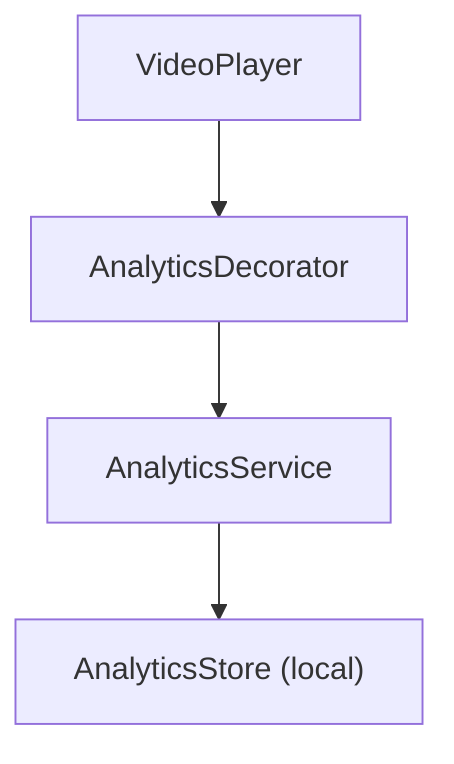
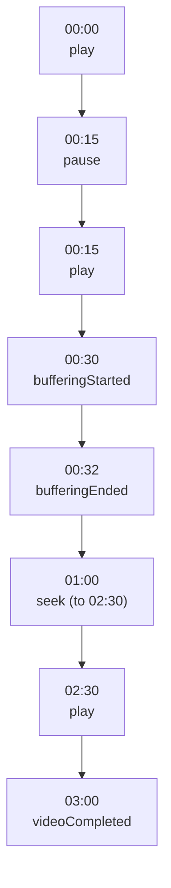

# Analytics Feature

The Analytics feature tracks playback events, user engagement, and performance metrics for video streaming sessions.

---

## Overview



---

## Features

- **Session Tracking** - Track complete playback sessions
- **Event Logging** - Record play, pause, seek, complete events
- **Engagement Metrics** - Watch time, completion rate
- **Performance Metrics** - Time to first frame, buffering ratio
- **Device Info** - Track device type, OS version, app version
- **Correlation IDs** - Link related events

---

## Architecture

### PlaybackAnalyticsLogger Protocol

**File:** `StreamingCore/StreamingCore/Video Analytics Feature/PlaybackAnalyticsLogger.swift`

```swift
@MainActor
public protocol PlaybackAnalyticsLogger: AnyObject {
    func startSession(
        videoID: UUID,
        videoTitle: String,
        deviceInfo: DeviceInfo,
        appVersion: String
    ) async -> PlaybackSession

    func log(_ event: PlaybackEventType, position: TimeInterval) async
    func endSession(watchedDuration: TimeInterval, completed: Bool) async

    // Performance tracking (drives the PerformanceTracker for the current session)
    func getCurrentPerformanceMetrics(watchDuration: TimeInterval) -> PerformanceMetrics?
    func trackVideoLoadStarted()
    func trackFirstFrameRendered()
    func trackBufferingStarted()
    func trackBufferingEnded()
}
```

### PlaybackAnalyticsService

**File:** `StreamingCore/StreamingCore/Video Analytics Feature/PlaybackAnalyticsService.swift`

Each event is persisted individually through the store as it is logged; the
service does not accumulate an in-memory `[PlaybackEvent]` on the session.
Domain models are mapped to local cache models via `toLocal()` before being
handed to the store (see [Storage](#storage)).

```swift
@MainActor
public final class PlaybackAnalyticsService: PlaybackAnalyticsLogger {
    private let store: AnalyticsStore
    private let currentDate: () -> Date
    private let uuidGenerator: () -> UUID

    private var currentSession: PlaybackSession?
    private var performanceTracker: PerformanceTracker?

    public func startSession(
        videoID: UUID,
        videoTitle: String,
        deviceInfo: DeviceInfo,
        appVersion: String
    ) async -> PlaybackSession {
        let sessionID = uuidGenerator()
        let session = PlaybackSession(
            id: sessionID,
            videoID: videoID,
            videoTitle: videoTitle,
            startTime: currentDate(),
            endTime: nil,
            deviceInfo: deviceInfo,
            appVersion: appVersion
        )

        currentSession = session
        performanceTracker = PerformanceTracker(sessionID: sessionID)

        try? await store.insert(session.toLocal())
        return session
    }

    public func log(_ event: PlaybackEventType, position: TimeInterval) async {
        guard let session = currentSession else { return }

        let playbackEvent = PlaybackEvent(
            id: uuidGenerator(),
            sessionID: session.id,
            videoID: session.videoID,
            type: event,
            timestamp: currentDate(),
            currentPosition: position
        )

        try? await store.insertEvent(playbackEvent.toLocal())
    }

    public func endSession(watchedDuration: TimeInterval, completed: Bool) async {
        guard var session = currentSession else { return }

        let eventType: PlaybackEventType = completed
            ? .videoCompleted
            : .videoAbandoned(watchedDuration: watchedDuration, totalDuration: 0)
        await log(eventType, position: watchedDuration)

        session = PlaybackSession(
            id: session.id,
            videoID: session.videoID,
            videoTitle: session.videoTitle,
            startTime: session.startTime,
            endTime: currentDate(),
            deviceInfo: session.deviceInfo,
            appVersion: session.appVersion
        )

        try? await store.updateSession(session.toLocal())
        currentSession = nil
        performanceTracker = nil
    }
}
```

---

## Event Types

**File:** `StreamingCore/StreamingCore/Video Analytics Feature/PlaybackEvent.swift`

The event type is a value enum with associated values (not a `String`-backed
enum). A stable string key for each case is available via `typeIdentifier`
(used by the cache layer).

```swift
public enum PlaybackEventType: Equatable, Sendable, Codable {
    // Playback Events
    case videoStarted
    case play
    case pause
    case seek(from: TimeInterval, to: TimeInterval)
    case videoCompleted
    case videoAbandoned(watchedDuration: TimeInterval, totalDuration: TimeInterval)

    // Control Events
    case speedChanged(from: Float, to: Float)
    case volumeChanged(from: Float, to: Float)
    case muteToggled(isMuted: Bool)

    // Quality / Buffering Events
    case qualityChanged(from: String?, to: String)
    case bufferingStarted
    case bufferingEnded(duration: TimeInterval)

    // Error Events
    case error(code: String, message: String)

    // User Events
    case fullscreenEntered
    case fullscreenExited
    case pipEntered
    case pipExited
}

public struct PlaybackEvent: Equatable, Sendable {
    public let id: UUID
    public let sessionID: UUID
    public let videoID: UUID
    public let type: PlaybackEventType
    public let timestamp: Date
    public let currentPosition: TimeInterval
}
```

---

## Session Model

**File:** `StreamingCore/StreamingCore/Video Analytics Feature/PlaybackSession.swift`

The session holds identity and context only. Events are persisted separately
through the store (see [Storage](#storage)), not accumulated on the session.

```swift
public struct PlaybackSession: Equatable, Sendable {
    public let id: UUID
    public let videoID: UUID
    public let videoTitle: String
    public let startTime: Date
    public var endTime: Date?
    public let deviceInfo: DeviceInfo
    public let appVersion: String
}

public struct DeviceInfo: Equatable, Sendable, Codable {
    public let model: String
    public let osVersion: String
    public let networkType: String?
}
```

---

## Engagement Metrics

**File:** `StreamingCore/StreamingCore/Video Analytics Feature/EngagementMetrics.swift`

Engagement is per-session, with a computed `completionPercentage` (0–100).

```swift
public struct EngagementMetrics: Equatable, Sendable {
    public let sessionID: UUID
    public let watchDuration: TimeInterval
    public let videoDuration: TimeInterval
    public let seekCount: Int
    public let pauseCount: Int

    public var completionPercentage: Double {
        guard videoDuration > 0 else { return 0 }
        return min(100, (watchDuration / videoDuration) * 100)
    }
}
```

---

## Performance Tracking

**File:** `StreamingCore/StreamingCore/Video Analytics Feature/PerformanceTracker.swift`

The tracker is thread-safe (`@unchecked Sendable` guarded by an `NSLock`) and
takes injected timestamps rather than reading `Date()` internally, so it is
deterministic under test. The `PlaybackAnalyticsService` owns the tracker for
the current session and drives it through the logger's `trackVideoLoadStarted()`
/ `trackFirstFrameRendered()` / `trackBufferingStarted()` / `trackBufferingEnded()`
methods, then reads it back via `getCurrentPerformanceMetrics(watchDuration:)`.

```swift
public final class PerformanceTracker: @unchecked Sendable {
    private let sessionID: UUID
    private let lock = NSLock()

    private var loadStartTime: Date?
    private var firstFrameTime: Date?
    private var bufferingStartTime: Date?
    private var bufferingEventsCount: Int = 0
    private var totalBufferingDuration: TimeInterval = 0

    public init(sessionID: UUID) {
        self.sessionID = sessionID
    }

    public func videoLoadStarted(at time: Date) { /* records load start */ }
    public func firstFrameRendered(at time: Date) { /* records first frame */ }
    public func bufferingStarted(at time: Date) { /* opens a buffering window */ }
    public func bufferingEnded(at time: Date) { /* closes it, accumulates duration + count */ }

    public func buildMetrics(watchDuration: TimeInterval) -> PerformanceMetrics {
        // timeToFirstFrame stays optional (nil until both timestamps exist)
        PerformanceMetrics(
            sessionID: sessionID,
            timeToFirstFrame: /* firstFrame - loadStart, or nil */ nil,
            bufferingEvents: bufferingEventsCount,
            totalBufferingDuration: totalBufferingDuration,
            watchDuration: watchDuration
        )
    }
}
```

`PerformanceMetrics` exposes `rebufferingRatio` as a computed property
(`totalBufferingDuration / watchDuration`), not an init argument:

```swift
public struct PerformanceMetrics: Equatable, Sendable {
    public let sessionID: UUID
    public let timeToFirstFrame: TimeInterval?
    public let bufferingEvents: Int
    public let totalBufferingDuration: TimeInterval
    public let watchDuration: TimeInterval

    public var rebufferingRatio: Double {
        guard watchDuration > 0 else { return 0 }
        return totalBufferingDuration / watchDuration
    }
}
```

---

## Analytics Decorator

**File:** `StreamingCore/StreamingCorePlayback/AnalyticsVideoPlayerDecorator.swift`

The decorator lives in the platform-agnostic `StreamingCorePlayback` framework
and is shared by both the iOS and tvOS surfaces (see [Composition](#composition)).
It forwards to the decoratee first, then enqueues the event onto an `AsyncStream`
drained by a single processing task — it does **not** spawn a `Task` per call.
It decorates `load`, `play`, `pause`, `seek`, `seekForward`, `seekBackward`,
`setVolume`, `toggleMute`, and `setPlaybackSpeed`, emitting the matching
`PlaybackEventType` for each; `load` also calls `trackVideoLoadStarted()`.

```swift
@MainActor
public final class AnalyticsVideoPlayerDecorator: VideoPlayer {
    private let decoratee: VideoPlayer
    private let analyticsLogger: PlaybackAnalyticsLogger
    private let continuation: AsyncStream<LoggedEvent>.Continuation
    private let processingTask: Task<Void, Never>

    public init(decoratee: VideoPlayer, analyticsLogger: PlaybackAnalyticsLogger) {
        self.decoratee = decoratee
        self.analyticsLogger = analyticsLogger

        let (stream, continuation) = AsyncStream<LoggedEvent>.makeStream()
        self.continuation = continuation
        self.processingTask = Task {
            for await event in stream {
                await analyticsLogger.log(event.type, position: event.position)
            }
        }
    }

    public func load(url: URL) {
        decoratee.load(url: url)
        analyticsLogger.trackVideoLoadStarted()
    }

    public func play() {
        decoratee.play()
        enqueue(.play, position: currentTime)
    }

    public func pause() {
        decoratee.pause()
        enqueue(.pause, position: currentTime)
    }

    public func seek(to time: TimeInterval) {
        let fromPosition = currentTime
        decoratee.seek(to: time)
        enqueue(.seek(from: fromPosition, to: time), position: time)
    }

    private func enqueue(_ type: PlaybackEventType, position: TimeInterval) {
        continuation.yield(LoggedEvent(type: type, position: position))
    }
}
```

---

## Storage

### AnalyticsStore Protocol

**File:** `StreamingCore/StreamingCore/Video Analytics Cache/AnalyticsStore.swift`

The store operates on local cache value types (`LocalPlaybackSession` /
`LocalPlaybackEvent`), not on the domain models directly. Sessions and events
are stored separately.

```swift
@MainActor
public protocol AnalyticsStore: AnyObject {
    func insert(_ session: LocalPlaybackSession) async throws
    func insertEvent(_ event: LocalPlaybackEvent) async throws
    func updateSession(_ session: LocalPlaybackSession) async throws
    func retrieve(sessionID: UUID) async throws
        -> (session: LocalPlaybackSession, events: [LocalPlaybackEvent])?
    func retrieveAllSessions() async throws -> [LocalPlaybackSession]
    func deleteSession(_ sessionID: UUID) async throws
    func deleteAllSessions() async throws
}
```

### Local Persistence Models

**Files:** `StreamingCore/StreamingCore/Video Analytics Cache/LocalPlaybackSession.swift`, `LocalPlaybackEvent.swift`

The domain/cache boundary is crossed by `toLocal()` on `PlaybackSession` and
`PlaybackEvent` (with `toModel()` for the reverse). `LocalPlaybackSession`
flattens `DeviceInfo` into `deviceModel` / `osVersion` / `networkType`;
`LocalPlaybackEvent` stores the event's `typeIdentifier` string plus the
`Codable`-encoded event as `eventData`.

### In-Memory Implementation

**File:** `StreamingCore/StreamingCore/Video Analytics Cache/Infrastructure/InMemory/InMemoryAnalyticsStore.swift`

```swift
@MainActor
public final class InMemoryAnalyticsStore: AnalyticsStore {
    private var sessions: [UUID: LocalPlaybackSession] = [:]
    private var events: [UUID: [LocalPlaybackEvent]] = [:]

    public func insert(_ session: LocalPlaybackSession) async throws {
        sessions[session.id] = session
        events[session.id] = []
    }

    public func insertEvent(_ event: LocalPlaybackEvent) async throws {
        events[event.sessionID, default: []].append(event)
    }

    public func updateSession(_ session: LocalPlaybackSession) async throws {
        sessions[session.id] = session
    }

    public func retrieve(sessionID: UUID) async throws
        -> (session: LocalPlaybackSession, events: [LocalPlaybackEvent])? {
        guard let session = sessions[sessionID] else { return nil }
        return (session, events[sessionID] ?? [])
    }

    public func retrieveAllSessions() async throws -> [LocalPlaybackSession] {
        Array(sessions.values)
    }

    public func deleteSession(_ sessionID: UUID) async throws {
        sessions.removeValue(forKey: sessionID)
        events.removeValue(forKey: sessionID)
    }

    public func deleteAllSessions() async throws {
        sessions.removeAll()
        events.removeAll()
    }
}
```

---

## Composition

The analytics decorator is wired in both composition roots — `VideoPlayerUIComposer`
(iOS) and `TVPlayerComposer` (tvOS). Both accept an optional `analyticsLogger`
and wrap the player only when one is supplied. `startSession` takes no
`videoDuration` and returns the created `PlaybackSession`.

```swift
// In VideoPlayerUIComposer (iOS) / TVPlayerComposer (tvOS)
var videoPlayer: VideoPlayer = basePlayer

if let analytics = analyticsLogger {
    videoPlayer = AnalyticsVideoPlayerDecorator(
        decoratee: videoPlayer,
        analyticsLogger: analytics
    )
}

// The session is opened via the logger (returns the PlaybackSession):
let session = await analyticsService.startSession(
    videoID: video.id,
    videoTitle: video.title,
    deviceInfo: DeviceInfoProvider.current,
    appVersion: Bundle.main.appVersion
)
```

> See [Apple TV](APPLE-TV.md) for the tvOS composition surface.

---

## Event Timeline Example



---

## Testing

### Service Tests

```swift
func test_log_recordsEvent() async throws {
    let store = InMemoryAnalyticsStore()
    let sut = PlaybackAnalyticsService(store: store)

    let session = await sut.startSession(videoID: UUID(), ...)
    await sut.log(.play, position: 0)
    await sut.log(.pause, position: 30)

    let stored = try await store.retrieve(sessionID: session.id)
    XCTAssertEqual(stored?.events.count, 2)
}
```

### Decorator Tests

```swift
func test_play_logsPlayEvent() async {
    let (sut, spy) = makeSUT()

    sut.play()
    await Task.yield()

    XCTAssertEqual(spy.loggedEvents, [.play])
}
```

---

## Related Documentation

- [Video Playback](VIDEO-PLAYBACK.md) - Player integration
- [Logging](LOGGING.md) - Structured logging
- [Performance](../PERFORMANCE.md) - Performance metrics
- [Design Patterns](../DESIGN-PATTERNS.md) - Decorator pattern
