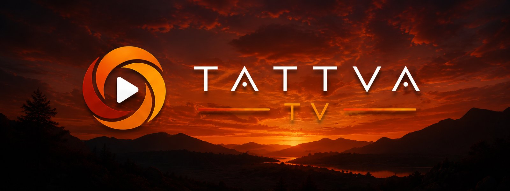
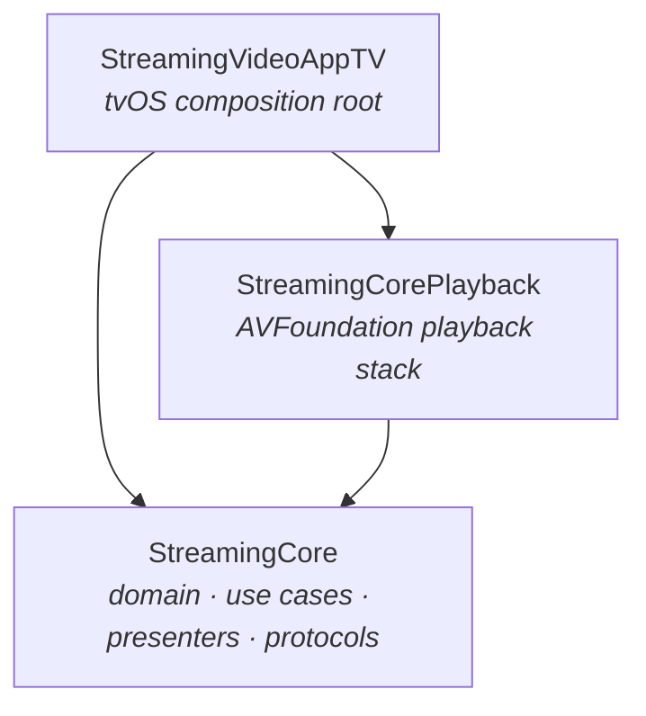

# Apple TV (tvOS) — TATTVA TV

The Apple TV app (`StreamingVideoAppTV`, branded **TATTVA TV**) is a native tvOS
front end that reuses the **entire** `StreamingCore` + `StreamingCorePlayback`
stack and adds only tvOS-native UI. No domain, networking, caching, playback, or
presentation logic is duplicated — the tvOS target contributes a focus-driven
feed, a native player, and a comments panel, and wires them in its own
composition root.

<p align="center">
  
</p>

## Design goal

> Reuse everything below the UI. tvOS gets a 10-foot interface; the shared
> frameworks stay untouched.

The iOS app and the tvOS app are two composition roots over the same core:



`StreamingCoreiOS` (UIKit iOS UI) is **not** linked by the tvOS target — its
custom iOS player controls are not ported. tvOS uses the system transport
instead (see [Player](#player)).

## Surfaces

| Surface | Type | Built on |
|---------|------|----------|
| Feed | `TVVideoFeedViewController` | `UICollectionViewController` + diffable data source + focus engine |
| Poster cell | `TVVideoPosterCell` | `UICollectionViewCell` with focus-driven scaling |
| Player | `TVPlayerViewController` | `AVPlayerViewController` |
| Comments | `TVCommentsViewController` | `UICollectionViewController` + `LoadResourcePresenter` |
| Composition | `SceneDelegate` | `UINavigationController` root |

## Feed

`TVVideoFeedViewController` is a `UICollectionViewController` backed by a
`UICollectionViewDiffableDataSource`. Each item is driven by a `TVCellController`
(a `Hashable`/`Equatable` value type wrapping an id + a `UICollectionViewDataSource`),
mirroring the iOS `CellController` pattern.

- **Focus.** `TVVideoPosterCell` overrides `didUpdateFocus(in:with:)` to scale and
  outline the focused poster, so the Siri Remote's focus engine drives selection —
  the tvOS equivalent of touch highlighting.
- **Images.** `TVVideoCellController` requests its poster lazily through the shared
  image-loader closure, exactly as the iOS feed does.
- **Pagination.** Load-more is triggered from `collectionView(_:willDisplay:forItemAt:)`
  on the last item, calling the feed's `onLoadMore`. `TVFeedLoaderPresentationAdapter`
  accumulates pages from `Paginated<Video>` and re-renders the snapshot.

Composition: `TVVideosUIComposer.feedComposedWith(videoLoader:imageLoader:selection:)`.

## Player

`TVPlayerViewController` subclasses `AVPlayerViewController` — the native tvOS
transport (scrubbing, skip, Info panel, subtitles) comes for free. In
`viewDidLoad` it composes the shared playback bundle via
`TVPlayerComposer`, which builds the same chain the iOS app uses:

```
AVPlayerVideoPlayer
  → LoggingVideoPlayerDecorator
  → AnalyticsVideoPlayerDecorator
  → StatefulVideoPlayer  (+ PlaybackCoordinator, VideoPlayerPerformanceAdapter)
```

The player sets `self.player` and exposes comments through the native
`customInfoViewControllers` slot, so comments appear in the transport bar's Info
panel beside the video.

**Lifetime.** `PlaybackCoordinator` has no `deinit`-based teardown, so
`TVPlayerViewController.viewDidDisappear(_:)` calls `coordinator.stop()`
explicitly to release the playback resources when the screen is dismissed.

## Comments

`TVCommentsViewController` renders the same `VideoCommentsViewModel` the iOS app
does, driven by the real shared `LoadResourcePresenter`:

- It conforms to `ResourceView`, `ResourceLoadingView`, and `ResourceErrorView`,
  with `TVCommentCell` displaying each comment.
- Loading shows an activity indicator; empty shows "No comments yet"; failure
  shows the error message.
- Because `ResourceLoadingViewModel`'s initializer is internal, the composer uses
  the production `LoadResourcePresenter` (mapper `{ VideoCommentsPresenter.map($0) }`)
  rather than reconstructing view models by hand. `TVWeakRefVirtualProxy` bridges
  the presenter to the view controller for all three view protocols while breaking
  the retain cycle.

Composition: `TVCommentsUIComposer`.

## Composition root

`SceneDelegate` roots a `UINavigationController` on the feed. Selecting a poster
calls `showPlayer`, which builds the comments controller via
`TVCommentsUIComposer` and pushes a `TVPlayerViewController(video:comments:)`.

## Brand assets

The tvOS target ships purpose-built TATTVA TV brand assets in
`StreamingVideoAppTV/Assets.xcassets/AppIcon.brandassets`:

- **App Icon** — layered imagestacks (`App Icon.imagestack`,
  `App Icon - App Store.imagestack`) with Back / Middle / Front layers, full-bleed
  so tvOS applies its own rounded-rectangle mask and parallax.
- **Top Shelf** — `Top Shelf Image` (2.67:1) and `Top Shelf Image Wide` imagesets.

See [BRANDING](../BRANDING.md) for the asset pipeline.

## Tests & CI

- Tests live in `StreamingVideoAppTVTests` (composers, presentation adapter,
  cell controllers, comments states).
- The `build-tvos` CI job (scheme `CI_tvOS`) builds and tests on the
  **Apple TV 4K (3rd generation)** simulator on every push and PR to `main`,
  alongside `build-ios` and `build-macos`.

## Related docs

- [Video Feed](VIDEO-FEED.md) · [Video Playback](VIDEO-PLAYBACK.md) · [Video Comments](VIDEO-COMMENTS.md) — the iOS counterparts
- [Composition Root](../COMPOSITION-ROOT.md) — the shared composition patterns
- [Architecture](../ARCHITECTURE.md) — layer boundaries and dependency direction
