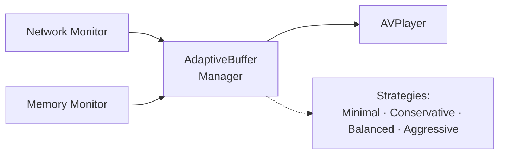
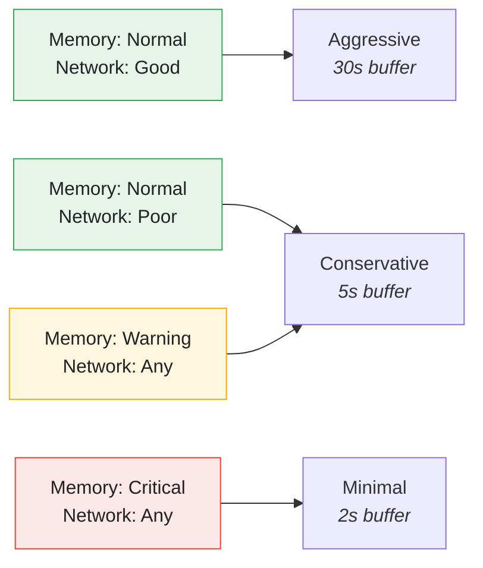

# Buffer Management Feature

The Buffer Management types model adaptive buffering based on network conditions and memory pressure.

> **Runtime integration status.** For HLS playback, AVFoundation manages buffering natively and tuning it manually can conflict with that logic. The `AdaptiveBufferManager` / `BufferConfiguration` types here are **implemented and unit-tested** but are **not** wired to drive the live player; they remain available for a custom-buffering or non-HLS scenario. `AVPlayerItem.preferredForwardBufferDuration` can be set through `AVPlayerBufferAdapter` when a fixed buffer is genuinely needed.

---

## Overview



---

## Features

- **Adaptive Buffering** - Adjust buffer size based on conditions
- **Memory-Aware** - Reduce buffer during memory pressure
- **Network-Aware** - Increase buffer for poor networks
- **Strategy Pattern** - Swappable buffering strategies
- **Real-time Updates** - Continuous monitoring and adjustment
- **Combine Integration** - Reactive configuration publishing

---

## Architecture

### BufferManager Protocol

**File:** `StreamingCore/StreamingCore/Buffer Management Feature/BufferManager.swift`

```swift
@MainActor
public protocol BufferSizeProvider: AnyObject {
    var currentConfiguration: BufferConfiguration { get }
}

@MainActor
public protocol BufferManager: BufferSizeProvider {
    var configurationPublisher: AnyPublisher<BufferConfiguration, Never> { get }

    func updateMemoryState(_ state: MemoryState)
    func updateNetworkQuality(_ quality: NetworkQuality)
}
```

### BufferConfiguration

**File:** `StreamingCore/StreamingCore/Buffer Management Feature/Domain/BufferConfiguration.swift`

```swift
public struct BufferConfiguration: Equatable, Sendable {
    public let strategy: BufferStrategy
    public let preferredForwardBufferDuration: TimeInterval
    public let reason: String

    public static let minimal = BufferConfiguration(
        strategy: .minimal,
        preferredForwardBufferDuration: 2.0,
        reason: "Memory critical - minimal buffering"
    )

    public static let conservative = BufferConfiguration(
        strategy: .conservative,
        preferredForwardBufferDuration: 5.0,
        reason: "Limited resources - conservative buffering"
    )

    public static let balanced = BufferConfiguration(
        strategy: .balanced,
        preferredForwardBufferDuration: 10.0,
        reason: "Normal conditions - balanced buffering"
    )

    public static let aggressive = BufferConfiguration(
        strategy: .aggressive,
        preferredForwardBufferDuration: 30.0,
        reason: "Optimal conditions - aggressive buffering"
    )
}
```

### BufferStrategy

**File:** `StreamingCore/StreamingCore/Buffer Management Feature/Domain/BufferStrategy.swift`

```swift
public enum BufferStrategy: Int, Sendable, CaseIterable, Comparable {
    case minimal = 0      // Critical memory or offline
    case conservative = 1 // Poor network or warning memory
    case balanced = 2     // Normal conditions
    case aggressive = 3   // Good network and plenty of memory

    public static func < (lhs: BufferStrategy, rhs: BufferStrategy) -> Bool {
        lhs.rawValue < rhs.rawValue
    }

    public var description: String {
        switch self {
        case .minimal: return "Minimal (memory critical)"
        case .conservative: return "Conservative (low resources)"
        case .balanced: return "Balanced (normal)"
        case .aggressive: return "Aggressive (optimal conditions)"
        }
    }
}
```

---

## AdaptiveBufferManager

**File:** `StreamingCore/StreamingCore/Buffer Management Feature/AdaptiveBufferManager.swift`

```swift
@MainActor
public final class AdaptiveBufferManager: BufferManager {
    private var memoryPressure: MemoryPressureLevel = .normal
    private var networkQuality: NetworkQuality = .good
    private var _currentConfiguration: BufferConfiguration = .balanced
    private let thresholds: MemoryThresholds

    private let configurationSubject = CurrentValueSubject<BufferConfiguration, Never>(.balanced)

    public var configurationPublisher: AnyPublisher<BufferConfiguration, Never> {
        configurationSubject
            .removeDuplicates()
            .eraseToAnyPublisher()
    }

    public var currentConfiguration: BufferConfiguration {
        _currentConfiguration
    }

    public init(thresholds: MemoryThresholds = .default) {
        self.thresholds = thresholds
    }

    public func updateMemoryState(_ state: MemoryState) {
        memoryPressure = state.pressureLevel(thresholds: thresholds)
        recalculateStrategy()
    }

    public func updateNetworkQuality(_ quality: NetworkQuality) {
        networkQuality = quality
        recalculateStrategy()
    }

    private func recalculateStrategy() {
        let newConfig = calculateConfiguration(memory: memoryPressure, network: networkQuality)

        if newConfig != _currentConfiguration {
            _currentConfiguration = newConfig
            configurationSubject.send(newConfig)
        }
    }

    private func calculateConfiguration(memory: MemoryPressureLevel, network: NetworkQuality) -> BufferConfiguration {
        // Priority: Memory pressure takes precedence over network quality
        switch memory {
        case .critical:
            return .minimal
        case .warning:
            // Even with good network, stay conservative when memory is tight
            return .conservative
        case .normal:
            // Normal memory - base on network quality
            switch network {
            case .offline, .poor:
                return BufferConfiguration(
                    strategy: .conservative,
                    preferredForwardBufferDuration: 5.0,
                    reason: "Poor network - conservative buffering to reduce rebuffering"
                )
            case .fair:
                return .balanced
            case .good, .excellent:
                return .aggressive
            }
        }
    }
}
```

---

## Strategy Selection Matrix

| Memory Pressure | Network Quality | Strategy |
|-----------------|-----------------|----------|
| Critical | Any | Minimal |
| Warning | Any | Conservative |
| Normal | Offline/Poor | Conservative |
| Normal | Fair | Balanced |
| Normal | Good/Excellent | Aggressive |

---

## AVPlayer Integration

### AVPlayerBufferAdapter

**File:** `StreamingCore/StreamingCorePlayback/AVPlayerBufferAdapter.swift`

```swift
@MainActor
public final class AVPlayerBufferAdapter<Player: BufferConfigurablePlayer> {
    public let player: Player
    private var cancellables = Set<AnyCancellable>()

    public init(player: Player, bufferManager: any BufferManager, observeChanges: Bool = true) {
        self.player = player

        guard observeChanges else { return }
        bufferManager.configurationPublisher
            .removeDuplicates()
            .sink { [weak self] configuration in
                self?.apply(configuration)
            }
            .store(in: &cancellables)
    }

    /// Applies the current buffer configuration to a newly created player item.
    public func applyToNewItem(_ item: Player.Item) {
        // item.preferredForwardBufferDuration = <current configuration>
    }
}

// Concrete specialization used with AVPlayer.
public typealias AVPlayerBufferAdapterConcrete = AVPlayerBufferAdapter<AVPlayer>
```

---

## Monitoring Integration

### Complete Flow

```swift
// In VideoPlayerComposer
func setupBufferManagement(
    player: AVPlayer,
    memoryMonitor: MemoryMonitor,
    networkMonitor: NetworkQualityMonitor
) {
    let bufferManager = AdaptiveBufferManager()

    // Subscribe to memory changes
    memoryMonitor.statePublisher
        .sink { [weak bufferManager] state in
            bufferManager?.updateMemoryState(state)
        }
        .store(in: &cancellables)

    // Subscribe to network changes
    networkMonitor.qualityPublisher
        .sink { [weak bufferManager] quality in
            bufferManager?.updateNetworkQuality(quality)
        }
        .store(in: &cancellables)

    // Apply to player
    let adapter = AVPlayerBufferAdapter(
        player: player,
        bufferManager: bufferManager
    )
}
```

---

## Configuration Values

### Minimal (Memory Critical)

```swift
strategy: .minimal
preferredForwardBufferDuration: 2 seconds
reason: "Memory critical - minimal buffering"
```

Use when:
- Memory pressure is critical
- Device is low on resources

### Conservative (Poor Network/Warning Memory)

```swift
strategy: .conservative
preferredForwardBufferDuration: 5 seconds
reason: "Limited resources - conservative buffering"
```

Use when:
- Network is poor or offline
- Memory pressure is warning

> For the Normal-memory + Poor/Offline-network branch, `AdaptiveBufferManager` builds a
> bespoke `.conservative`-strategy configuration inline (5s, reason
> `"Poor network - conservative buffering to reduce rebuffering"`) rather than returning the
> shared `.conservative` constant.

### Balanced (Normal Conditions)

```swift
strategy: .balanced
preferredForwardBufferDuration: 10 seconds
reason: "Normal conditions - balanced buffering"
```

Use when:
- Network is fair
- Memory is normal

### Aggressive (Optimal Conditions)

```swift
strategy: .aggressive
preferredForwardBufferDuration: 30 seconds
reason: "Optimal conditions - aggressive buffering"
```

Use when:
- Network is good/excellent
- Memory is plentiful

---

## State Transitions



---

## Testing

### Unit Tests

```swift
@MainActor
func test_updateMemoryState_withCriticalPressure_setsMinimalStrategy() async {
    let sut = AdaptiveBufferManager()
    let criticalMemoryState = makeMemoryState(availableBytes: 40_000_000) // 40MB = critical

    sut.updateMemoryState(criticalMemoryState)

    XCTAssertEqual(sut.currentConfiguration.strategy, .minimal)
}

@MainActor
func test_updateNetworkQuality_withPoorNetwork_setsConservativeStrategy() async {
    let sut = AdaptiveBufferManager()
    let normalMemoryState = makeMemoryState(availableBytes: 200_000_000)

    sut.updateMemoryState(normalMemoryState)
    sut.updateNetworkQuality(.poor)

    XCTAssertEqual(sut.currentConfiguration.strategy, .conservative)
}

@MainActor
func test_memoryPressure_takesPriorityOverNetwork() async {
    let sut = AdaptiveBufferManager()

    sut.updateNetworkQuality(.excellent)
    sut.updateMemoryState(makeMemoryState(availableBytes: 40_000_000))

    XCTAssertEqual(sut.currentConfiguration.strategy, .minimal)
}
```

### Publisher Tests

```swift
@MainActor
func test_configurationPublisher_emitsOnStrategyChange() async {
    let sut = AdaptiveBufferManager()
    var receivedConfigs: [BufferConfiguration] = []

    sut.configurationPublisher
        .sink { receivedConfigs.append($0) }
        .store(in: &cancellables)

    // Trigger a change (publisher drops duplicates)
    sut.updateMemoryState(makeMemoryState(availableBytes: 40_000_000))

    XCTAssertEqual(receivedConfigs.last?.strategy, .minimal)
}
```

---

## Related Documentation

- [Video Playback](VIDEO-PLAYBACK.md) - Player integration
- [Memory Management](MEMORY-MANAGEMENT.md) - Memory monitoring
- [Network Quality](NETWORK-QUALITY.md) - Network monitoring
- [Performance](../PERFORMANCE.md) - Performance optimization
