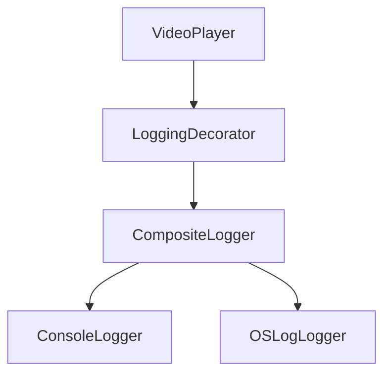

# Structured Logging Feature

The Structured Logging feature provides a comprehensive logging system with multiple destinations, log levels, and correlation tracking.

---

## Overview



---

## Features

- **Multiple Log Levels** - debug, info, warning, error, critical
- **Per-Logger Level Filtering** - every `Logger` exposes a `minimumLevel`; entries below it are dropped. `CompositeLogger` filters on both its own `minimumLevel` and each child logger's before forwarding.
- **Composite Logging** - Log to multiple destinations simultaneously
- **Structured Context** - Subsystem, category, correlation ID, metadata
- **Correlation Tracking** - Link related log entries
- **Platform Integration** - OSLog for Apple's unified logging
- **Testable Design** - NullLogger for unit tests

---

## Architecture

### Logger Protocol

**File:** `StreamingCore/StreamingCore/Structured Logging Feature/Logger.swift`

```swift
public protocol Logger: Sendable {
    /// The minimum level this logger will process; entries below it are ignored.
    var minimumLevel: LogLevel { get }
    func log(_ entry: LogEntry)
}

extension Logger {
    public func debug(_ message: String, context: LogContext = LogContext())
    public func info(_ message: String, context: LogContext = LogContext())
    public func warning(_ message: String, context: LogContext = LogContext())
    public func error(_ message: String, context: LogContext = LogContext())
    public func critical(_ message: String, context: LogContext = LogContext())
}
```

### Log Entry

**File:** `StreamingCore/StreamingCore/Structured Logging Feature/Domain/LogEntry.swift`

```swift
public struct LogEntry: Equatable, Sendable {
    public let id: UUID
    public let timestamp: Date
    public let level: LogLevel
    public let message: String
    public let context: LogContext

    public init(
        id: UUID = UUID(),
        timestamp: Date = Date(),
        level: LogLevel,
        message: String,
        context: LogContext
    ) {
        self.id = id
        self.timestamp = timestamp
        self.level = level
        self.message = message
        self.context = context
    }
}

extension LogEntry {
    /// A formatted string of the form `[subsystem] [level] message [cid:xxxxxxxx]`,
    /// rendered by ConsoleLogger and OSLogLogger.
    public var formattedMessage: String
}
```

### Log Context

**File:** `StreamingCore/StreamingCore/Structured Logging Feature/Domain/LogContext.swift`

```swift
public struct LogContext: Equatable, Sendable {
    public let file: String       // auto-captured, last path component
    public let function: String   // auto-captured
    public let line: UInt         // auto-captured
    public let subsystem: String?
    public let category: String?
    public let correlationID: UUID?
    public let metadata: [String: String]

    public init(
        file: String = #file,
        function: String = #function,
        line: UInt = #line,
        subsystem: String? = nil,
        category: String? = nil,
        correlationID: UUID? = nil,
        metadata: [String: String] = [:]
    ) {
        self.file = (file as NSString).lastPathComponent
        self.function = function
        self.line = line
        self.subsystem = subsystem
        self.category = category
        self.correlationID = correlationID
        self.metadata = metadata
    }
}
```

Source location (`file`/`function`/`line`) is auto-captured from `#file`/`#function`/`#line` at the call site; `subsystem`, `category`, and `correlationID` are optional and default to `nil`.

### Log Levels

**File:** `StreamingCore/StreamingCore/Structured Logging Feature/Domain/LogLevel.swift`

```swift
public enum LogLevel: Int, Comparable, Sendable, Codable {
    case debug = 0
    case info = 1
    case warning = 2
    case error = 3
    case critical = 4

    public static func < (lhs: LogLevel, rhs: LogLevel) -> Bool {
        lhs.rawValue < rhs.rawValue
    }
}
```

---

## Logger Implementations

### ConsoleLogger

**File:** `StreamingCore/StreamingCore/Structured Logging Feature/ConsoleLogger.swift`

```swift
public final class ConsoleLogger: Logger, @unchecked Sendable {
    public let minimumLevel: LogLevel
    private let dateFormatter: ISO8601DateFormatter

    public init(minimumLevel: LogLevel = .debug) {
        self.minimumLevel = minimumLevel
        self.dateFormatter = ISO8601DateFormatter()
        self.dateFormatter.formatOptions = [.withInternetDateTime, .withFractionalSeconds]
    }

    public func log(_ entry: LogEntry) {
        guard entry.level >= minimumLevel else { return }

        let timestamp = dateFormatter.string(from: entry.timestamp)
        var output = "\(timestamp) \(entry.formattedMessage)"

        if !entry.context.metadata.isEmpty {
            let meta = entry.context.metadata
                .sorted { $0.key < $1.key }
                .map { "\($0.key)=\($0.value)" }
                .joined(separator: ", ")
            output += " {\(meta)}"
        }

        output += " (\(entry.context.file):\(entry.context.line))"

        print(output)
    }
}
```

### OSLogLogger

**File:** `StreamingCoreiOS/Structured Logging iOS/OSLogLogger.swift`

```swift
import os.log
import StreamingCore

public final class OSLogLogger: StreamingCore.Logger, @unchecked Sendable {
    public let minimumLevel: LogLevel
    private let osLog: OSLog

    public init(
        subsystem: String,
        category: String,
        minimumLevel: LogLevel = .info
    ) {
        self.minimumLevel = minimumLevel
        self.osLog = OSLog(subsystem: subsystem, category: category)
    }

    public func log(_ entry: LogEntry) {
        guard entry.level >= minimumLevel else { return }

        let osLogType: OSLogType
        switch entry.level {
        case .debug:    osLogType = .debug
        case .info:     osLogType = .info
        case .warning:  osLogType = .default
        case .error:    osLogType = .error
        case .critical: osLogType = .fault
        @unknown default: osLogType = .default
        }

        os_log("%{public}@", log: osLog, type: osLogType, entry.formattedMessage)
    }
}
```

### CompositeLogger

**File:** `StreamingCore/StreamingCore/Structured Logging Feature/CompositeLogger.swift`

```swift
public final class CompositeLogger: Logger, @unchecked Sendable {
    private let loggers: [any Logger]
    public let minimumLevel: LogLevel

    public init(loggers: [any Logger], minimumLevel: LogLevel = .debug) {
        self.loggers = loggers
        self.minimumLevel = minimumLevel
    }

    public func log(_ entry: LogEntry) {
        guard entry.level >= minimumLevel else { return }

        for logger in loggers {
            if entry.level >= logger.minimumLevel {
                logger.log(entry)
            }
        }
    }
}
```

### NullLogger

**File:** `StreamingCore/StreamingCore/Structured Logging Feature/NullLogger.swift`

```swift
public struct NullLogger: Logger, Sendable {
    public let minimumLevel: LogLevel = .critical

    public init() {}

    public func log(_ entry: LogEntry) {
        // No-op
    }
}
```

---

## Logging Decorator

**File:** `StreamingCore/StreamingCorePlayback/LoggingVideoPlayerDecorator.swift`

```swift
@MainActor
public final class LoggingVideoPlayerDecorator: VideoPlayer {
    private let decoratee: VideoPlayer
    private let logger: Logger
    private let correlationID: UUID

    public init(decoratee: VideoPlayer, logger: Logger, correlationID: UUID = UUID()) {
        self.decoratee = decoratee
        self.logger = logger
        self.correlationID = correlationID
    }

    // Forwarded VideoPlayer properties
    public var isPlaying: Bool { decoratee.isPlaying }
    public var currentTime: TimeInterval { decoratee.currentTime }
    public var duration: TimeInterval { decoratee.duration }
    public var volume: Float { decoratee.volume }
    public var isMuted: Bool { decoratee.isMuted }
    public var playbackSpeed: Float { decoratee.playbackSpeed }

    public func load(url: URL) {
        decoratee.load(url: url)
        logEvent("Loading video", metadata: ["url": url.absoluteString])
    }

    public func play() {
        decoratee.play()
        logEvent("Play requested", metadata: ["position": "\(currentTime)"])
    }

    public func pause() {
        decoratee.pause()
        logEvent("Pause requested", metadata: ["position": "\(currentTime)"])
    }

    // Also implements seekForward(by:), seekBackward(by:), seek(to:),
    // setVolume(_:), toggleMute(), and setPlaybackSpeed(_:), each forwarding
    // to the decoratee first and then logging via logEvent.

    private func logEvent(
        _ message: String,
        metadata: [String: String] = [:],
        level: LogLevel = .info
    ) {
        let context = LogContext(
            subsystem: "VideoPlayer",
            category: "Playback",
            correlationID: correlationID,
            metadata: metadata
        )
        logger.log(LogEntry(level: level, message: message, context: context))
    }
}
```

---

## Correlation Tracking

Correlation IDs link related log entries across a session. The console line is
`<timestamp> <formattedMessage> {metadata} (file:line)`, where
`formattedMessage` is `[subsystem] [level] message [cid:xxxxxxxx]`:

```
2026-07-23T12:34:56.789Z [VideoPlayer] [info] Loading video [cid:a1b2c3d4] {url=https://example.com/video.mp4} (LoggingVideoPlayerDecorator.swift:42)
2026-07-23T12:34:57.456Z [VideoPlayer] [info] Play requested [cid:a1b2c3d4] {position=0.0} (LoggingVideoPlayerDecorator.swift:47)
2026-07-23T12:35:00.000Z [VideoPlayer] [info] Pause requested [cid:a1b2c3d4] {position=3.2} (LoggingVideoPlayerDecorator.swift:52)
```

All entries with `[cid:a1b2c3d4]` belong to the same playback session.

---

## Composition

Logger construction lives in the `LoggingConfiguration` enum
(`StreamingVideoApp/LoggingConfiguration.swift`); `SceneDelegate` only calls
`LoggingConfiguration.makeLogger()`.

```swift
public enum LoggingConfiguration {
    public static func makeLogger() -> any Logger {
        #if DEBUG
        return makeDebugLogger()
        #else
        return makeReleaseLogger()
        #endif
    }

    private static func makeDebugLogger() -> any Logger {
        let consoleLogger = ConsoleLogger(minimumLevel: .debug)
        let osLogLogger = OSLogLogger(
            subsystem: "com.streamingvideoapp.StreamingVideoApp",
            category: "VideoPlayer",
            minimumLevel: .debug
        )
        return CompositeLogger(
            loggers: [consoleLogger, osLogLogger],
            minimumLevel: .debug
        )
    }

    private static func makeReleaseLogger() -> any Logger {
        OSLogLogger(
            subsystem: "com.streamingvideoapp.StreamingVideoApp",
            category: "VideoPlayer",
            minimumLevel: .info
        )
    }
}
```

```swift
// In SceneDelegate
func makeVideoPlayer() -> VideoPlayer {
    let basePlayer = AVPlayerVideoPlayer(player: avPlayer)
    let correlationID = UUID()

    return LoggingVideoPlayerDecorator(
        decoratee: basePlayer,
        logger: logger,
        correlationID: correlationID
    )
}
```

---

## Log Output Example

### Console Output

```
2026-07-23T14:32:15.123Z [VideoPlayer] [info] Loading video [cid:a1b2c3d4] {url=https://example.com/video.mp4} (LoggingVideoPlayerDecorator.swift:42)
2026-07-23T14:32:16.456Z [VideoPlayer] [info] Play requested [cid:a1b2c3d4] {position=0.0} (LoggingVideoPlayerDecorator.swift:47)
2026-07-23T14:32:45.789Z [VideoPlayer] [debug] Volume changed [cid:a1b2c3d4] {from=1.0, to=0.5} (LoggingVideoPlayerDecorator.swift:85)
```

### OSLog (Console.app)

OSLog renders `entry.formattedMessage` via `os_log`:

```
type: info
subsystem: com.streamingvideoapp.StreamingVideoApp
category: VideoPlayer
message: [VideoPlayer] [info] Play requested [cid:a1b2c3d4]
```

---

## Testing

### Using NullLogger

```swift
func makeSUT() -> (VideoPlayer, VideoPlayerSpy) {
    let spy = VideoPlayerSpy()
    let sut = LoggingVideoPlayerDecorator(
        decoratee: spy,
        logger: NullLogger()  // No logging noise in tests
    )
    return (sut, spy)
}
```

### Verifying Logs

```swift
final class LoggerSpy: Logger {
    let minimumLevel: LogLevel = .debug
    var loggedEntries: [LogEntry] = []

    func log(_ entry: LogEntry) {
        loggedEntries.append(entry)
    }
}

func test_play_logsInfoMessage() {
    let loggerSpy = LoggerSpy()
    let sut = LoggingVideoPlayerDecorator(
        decoratee: VideoPlayerSpy(),
        logger: loggerSpy
    )

    sut.play()

    XCTAssertEqual(loggerSpy.loggedEntries.count, 1)
    XCTAssertEqual(loggerSpy.loggedEntries[0].level, .info)
    XCTAssertTrue(loggerSpy.loggedEntries[0].message.contains("Play"))
}
```

---

## Related Documentation

- [Video Playback](VIDEO-PLAYBACK.md) - Player integration
- [Analytics](ANALYTICS.md) - Event tracking
- [Design Patterns](../DESIGN-PATTERNS.md) - Decorator, Composite patterns
