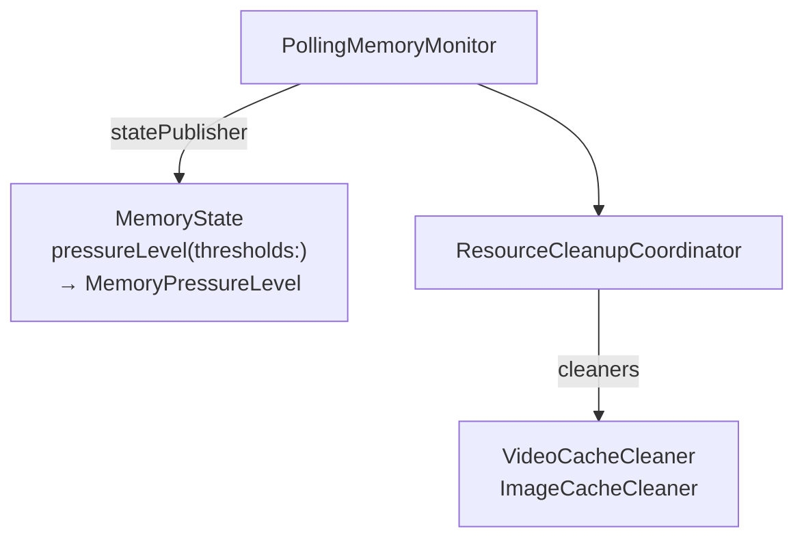
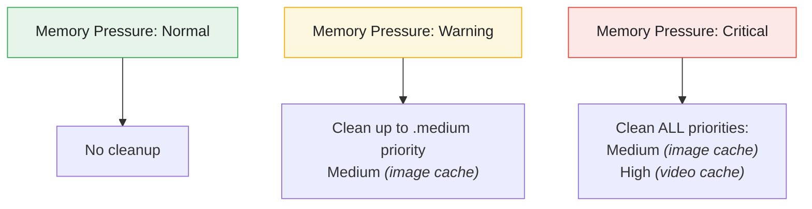

# Memory Management Feature

The Memory Management feature monitors system memory, detects pressure levels, and coordinates resource cleanup to prevent out-of-memory crashes.

---

## Overview



---

## Features

- **Continuous Monitoring** - Poll memory state at regular intervals
- **Pressure Levels** - Normal, warning, critical thresholds
- **Auto-Cleanup** - Automatic cleanup on memory pressure
- **Priority-Based** - Clean low-priority resources first
- **Combine Integration** - Reactive state publishing
- **Configurable Thresholds** - Customize pressure levels

---

## Architecture

### MemoryMonitor Protocol

**File:** `StreamingCore/StreamingCore/Memory Monitoring Feature/MemoryMonitor.swift`

```swift
@MainActor
public protocol MemoryStateProvider: AnyObject {
    func currentMemoryState() -> MemoryState
}

@MainActor
public protocol MemoryMonitor: MemoryStateProvider {
    var statePublisher: AnyPublisher<MemoryState, Never> { get }
    func startMonitoring()
    func stopMonitoring()
}
```

### MemoryState

**File:** `StreamingCore/StreamingCore/Memory Monitoring Feature/Domain/MemoryState.swift`

```swift
public struct MemoryState: Equatable, Sendable {
    public let availableBytes: UInt64
    public let totalBytes: UInt64
    public let usedBytes: UInt64
    public let timestamp: Date

    public var availableMB: Double { Double(availableBytes) / 1_048_576.0 }
    public var usedMB: Double { Double(usedBytes) / 1_048_576.0 }

    public var usagePercentage: Double {
        guard totalBytes > 0 else { return 0 }
        return Double(usedBytes) / Double(totalBytes) * 100
    }

    public func pressureLevel(thresholds: MemoryThresholds) -> MemoryPressureLevel {
        thresholds.pressureLevel(for: availableMB)
    }
}
```

`MemoryState` stores raw byte counts and a `timestamp`. Pressure is not stored — it is computed on demand from the available-megabytes floors in `MemoryThresholds`. `usagePercentage` returns a `0–100` value.

### MemoryPressureLevel

**File:** `StreamingCore/StreamingCore/Video Performance Feature/PerformanceEvent.swift`

The shared pressure enum used across memory monitoring and the cleanup coordinator:

```swift
public enum MemoryPressureLevel: Int, Sendable, Comparable, Codable, Equatable {
    case normal = 0
    case warning = 1
    case critical = 2
}
```

### MemoryThresholds

**File:** `StreamingCore/StreamingCore/Memory Monitoring Feature/Domain/MemoryThresholds.swift`

```swift
public struct MemoryThresholds: Equatable, Sendable {
    public let warningAvailableMB: Double   // e.g., 100.0
    public let criticalAvailableMB: Double  // e.g., 50.0
    public let pollingInterval: TimeInterval // e.g., 2.0

    public static let `default` = MemoryThresholds(
        warningAvailableMB: 100.0,
        criticalAvailableMB: 50.0,
        pollingInterval: 2.0
    )

    public func pressureLevel(for availableMB: Double) -> MemoryPressureLevel {
        if availableMB < criticalAvailableMB { return .critical }
        if availableMB < warningAvailableMB { return .warning }
        return .normal
    }
}
```

Thresholds are available-megabytes *floors*, not usage-percentage ceilings: pressure escalates as free memory drops below the warning (100 MB) and critical (50 MB) marks. The polling cadence lives here (`pollingInterval`, default 2.0s), not on the monitor.

---

## PollingMemoryMonitor

**File:** `StreamingCore/StreamingCore/Memory Monitoring Feature/PollingMemoryMonitor.swift`

```swift
@MainActor
public final class PollingMemoryMonitor: MemoryMonitor {
    private let memoryReader: () -> MemoryState
    private let thresholds: MemoryThresholds

    private let stateSubject = CurrentValueSubject<MemoryState?, Never>(nil)
    private var pollingTask: Task<Void, Never>?
    private var isMonitoring = false

    public var statePublisher: AnyPublisher<MemoryState, Never> {
        stateSubject
            .compactMap { $0 }
            .removeDuplicates()
            .eraseToAnyPublisher()
    }

    public init(
        memoryReader: @escaping @Sendable () -> MemoryState,
        thresholds: MemoryThresholds = .default
    ) {
        self.memoryReader = memoryReader
        self.thresholds = thresholds
    }

    public func currentMemoryState() -> MemoryState {
        memoryReader()
    }

    public func startMonitoring() {
        guard !isMonitoring else { return }
        isMonitoring = true

        pollingTask = Task { [weak self, thresholds, memoryReader] in
            while !Task.isCancelled {
                guard let self = self else { break }
                let state = memoryReader()
                await MainActor.run { self.updateState(state) }
                try? await Task.sleep(nanoseconds: UInt64(thresholds.pollingInterval * 1_000_000_000))
            }
        }
    }

    public func stopMonitoring() {
        isMonitoring = false
        pollingTask?.cancel()
        pollingTask = nil
    }

    private func updateState(_ state: MemoryState) {
        stateSubject.send(state)
    }
}
```

The monitor takes an injected `memoryReader: () -> MemoryState` seam (defaulting to nothing — the reader is always supplied) rather than reading system memory itself. Polling runs on a cancellable `Task` with `Task.sleep` at `thresholds.pollingInterval`, and `currentMemoryState()` calls the reader directly rather than returning a cached subject value.

### SystemMemoryProvider & MemoryMonitorFactory

**File:** `StreamingVideoApp/StreamingVideoApp/SystemMemoryProvider.swift` (app target)

The real system reader lives in the composition target, keeping `StreamingCore` free of platform memory APIs. `SystemMemoryProvider.memoryReader` reads free memory via `os_proc_available_memory()`, and `MemoryMonitorFactory.makeSystemMemoryMonitor()` is the entry point the `SceneDelegate` calls:

```swift
public enum SystemMemoryProvider {
    public static let memoryReader: @Sendable () -> MemoryState = {
        let availableBytes = UInt64(os_proc_available_memory())
        let totalBytes = ProcessInfo.processInfo.physicalMemory
        let usedBytes = totalBytes > availableBytes ? totalBytes - availableBytes : 0
        return MemoryState(
            availableBytes: availableBytes,
            totalBytes: totalBytes,
            usedBytes: usedBytes,
            timestamp: Date()
        )
    }
}

public enum MemoryMonitorFactory {
    @MainActor
    public static func makeSystemMemoryMonitor(
        thresholds: MemoryThresholds = .default
    ) -> PollingMemoryMonitor {
        PollingMemoryMonitor(
            memoryReader: SystemMemoryProvider.memoryReader,
            thresholds: thresholds
        )
    }
}
```

---

## Resource Cleanup

### ResourceCleaner Protocol

**File:** `StreamingCore/StreamingCore/Resource Cleanup Feature/ResourceCleaner.swift`

```swift
public protocol ResourceCleaner: Sendable {
    var resourceName: String { get }
    var priority: CleanupPriority { get }
    func estimateCleanup() async -> UInt64
    func cleanup() async -> CleanupResult
}
```

### CleanupPriority

**File:** `StreamingCore/StreamingCore/Resource Cleanup Feature/Domain/CleanupPriority.swift`

```swift
public enum CleanupPriority: Int, Comparable, Sendable {
    case low = 0      // Optional caches
    case medium = 1   // Important but not critical
    case high = 2     // Critical resources

    public static func < (lhs: CleanupPriority, rhs: CleanupPriority) -> Bool {
        lhs.rawValue < rhs.rawValue
    }
}
```

### CleanupResult

**File:** `StreamingCore/StreamingCore/Resource Cleanup Feature/Domain/CleanupResult.swift`

```swift
public struct CleanupResult: Equatable, Sendable {
    public let resourceName: String
    public let bytesFreed: UInt64
    public let itemsRemoved: Int
    public let success: Bool
    public let error: String?

    public var freedMB: Double { Double(bytesFreed) / 1_048_576.0 }

    public static func failure(resourceName: String, error: String) -> CleanupResult
}
```

### ClearableCache

**File:** `StreamingCore/StreamingCore/Resource Cleanup Feature/ClearableCache.swift`

Abstraction for any cache a cleaner can clear and size. Methods are deliberately **synchronous** to avoid Swift interface-generation issues with async closures in public APIs when `BUILD_LIBRARY_FOR_DISTRIBUTION` is enabled:

```swift
public protocol ClearableCache: Sendable {
    func clearAll() throws -> Int      // Returns number of items cleared
    func estimateSize() -> UInt64      // Estimated size in bytes (0 if unknown)
}
```

---

## ResourceCleanupCoordinator

**File:** `StreamingCore/StreamingCore/Resource Cleanup Feature/ResourceCleanupCoordinator.swift`

```swift
@MainActor
public final class ResourceCleanupCoordinator {
    private var cleaners: [ResourceCleaner]
    private let memoryMonitor: MemoryMonitor
    private var isAutoCleanupEnabled = false
    private var monitoringCancellable: AnyCancellable?

    private let cleanupSubject = PassthroughSubject<[CleanupResult], Never>()

    public var cleanupResultsPublisher: AnyPublisher<[CleanupResult], Never> {
        cleanupSubject.eraseToAnyPublisher()
    }

    public init(cleaners: [ResourceCleaner], memoryMonitor: MemoryMonitor) {
        // Sort by priority (highest first for cleanup)
        self.cleaners = cleaners.sorted { $0.priority > $1.priority }
        self.memoryMonitor = memoryMonitor
    }

    public func register(_ cleaner: ResourceCleaner) {
        cleaners.append(cleaner)
        cleaners.sort { $0.priority > $1.priority }
    }

    public func enableAutoCleanup() {
        guard !isAutoCleanupEnabled else { return }
        isAutoCleanupEnabled = true

        memoryMonitor.startMonitoring()

        monitoringCancellable = memoryMonitor.statePublisher
            .receive(on: RunLoop.main)
            .sink { [weak self] state in
                let pressureLevel = state.pressureLevel(thresholds: .default)
                Task { @MainActor [weak self] in
                    guard let self = self else { return }
                    switch pressureLevel {
                    case .critical:
                        self.triggerCleanupResults(await self.cleanupAll())
                    case .warning:
                        let results = await self.cleanupUpTo(priority: .medium)
                        if !results.isEmpty { self.triggerCleanupResults(results) }
                    case .normal:
                        break
                    }
                }
            }
    }

    public func disableAutoCleanup() {
        isAutoCleanupEnabled = false
        monitoringCancellable?.cancel()
        monitoringCancellable = nil
        memoryMonitor.stopMonitoring()
    }

    public func cleanupAll() async -> [CleanupResult] {
        var results: [CleanupResult] = []
        for cleaner in cleaners {
            results.append(await cleaner.cleanup())
        }
        return results
    }

    public func cleanupUpTo(priority: CleanupPriority) async -> [CleanupResult] {
        var results: [CleanupResult] = []
        for cleaner in cleaners where cleaner.priority <= priority {
            results.append(await cleaner.cleanup())
        }
        return results
    }

    public func estimateTotalCleanup() async -> UInt64 {
        var total: UInt64 = 0
        for cleaner in cleaners { total += await cleaner.estimateCleanup() }
        return total
    }
}
```

The coordinator takes its cleaners at init and stores them **highest-priority-first** (`$0.priority > $1.priority`). `enableAutoCleanup()` starts the monitor internally; `disableAutoCleanup()` cancels the subscription and stops it. `estimateTotalCleanup()` sums each cleaner's `estimateCleanup()` without freeing anything.

---

## Cache Cleaners

### VideoCacheCleaner

**File:** `StreamingCore/StreamingCore/Resource Cleanup Feature/VideoCacheCleaner.swift`

```swift
public final class VideoCacheCleaner: ResourceCleaner, @unchecked Sendable {
    public let resourceName = "Video Cache"
    public let priority: CleanupPriority = .high

    private let deleteAction: () throws -> Void
    private let statisticsCallback: (() -> (bytesFreed: UInt64, itemsRemoved: Int))?
    private let sizeEstimate: UInt64

    public init(
        deleteAction: @escaping () throws -> Void,
        statisticsCallback: (() -> (bytesFreed: UInt64, itemsRemoved: Int))? = nil,
        estimateSize: UInt64 = 0
    ) {
        self.deleteAction = deleteAction
        self.statisticsCallback = statisticsCallback
        self.sizeEstimate = estimateSize
    }

    public func estimateCleanup() async -> UInt64 { sizeEstimate }

    public func cleanup() async -> CleanupResult {
        do {
            try deleteAction()
            let (bytesFreed, itemsRemoved) = statisticsCallback?() ?? (0, 0)
            return CleanupResult(
                resourceName: resourceName,
                bytesFreed: bytesFreed,
                itemsRemoved: itemsRemoved,
                success: true
            )
        } catch {
            return .failure(resourceName: resourceName, error: error.localizedDescription)
        }
    }
}
```

Video cache is `.high` priority — video files consume the most storage, so they are reserved for critical pressure. The cleaner injects a synchronous `deleteAction` closure rather than depending on a concrete cache.

### ImageCacheCleaner

**File:** `StreamingCore/StreamingCore/Resource Cleanup Feature/ImageCacheCleaner.swift`

```swift
public final class ImageCacheCleaner: ResourceCleaner, @unchecked Sendable {
    public let resourceName = "Image Cache"
    public let priority: CleanupPriority = .medium

    private let clearAction: () throws -> Int
    private let sizeEstimate: UInt64

    public init(
        clearAction: @escaping () throws -> Int,
        estimateSize: UInt64 = 0
    ) {
        self.clearAction = clearAction
        self.sizeEstimate = estimateSize
    }

    public func estimateCleanup() async -> UInt64 { sizeEstimate }

    public func cleanup() async -> CleanupResult {
        do {
            let itemsRemoved = try clearAction()
            return CleanupResult(
                resourceName: resourceName,
                bytesFreed: 0, // NSCache doesn't expose size
                itemsRemoved: itemsRemoved,
                success: true
            )
        } catch {
            return .failure(resourceName: resourceName, error: error.localizedDescription)
        }
    }
}
```

Image cache is `.medium` priority and injects a synchronous `clearAction` returning the number of items removed. `bytesFreed` stays `0` because `NSCache` does not expose its size.

---

## Cleanup Strategy



---

## Composition

```swift
// In SceneDelegate
lazy var memoryMonitor: PollingMemoryMonitor = {
    MemoryMonitorFactory.makeSystemMemoryMonitor()
}()

lazy var resourceCleanupCoordinator: ResourceCleanupCoordinator = {
    let videoCleaner = VideoCacheCleaner(
        deleteAction: { [store] in try store.deleteCachedVideos() }
    )
    let imageCleaner = ImageCacheCleaner(
        clearAction: { return 0 }
    )
    return ResourceCleanupCoordinator(
        cleaners: [videoCleaner, imageCleaner],
        memoryMonitor: memoryMonitor
    )
}()

// Cleaners are passed at init (sorted highest-priority-first internally).
// enableAutoCleanup() starts the monitor for you — no separate startMonitoring() call.
resourceCleanupCoordinator.enableAutoCleanup()
```

---

## Testing

### Memory Monitor Tests

```swift
@MainActor
func test_emittedState_hasCorrectPressureLevel() async {
    let lowMemoryState = makeMemoryState(availableBytes: 40_000_000) // 40MB = critical
    let thresholds = MemoryThresholds.default
    let sut = PollingMemoryMonitor(
        memoryReader: { lowMemoryState },
        thresholds: thresholds
    )
    var receivedState: MemoryState?

    let cancellable = sut.statePublisher.first().sink { receivedState = $0 }

    sut.startMonitoring()
    // ... await the emission ...

    XCTAssertEqual(receivedState?.pressureLevel(thresholds: thresholds), .critical)
    cancellable.cancel()
    sut.stopMonitoring()
}
```

The monitor is injected with a `memoryReader: () -> MemoryState` seam, so tests supply a fixed `MemoryState` and assert on its computed `pressureLevel(thresholds:)` rather than a stored `pressure` field.

### Cleanup Coordinator Tests

```swift
@MainActor
func test_cleanupAll_callsCleanupOnAllCleaners() async {
    let cleaner1 = ResourceCleanerSpy(name: "Cleaner 1", priority: .low)
    let cleaner2 = ResourceCleanerSpy(name: "Cleaner 2", priority: .high)
    let sut = ResourceCleanupCoordinator(
        cleaners: [cleaner1, cleaner2],
        memoryMonitor: MemoryMonitorSpy()
    )

    _ = await sut.cleanupAll()

    XCTAssertEqual(cleaner1.cleanupCallCount, 1)
    XCTAssertEqual(cleaner2.cleanupCallCount, 1)
}
```

---

## Related Documentation

- [Buffer Management](BUFFER-MANAGEMENT.md) - Memory-aware buffering
- [Offline Support](OFFLINE-SUPPORT.md) - Cache management
- [Performance](../PERFORMANCE.md) - Performance optimization
