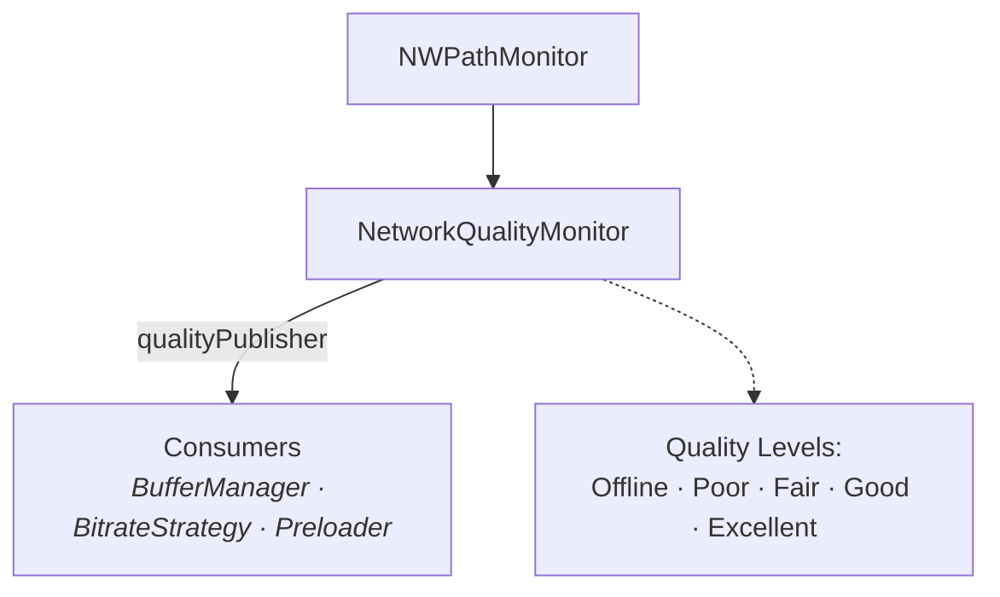

# Network Quality Monitoring Feature

The Network Quality Monitoring feature tracks network conditions to enable adaptive streaming quality and buffer management.

---

## Overview



---

## Features

- **Real-time Monitoring** - Continuous network status tracking
- **Quality Levels** - Five distinct quality classifications
- **Connection Type Detection** - WiFi, cellular, wired
- **Bandwidth Estimation** - Sample-based throughput estimation
- **Constrained Network Detection** - Low data mode awareness
- **Combine Integration** - Reactive quality publishing

---

## Architecture

### NetworkQuality

**File:** `StreamingCore/StreamingCore/Video Performance Feature/PerformanceEvent.swift`

```swift
public enum NetworkQuality: Int, Sendable, Comparable, Codable, Equatable {
    case offline = 0
    case poor = 1
    case fair = 2
    case good = 3
    case excellent = 4

    public static func < (lhs: Self, rhs: Self) -> Bool {
        lhs.rawValue < rhs.rawValue
    }
}
```

### NetworkQualityMonitor

**File:** `StreamingCore/StreamingCoreiOS/Video Performance iOS/NetworkQualityMonitor.swift`

```swift
import Network

public final class NetworkQualityMonitor: @unchecked Sendable {

    public enum ConnectionType: Sendable {
        case wifi
        case cellular
        case wiredEthernet
        case loopback
        case other
    }

    private let monitor: NWPathMonitor
    private let queue: DispatchQueue
    private var isMonitoring = false

    private let qualitySubject = CurrentValueSubject<NetworkQuality, Never>(.fair)

    public var currentQuality: NetworkQuality {
        qualitySubject.value
    }

    public var qualityPublisher: AnyPublisher<NetworkQuality, Never> {
        qualitySubject.eraseToAnyPublisher()
    }

    public init() {
        self.monitor = NWPathMonitor()
        self.queue = DispatchQueue(label: "com.streamingcore.networkmonitor", qos: .utility)
    }

    public func startMonitoring() async {
        guard !isMonitoring else { return }
        isMonitoring = true

        monitor.pathUpdateHandler = { [weak self] path in
            guard let self = self else { return }

            let connectionType = Self.connectionType(from: path)
            let quality = Self.determineQuality(
                status: path.status,
                isExpensive: path.isExpensive,
                isConstrained: path.isConstrained,
                connectionType: connectionType
            )

            self.qualitySubject.send(quality)
        }

        monitor.start(queue: queue)
    }

    public func stopMonitoring() async {
        guard isMonitoring else { return }
        isMonitoring = false
        monitor.cancel()
    }

    public static func determineQuality(
        status: NWPath.Status,
        isExpensive: Bool,
        isConstrained: Bool,
        connectionType: ConnectionType
    ) -> NetworkQuality {
        // Offline check
        guard status == .satisfied else {
            return .offline
        }

        // Constrained connections (e.g. Low Data Mode) are poor quality
        if isConstrained {
            return .poor
        }

        // Base quality by connection type
        var quality: NetworkQuality
        switch connectionType {
        case .wifi, .wiredEthernet, .loopback:
            quality = .excellent
        case .cellular:
            quality = .good
        case .other:
            quality = .fair
        }

        // Reduce quality if expensive (metered connection)
        if isExpensive && quality > .fair {
            quality = .fair
        }

        return quality
    }

    private static func connectionType(from path: NWPath) -> ConnectionType {
        if path.usesInterfaceType(.wifi) {
            return .wifi
        } else if path.usesInterfaceType(.cellular) {
            return .cellular
        } else if path.usesInterfaceType(.wiredEthernet) {
            return .wiredEthernet
        } else if path.usesInterfaceType(.loopback) {
            return .loopback
        } else {
            return .other
        }
    }
}
```

---

## Bandwidth Estimation

> The bandwidth estimation types (`NetworkBandwidthEstimator`, `BandwidthSample`,
> `BandwidthEstimate`) live in the platform-agnostic `StreamingCorePlayback`
> module and are wired on both iOS and tvOS (see `StreamingVideoAppTV/TVPlayerComposer.swift`).
> `NetworkQualityMonitor` above, by contrast, lives in the iOS-only `StreamingCoreiOS` layer.

### NetworkBandwidthEstimator

**File:** `StreamingCore/StreamingCorePlayback/NetworkBandwidthEstimator.swift`

```swift
@MainActor
public final class NetworkBandwidthEstimator {

    private let maxSamples: Int
    private var samples: [BandwidthSample] = []

    /// Number of samples currently stored
    public var sampleCount: Int {
        samples.count
    }

    /// Current bandwidth estimate based on stored samples
    public var currentEstimate: BandwidthEstimate {
        calculateEstimate()
    }

    public init(maxSamples: Int = 30) {
        self.maxSamples = maxSamples
    }

    /// Record a new bandwidth sample. Invalid samples (non-positive duration or
    /// bytes) are ignored. When over the limit, the oldest samples are trimmed
    /// by count (there is no time-based windowing).
    public func recordSample(_ sample: BandwidthSample) {
        guard sample.duration > 0, sample.bytesTransferred > 0 else { return }

        samples.append(sample)

        if samples.count > maxSamples {
            samples.removeFirst(samples.count - maxSamples)
        }
    }

    /// Clear all stored samples
    public func clear() {
        samples.removeAll()
    }

    private func calculateEstimate() -> BandwidthEstimate {
        guard !samples.isEmpty else { return .empty }

        let bandwidths = samples.map { $0.bitsPerSecond }
        // Simple (unweighted) average across all stored samples.
        let average = bandwidths.reduce(0, +) / Double(bandwidths.count)
        let peak = bandwidths.max() ?? 0
        let minimum = bandwidths.min() ?? 0

        return BandwidthEstimate(
            averageBandwidthBps: average,
            peakBandwidthBps: peak,
            minimumBandwidthBps: minimum,
            stability: /* coefficient-of-variation score */ 0,
            confidence: /* grows with sample count */ 0,
            sampleCount: samples.count
        )
    }
}
```

### BandwidthSample

**File:** `StreamingCore/StreamingCorePlayback/BandwidthSample.swift`

```swift
public struct BandwidthSample: Equatable, Sendable {
    public let bytesTransferred: Int64
    public let duration: TimeInterval        // seconds
    public let timestamp: Date

    /// Calculated bandwidth in bits per second
    public var bitsPerSecond: Double {
        guard duration > 0 else { return 0 }
        return Double(bytesTransferred * 8) / duration
    }

    /// Calculated bandwidth in megabits per second
    public var megabitsPerSecond: Double {
        bitsPerSecond / 1_000_000
    }
}
```

### BandwidthEstimate

**File:** `StreamingCore/StreamingCorePlayback/BandwidthEstimate.swift`

The output type of `NetworkBandwidthEstimator.currentEstimate`.

```swift
public struct BandwidthEstimate: Equatable, Sendable {
    public let averageBandwidthBps: Double
    public let peakBandwidthBps: Double
    public let minimumBandwidthBps: Double
    public let stability: Double      // 0-1, 1 is most stable (from coefficient of variation)
    public let confidence: Double     // 0-1, grows with sample count
    public let sampleCount: Int

    /// Conservative recommended maximum bitrate (70% of minimum observed bandwidth)
    public var recommendedMaxBitrate: Int {
        Int(minimumBandwidthBps * 0.7)
    }

    /// Whether this estimate is reliable enough to base decisions on
    public var isReliable: Bool {
        confidence >= 0.5 && stability >= 0.5 && sampleCount >= 3
    }

    /// Empty estimate representing no bandwidth data
    public static let empty: BandwidthEstimate
}
```

---

## AVPlayer Performance Observer

**File:** `StreamingCore/StreamingCorePlayback/AVPlayerPerformanceObserver.swift`

```swift
public final class AVPlayerPerformanceObserver: @unchecked Sendable {
    private weak var player: AVPlayer?

    private let playbackStateSubject = CurrentValueSubject<ObserverPlaybackState, Never>(.idle)
    private let bufferingStateSubject = CurrentValueSubject<BufferingState, Never>(.unknown)
    private let performanceEventSubject = PassthroughSubject<PerformanceEvent, Never>()

    public var currentPlaybackState: ObserverPlaybackState { playbackStateSubject.value }
    public var currentBufferingState: BufferingState { bufferingStateSubject.value }

    public var playbackStatePublisher: AnyPublisher<ObserverPlaybackState, Never> {
        playbackStateSubject.eraseToAnyPublisher()
    }

    public var bufferingStatePublisher: AnyPublisher<BufferingState, Never> {
        bufferingStateSubject.eraseToAnyPublisher()
    }

    public var performanceEventPublisher: AnyPublisher<PerformanceEvent, Never> {
        performanceEventSubject.eraseToAnyPublisher()
    }

    // Player is injected at init; startObserving() takes no argument.
    public init(player: AVPlayer) {
        self.player = player
    }

    public func startObserving() {
        guard let player = player else { return }
        // KVO on timeControlStatus + currentItem, and item buffer/status
        // observation, all wired here. See source for details.
        _ = player
    }

    public func stopObserving() {
        // Invalidate all KVO observers and remove notification tokens.
    }

    private func handleTimeControlStatusChange(_ status: AVPlayer.TimeControlStatus) {
        switch status {
        case .paused:
            playbackStateSubject.send(.paused)
        case .playing:
            playbackStateSubject.send(.playing)
        case .waitingToPlayAtSpecifiedRate:
            playbackStateSubject.send(.buffering)
        @unknown default:
            break
        }
    }
}

public enum ObserverPlaybackState: Equatable, Sendable {
    case idle
    case playing
    case paused
    case buffering
    case stalled
    case failed(Error)
}

public enum BufferingState: Equatable, Sendable {
    case unknown
    case buffering
    case ready
    case stalled
}
```

---

## Integration with Other Features

### Bitrate Strategy

```swift
let bitrate = bitrateStrategy.initialBitrate(
    for: networkMonitor.currentQuality,
    availableLevels: availableBitrates
)
```

### Video Preloader

```swift
let videosToPreload = preloadStrategy.videosToPreload(
    currentVideoIndex: currentIndex,
    playlist: videos,
    networkQuality: networkMonitor.currentQuality
)
```

---

## Composition

```swift
// In SceneDelegate
func setupNetworkMonitoring() -> NetworkQualityMonitor {
    let networkMonitor = NetworkQualityMonitor()
    Task { await networkMonitor.startMonitoring() }  // startMonitoring() is async

    // Subscribe to quality changes
    networkMonitor.qualityPublisher
        .removeDuplicates()
        .sink { quality in
            print("Network quality changed to: \(quality)")
        }
        .store(in: &cancellables)

    return networkMonitor
}
```

---

## Testing

### Mock Network Monitor

```swift
final class NetworkQualityMonitorStub: NetworkQualityMonitor {
    private let qualitySubject = CurrentValueSubject<NetworkQuality, Never>(.good)

    override var qualityPublisher: AnyPublisher<NetworkQuality, Never> {
        qualitySubject.eraseToAnyPublisher()
    }

    func simulateQualityChange(_ quality: NetworkQuality) {
        qualitySubject.send(quality)
    }
}
```

### Bandwidth Estimator Tests

```swift
@MainActor
func test_currentEstimate_afterMultipleSamples_calculatesCorrectAverage() {
    let sut = NetworkBandwidthEstimator()

    // 1,000,000 bytes / 1 sec = 8,000,000 bps
    sut.recordSample(BandwidthSample(bytesTransferred: 1_000_000, duration: 1.0, timestamp: Date()))
    // 2,000,000 bytes / 1 sec = 16,000,000 bps
    sut.recordSample(BandwidthSample(bytesTransferred: 2_000_000, duration: 1.0, timestamp: Date()))

    // Simple (unweighted) average: (8,000,000 + 16,000,000) / 2 = 12,000,000 bps
    XCTAssertEqual(sut.currentEstimate.averageBandwidthBps, 12_000_000)
}
```

---

## Related Documentation

- [Buffer Management](BUFFER-MANAGEMENT.md) - Network-aware buffering
- [Video Playback](VIDEO-PLAYBACK.md) - Adaptive streaming
- [Performance](../PERFORMANCE.md) - Bitrate strategies
