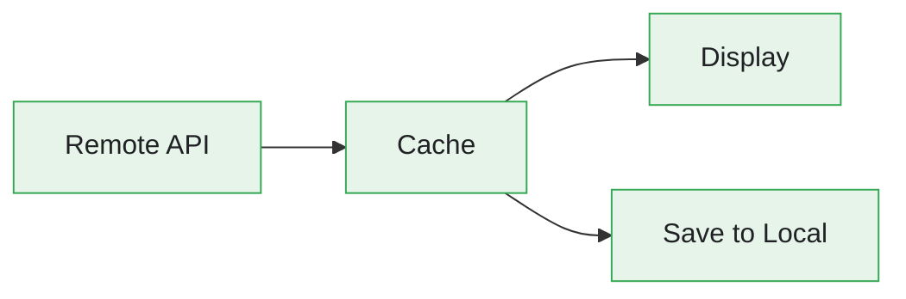
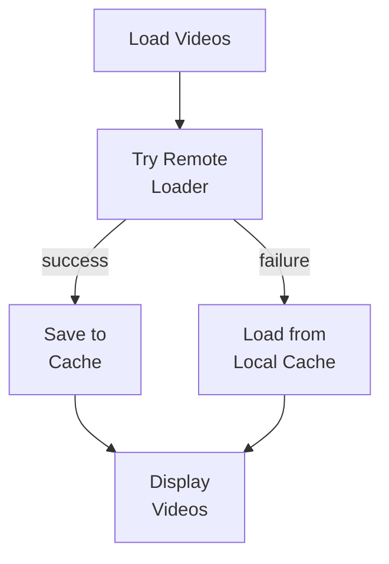

# Offline Support Feature

The Offline Support feature enables the app to work without network connectivity by caching videos and images locally.

---

## Overview

**Online mode** — try remote, display, and save to the local cache in the background:



**Offline mode** — remote fails, fall back to the local cache:


---

## Features

- **Video Metadata Caching** - Store video list locally
- **Image Caching** - Persist thumbnails for offline viewing
- **Cache Validation** - 7-day expiration policy
- **Fallback Loading** - Automatic switch to cache on network failure
- **Cache-First Strategy** - Try remote, save to cache, fallback on error

---

## Architecture

### Cache Policy

**File:** `StreamingCore/StreamingCore/Video Cache/VideoCachePolicy.swift`

```swift
final class VideoCachePolicy {
    private static let calendar = Calendar(identifier: .gregorian)
    private static var maxCacheAgeInDays: Int { 7 }

    static func validate(_ timestamp: Date, against date: Date) -> Bool {
        guard let maxCacheAge = calendar.date(
            byAdding: .day,
            value: maxCacheAgeInDays,
            to: timestamp
        ) else {
            return false
        }
        return date < maxCacheAge
    }
}
```

### Video Store Protocol

**File:** `StreamingCore/StreamingCore/Video Cache/VideoStore.swift`

```swift
public protocol VideoStore {
    func deleteCachedVideos() throws
    func insert(_ videos: [LocalVideo], timestamp: Date) throws
    func retrieve() throws -> CachedVideos?
}

public typealias CachedVideos = (videos: [LocalVideo], timestamp: Date)
```

---

## Storage Implementations

### CoreData Store

**File:** `StreamingCore/StreamingCore/Video Cache/Infrastructure/CoreData/CoreDataVideoStore.swift`

```swift
public final class CoreDataVideoStore: VideoStore {
    private let container: NSPersistentContainer
    private let context: NSManagedObjectContext

    public func insert(_ videos: [LocalVideo], timestamp: Date) throws {
        try context.performAndWait {
            let cache = ManagedCache(context: context)
            cache.timestamp = timestamp
            cache.videos = NSOrderedSet(array: videos.map {
                ManagedVideo.video(from: $0, in: context)
            })
            try context.save()
        }
    }

    public func retrieve() throws -> CachedVideos? {
        try context.performAndWait {
            guard let cache = try ManagedCache.find(in: context) else {
                return nil
            }
            return CachedVideos(
                videos: cache.localVideos,
                timestamp: cache.timestamp
            )
        }
    }

    public func deleteCachedVideos() throws {
        try context.performAndWait {
            try ManagedCache.find(in: context).map(context.delete)
            try context.save()
        }
    }
}
```

### In-Memory Store (Testing)

**File:** `StreamingCore/StreamingCore/Video Cache/Infrastructure/InMemory/InMemoryVideoStore.swift`

```swift
public final class InMemoryVideoStore: VideoStore {
    private var cache: CachedVideos?

    public func insert(_ videos: [LocalVideo], timestamp: Date) throws {
        cache = (videos, timestamp)
    }

    public func retrieve() throws -> CachedVideos? {
        cache
    }

    public func deleteCachedVideos() throws {
        cache = nil
    }
}
```

---

## Local Video Loader

**File:** `StreamingCore/StreamingCore/Video Cache/LocalVideoLoader.swift`

```swift
public final class LocalVideoLoader {
    private let store: VideoStore
    private let currentDate: () -> Date

    public init(store: VideoStore, currentDate: @escaping () -> Date) {
        self.store = store
        self.currentDate = currentDate
    }
}

// MARK: - VideoCache
extension LocalVideoLoader: VideoCache {
    public func save(_ videos: [Video]) throws {
        try store.deleteCachedVideos()
        let localVideos = videos.map { video in
            LocalVideo(
                id: video.id,
                title: video.title,
                description: video.description,
                url: video.url,
                thumbnailURL: video.thumbnailURL,
                duration: video.duration
            )
        }
        try store.insert(localVideos, timestamp: currentDate())
    }
}

// MARK: - Loading
extension LocalVideoLoader {
    public func load() throws -> [Video] {
        if let cache = try store.retrieve(),
           VideoCachePolicy.validate(cache.timestamp, against: currentDate()) {
            return cache.videos.map { local in
                Video(
                    id: local.id,
                    title: local.title,
                    description: local.description,
                    url: local.url,
                    thumbnailURL: local.thumbnailURL,
                    duration: local.duration
                )
            }
        }
        return []
    }
}

// MARK: - Validation
extension LocalVideoLoader {
    public func validateCache() throws {
        do {
            if let cache = try store.retrieve(),
               !VideoCachePolicy.validate(cache.timestamp, against: currentDate()) {
                try store.deleteCachedVideos()
            }
        } catch {
            try store.deleteCachedVideos()
        }
    }
}
```

> **Note:** `LocalVideoLoader` does not conform to the `@MainActor async` `VideoLoader`
> protocol — its `load()` is synchronous `throws`. It is the local cache
> reader/writer (`VideoCache` for saving, plus `load()`/`validateCache()`), not a
> drop-in `VideoLoader`. `Video`↔`LocalVideo` mapping is done inline.

---

## Orchestration: VideoService

**File:** `StreamingCore/StreamingCorePlayback/VideoService.swift`

The remote-with-caching and local-fallback flow is orchestrated by `VideoService`,
a `@MainActor` type that wraps an `HTTPClient` and a store (which is both a
`VideoStore` and a `VideoImageDataStore`). It owns a `LocalVideoLoader` internally
and exposes closures that the UI composers consume as their video and image loaders.

### Remote-with-caching + local fallback

```swift
public func loadRemoteVideosWithLocalFallback() async throws -> Paginated<Video> {
    do {
        let items = try await loadRemoteVideos()
        try? localVideoLoader.save(items)     // Cache on success
        return makeFirstPage(items: items)
    } catch {
        return makeFirstPage(items: try localVideoLoader.load())  // Fall back to cache
    }
}
```

Load-more merges the cached items with the newly fetched page before re-caching:

```swift
private func loadMoreRemoteVideos(last: Video?) async throws -> Paginated<Video> {
    async let remote = loadRemoteVideos(after: last)
    let cachedItems = try localVideoLoader.load()
    let newItems = try await remote
    let items = cachedItems + newItems
    try? localVideoLoader.save(items)
    return makePage(items: items, last: newItems.last)
}
```

Images follow the mirror-image policy (local first, remote fallback that caches):

```swift
public func loadLocalImageWithRemoteFallback(url: URL) async throws -> Data {
    do {
        return try await loadLocalImage(url: url)
    } catch {
        return try await loadAndCacheRemoteImage(url: url)
    }
}
```

### Composition

Both scene delegates construct a `VideoService` and pass its loader closures to the
UI composer — the offline behavior is identical on iOS and tvOS:

```swift
// In SceneDelegate (iOS and tvOS)
private lazy var videoService = VideoService(httpClient: httpClient, store: store, logger: logger)

// ...composed with:
//   videoLoader: videoService.loadRemoteVideosWithLocalFallback
//   imageLoader: videoService.loadLocalImageWithRemoteFallback
```

The tvOS surface wires these into `TVVideosUIComposer` — see
[Apple TV Support](APPLE-TV.md) — so caching and fallback are shared, not iOS-only.

---

## Loading Flow



---

## Image Caching

### FileSystem Storage

**File:** `StreamingCore/StreamingCore/Video Cache/Infrastructure/FileSystem/FileSystemVideoImageDataStore.swift`

```swift
public final class FileSystemVideoImageDataStore: VideoImageDataStore {
    private let storeURL: URL

    public func insert(_ data: Data, for url: URL) throws {
        let data = CodableVideoImageData(data: data, url: url)
        let encoded = try JSONEncoder().encode(data)
        try encoded.write(to: storeURL)
    }

    public func retrieve(dataForURL url: URL) throws -> Data? {
        guard let data = try? Data(contentsOf: storeURL) else {
            return nil
        }
        let decoded = try JSONDecoder().decode(CodableVideoImageData.self, from: data)
        return decoded.url == url ? decoded.data : nil
    }

    private struct CodableVideoImageData: Codable {
        let data: Data
        let url: URL
    }
}
```

The image cache persists a single `CodableVideoImageData` (`data` + `url`) as JSON
at `storeURL`; retrieval decodes it and returns the bytes only when the stored `url`
matches the requested one.

---

## Cache Invalidation

### Automatic Expiration

```swift
// In LocalVideoLoader.load()
if let cache = try store.retrieve(),
   VideoCachePolicy.validate(cache.timestamp, against: currentDate()) {
    return cache.videos.map { local in Video(/* map LocalVideo -> Video */) }
}
// Expired or no cache - return empty
return []
```

### Explicit Invalidation

`LocalVideoLoader.validateCache()` deletes the cache when the 7-day policy fails
*or* when retrieval throws:

```swift
public func validateCache() throws {
    do {
        if let cache = try store.retrieve(),
           !VideoCachePolicy.validate(cache.timestamp, against: currentDate()) {
            try store.deleteCachedVideos()
        }
    } catch {
        try store.deleteCachedVideos()
    }
}
```

`VideoService.validateCache()` schedules this on the store (called from the
`SceneDelegate` on scene lifecycle events).

### Manual Clearing

```swift
// Clear video cache
try store.deleteCachedVideos()

// Clear image cache
try FileManager.default.removeItem(at: imageCacheURL)
```

---

## Data Models

### LocalVideo

**File:** `StreamingCore/StreamingCore/Video Cache/LocalVideo.swift`

```swift
public struct LocalVideo: Equatable, Sendable {
    public let id: UUID
    public let title: String
    public let description: String?
    public let url: URL
    public let thumbnailURL: URL
    public let duration: TimeInterval

    public init(id: UUID,
                title: String,
                description: String? = nil,
                url: URL,
                thumbnailURL: URL,
                duration: TimeInterval) {
        self.id = id
        self.title = title
        self.description = description
        self.url = url
        self.thumbnailURL = thumbnailURL
        self.duration = duration
    }
}
```

`Video`↔`LocalVideo` mapping is performed inline inside `LocalVideoLoader.save()`
and `load()` (see above) — there is no dedicated `toLocal()`/`toModels()` extension.

---

## Testing

### Cache Policy Tests

```swift
func test_validate_returnsTrueOnLessThanSevenDaysOldCache() {
    let sixDaysAgo = Date().addingTimeInterval(-6 * 24 * 60 * 60)
    XCTAssertTrue(VideoCachePolicy.validate(sixDaysAgo, against: Date()))
}

func test_validate_returnsFalseOnSevenDaysOldCache() {
    let sevenDaysAgo = Date().addingTimeInterval(-7 * 24 * 60 * 60)
    XCTAssertFalse(VideoCachePolicy.validate(sevenDaysAgo, against: Date()))
}
```

### Integration Tests

```swift
func test_load_deliversCachedVideosOnCacheHit() async throws {
    let store = InMemoryVideoStore()
    let sut = LocalVideoLoader(store: store, currentDate: Date.init)
    let videos = [makeVideo(), makeVideo()]

    try sut.save(videos)
    let result = try sut.load()

    XCTAssertEqual(result, videos)
}
```

---

## Related Documentation

- [Video Feed](VIDEO-FEED.md) - Feed loading
- [Thumbnail Loading](THUMBNAIL-LOADING.md) - Image caching
- [Design Patterns](../DESIGN-PATTERNS.md) - Decorator pattern
- [Memory Management](MEMORY-MANAGEMENT.md) - Cache cleanup
