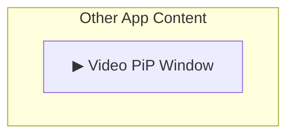
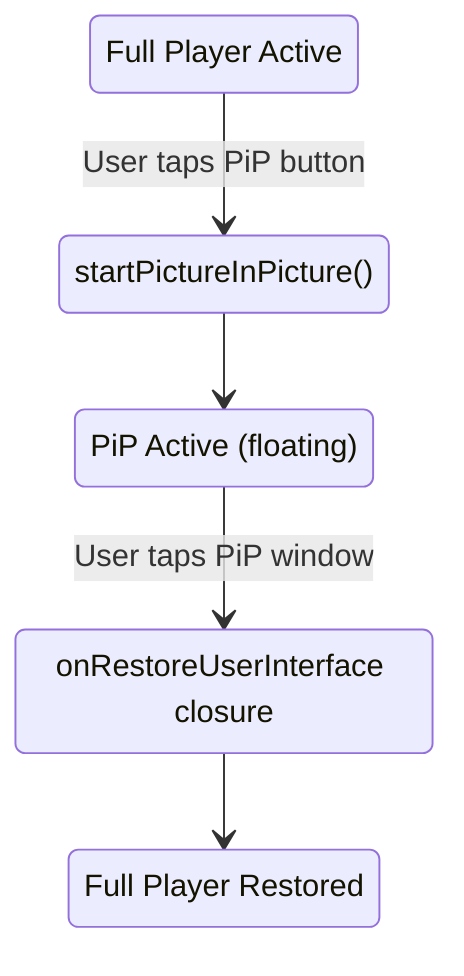

# Picture-in-Picture (PiP) Feature

Picture-in-Picture allows users to continue watching video in a floating window while using other apps.

> **Scope:** iOS only. `PictureInPictureController` lives in the iOS UI layer
> (`StreamingCoreiOS`) and is not part of the tvOS surface — see
> [Apple TV](APPLE-TV.md).

---

## Overview



---

## Features

- **Floating Video Window** - Continue playback in mini player
- **System Integration** - Uses iOS native PiP controller
- **Seamless Transition** - Smooth animation in/out of PiP
- **Playback Controls** - Play/pause, seek from PiP window
- **Return to App** - Tap to return to full player

---

## Architecture

### Protocol Abstraction

**File:** `StreamingCoreiOS/Video UI/Controllers/PictureInPictureControlling.swift`

```swift
public protocol PictureInPictureControlling: AnyObject {
    var isPictureInPictureActive: Bool { get }
    var isPictureInPicturePossible: Bool { get }

    func togglePictureInPicture()
    func startPictureInPicture()
    func stopPictureInPicture()
}
```

> `setup(with:)` is **not** part of the protocol. It lives on the concrete
> `PictureInPictureController` and takes a `PlayerView` (see below).

### Implementation

**File:** `StreamingCoreiOS/Video UI/Controllers/PictureInPictureController.swift`

```swift
public final class PictureInPictureController: NSObject, PictureInPictureControlling {
    private var pipController: AVPictureInPictureController?
    private weak var playerView: PlayerView?

    public var onRestoreUserInterface: ((@escaping (Bool) -> Void) -> Void)?

    public var isPictureInPictureActive: Bool {
        pipController?.isPictureInPictureActive ?? false
    }

    public var isPictureInPicturePossible: Bool {
        pipController?.isPictureInPicturePossible ?? false
    }

    public func setup(with playerView: PlayerView) {
        guard AVPictureInPictureController.isPictureInPictureSupported() else { return }

        self.playerView = playerView
        pipController = AVPictureInPictureController(playerLayer: playerView.playerLayer)
        pipController?.delegate = self
        pipController?.canStartPictureInPictureAutomaticallyFromInline = true
    }

    public func togglePictureInPicture() {
        guard let pipController = pipController else { return }

        if pipController.isPictureInPictureActive {
            pipController.stopPictureInPicture()
        } else if pipController.isPictureInPicturePossible {
            pipController.startPictureInPicture()
        }
    }

    public func startPictureInPicture() {
        guard let pipController = pipController,
              pipController.isPictureInPicturePossible else { return }
        pipController.startPictureInPicture()
    }

    public func stopPictureInPicture() {
        pipController?.stopPictureInPicture()
    }
}
```

Support is checked inline with `AVPictureInPictureController.isPictureInPictureSupported()`
inside `setup(with:)` — there is no static `isPictureInPictureSupported` on the controller.
`setup(with:)` also sets `canStartPictureInPictureAutomaticallyFromInline = true`, so PiP can
start automatically when the app moves to the background during inline playback.

### Return-to-app restore

There is no `PictureInPictureControllerDelegate` protocol. Restoring the full-screen UI
after PiP stops is handled by a single closure property:

```swift
public var onRestoreUserInterface: ((@escaping (Bool) -> Void) -> Void)?
```

The composer can assign this closure to re-present the player. When it is left unset, the
controller calls `completionHandler(true)` directly (see the delegate extension below).

---

## AVPictureInPictureControllerDelegate

```swift
extension PictureInPictureController: AVPictureInPictureControllerDelegate {
    public func pictureInPictureControllerWillStartPictureInPicture(_ pictureInPictureController: AVPictureInPictureController) {
        // PiP is about to start
    }

    public func pictureInPictureControllerDidStartPictureInPicture(_ pictureInPictureController: AVPictureInPictureController) {
        // PiP has started
    }

    public func pictureInPictureControllerWillStopPictureInPicture(_ pictureInPictureController: AVPictureInPictureController) {
        // PiP is about to stop
    }

    public func pictureInPictureControllerDidStopPictureInPicture(_ pictureInPictureController: AVPictureInPictureController) {
        // PiP has stopped
    }

    public func pictureInPictureController(_ pictureInPictureController: AVPictureInPictureController, failedToStartPictureInPictureWithError error: Error) {
        // Handle PiP start failure
    }

    public func pictureInPictureController(_ pictureInPictureController: AVPictureInPictureController, restoreUserInterfaceForPictureInPictureStopWithCompletionHandler completionHandler: @escaping (Bool) -> Void) {
        if let onRestoreUserInterface {
            onRestoreUserInterface(completionHandler)
        } else {
            completionHandler(true)
        }
    }
}
```

The lifecycle callbacks currently have empty bodies. Only
`restoreUserInterfaceForPictureInPictureStop...` forwards work — to the
`onRestoreUserInterface` closure, falling back to `completionHandler(true)`.

---

## Integration

### PlayerView Setup

**File:** `StreamingCoreiOS/Video UI/Views/PlayerView.swift`

```swift
public final class PlayerView: UIView {
    public override class var layerClass: AnyClass {
        AVPlayerLayer.self
    }

    public var playerLayer: AVPlayerLayer {
        layer as! AVPlayerLayer
    }

    public override func layoutSubviews() {
        super.layoutSubviews()
        playerLayer.frame = bounds
        playerLayer.videoGravity = .resizeAspect
    }
}
```

`PlayerView` only exposes its `AVPlayerLayer`. PiP setup lives on
`PictureInPictureController.setup(with:)`, which takes the `PlayerView` directly.

### Composition Root Wiring

PiP is wired in `Tattva/VideoPlayerUIComposer.swift`. The controller is
created, handed the player view, and stored on the view controller; the PiP button
toggles it through the `onPipToggle` closure:

```swift
let pipController = PictureInPictureController()
pipController.setup(with: controller.playerView)
controller.pipController = pipController

controller.onPipToggle = { [weak controller] in
    controller?.pipController?.togglePictureInPicture()
}
```

`VideoPlayerViewController` holds `public var pipController: PictureInPictureControlling?`
and forwards the button tap through `onPipToggle` — it does not conform to any PiP delegate
protocol.

---

## Requirements

### App Configuration

**Info.plist:**
```xml
<key>UIBackgroundModes</key>
<array>
    <string>audio</string>
</array>
```

### Audio Session Setup

```swift
do {
    try AVAudioSession.sharedInstance().setCategory(
        .playback,
        mode: .moviePlayback
    )
    try AVAudioSession.sharedInstance().setActive(true)
} catch {
    print("Failed to configure audio session: \(error)")
}
```

---

## State Flow



---

## Device Support

| Device | PiP Support |
|--------|-------------|
| iPhone | Yes |
| iPad | Yes |
| Simulator | Limited |

```swift
// Support is checked inside setup(with:), which no-ops when unsupported
guard AVPictureInPictureController.isPictureInPictureSupported() else { return }
```

Runtime possibility (used to drive button state) is read from
`pipController.isPictureInPicturePossible`.

---

## Testing

### Protocol-Based Testing

```swift
final class PictureInPictureControllerSpy: PictureInPictureControlling {
    var isPictureInPictureActive = false
    var isPictureInPicturePossible = true
    var toggleCallCount = 0

    func togglePictureInPicture() {
        toggleCallCount += 1
        isPictureInPictureActive.toggle()
    }

    func startPictureInPicture() {}
    func stopPictureInPicture() {}
}

func test_pipButtonTapped_togglesPiP() {
    let pipSpy = PictureInPictureControllerSpy()
    let sut = makeVideoPlayerViewController(pipController: pipSpy)

    sut.pipButtonTapped()

    XCTAssertEqual(pipSpy.toggleCallCount, 1)
    XCTAssertTrue(pipSpy.isPictureInPictureActive)
}
```

---

## Common Issues

### PiP Not Starting

1. Check `UIBackgroundModes` includes "audio"
2. Verify audio session is configured
3. Ensure player has active content
4. Check device supports PiP

### PiP Button Not Visible

```swift
// Must check after player is ready
func playerDidBecomeReady() {
    controlsView.pipButton.isHidden = !pipController.isPictureInPicturePossible
}
```

---

## Related Documentation

- [Video Playback](VIDEO-PLAYBACK.md) - Player integration
- [Architecture](../ARCHITECTURE.md) - Protocol abstraction
- [Design Patterns](../DESIGN-PATTERNS.md) - Adapter pattern
