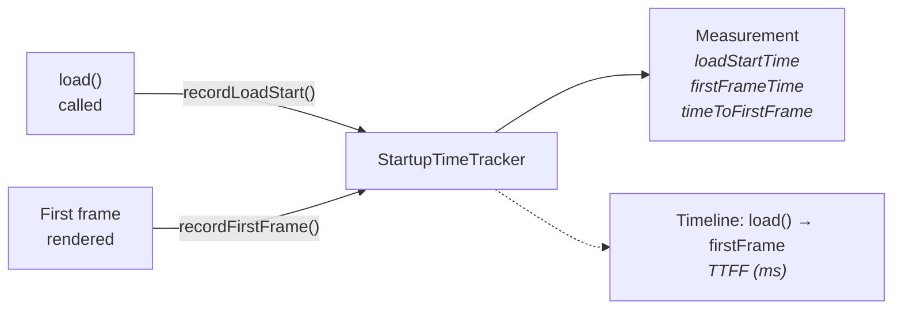
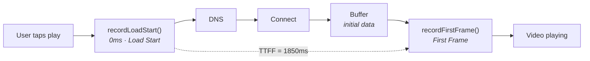

# Startup Performance Feature

The Startup Performance feature tracks Time-to-First-Frame (TTFF), the critical metric that measures how long users wait before video playback begins.

---

## Overview



---

## Features

- **Precise Timing** - Captures exact load start and first frame times
- **Thread-Safe** - NSLock protection for concurrent access
- **Sendable** - Safe to use across concurrency domains
- **Single Measurement** - Prevents duplicate recordings
- **Reset Capability** - Clear for new sessions
- **Completion Detection** - Know when measurement is valid

---

## Architecture

### StartupTimeTracker

**File:** `StreamingCore/StreamingCore/Video Performance Feature/StartupTimeTracker.swift`

```swift
public final class StartupTimeTracker: Sendable {

    // MARK: - Measurement

    public struct Measurement: Equatable, Sendable {
        public let loadStartTime: Date
        public let firstFrameTime: Date?

        public var timeToFirstFrame: TimeInterval? {
            guard let firstFrameTime else { return nil }
            return firstFrameTime.timeIntervalSince(loadStartTime)
        }

        public var isComplete: Bool {
            firstFrameTime != nil
        }
    }

    // MARK: - Private Properties

    private let lock = NSLock()
    private nonisolated(unsafe) var _measurement: Measurement?

    // MARK: - Public Properties

    public var measurement: Measurement? {
        lock.withLock { _measurement }
    }
}
```

---

## Core Methods

```swift
/// Record when video loading begins
public func recordLoadStart(at time: Date = Date()) {
    lock.withLock {
        guard _measurement == nil else { return }
        _measurement = Measurement(loadStartTime: time, firstFrameTime: nil)
    }
}

/// Record when first frame is rendered
public func recordFirstFrame(at time: Date = Date()) {
    lock.withLock {
        guard let current = _measurement, current.firstFrameTime == nil else { return }
        _measurement = Measurement(loadStartTime: current.loadStartTime, firstFrameTime: time)
    }
}

/// Reset for new measurement
public func reset() {
    lock.withLock {
        _measurement = nil
    }
}
```

---

## Measurement Properties

| Property | Type | Description |
|----------|------|-------------|
| `loadStartTime` | Date | When load() was called |
| `firstFrameTime` | Date? | When first frame rendered |
| `timeToFirstFrame` | TimeInterval? | Duration in seconds |
| `isComplete` | Bool | Both timestamps recorded |

---

## TTFF Thresholds

Based on industry standards and `PerformanceThresholds`:

| Rating | TTFF | User Experience |
|--------|------|-----------------|
| Excellent | < 2.0s | Instant feel |
| Good | 2.0 - 4.0s | Acceptable |
| Warning | 4.0 - 8.0s | Noticeable delay |
| Critical | > 8.0s | User may abandon |

```swift
public static let `default` = PerformanceThresholds(
    acceptableStartupTime: 2.0,
    warningStartupTime: 4.0,
    criticalStartupTime: 8.0,
    // ...
)

public static let strictStreaming = PerformanceThresholds(
    acceptableStartupTime: 1.5,
    warningStartupTime: 3.0,
    criticalStartupTime: 5.0,
    // ...
)
```

---

## Usage Example

> The `VideoPlayerCoordinator` and hand-rolled KVO below are illustrative. For the real in-app wiring, see [Production Integration](#production-integration).

### Basic Tracking

```swift
class VideoPlayerCoordinator {
    let startupTracker = StartupTimeTracker()

    func loadVideo(_ url: URL) {
        startupTracker.reset()
        startupTracker.recordLoadStart()

        player.replaceCurrentItem(with: AVPlayerItem(url: url))
    }

    func observePlayerItem(_ item: AVPlayerItem) {
        item.observe(\.status) { [weak self] item, _ in
            if item.status == .readyToPlay {
                self?.startupTracker.recordFirstFrame()
                self?.reportTTFF()
            }
        }
    }

    func reportTTFF() {
        guard let measurement = startupTracker.measurement,
              let ttff = measurement.timeToFirstFrame else { return }

        analytics.track(.timeToFirstFrame(duration: ttff))

        // Check thresholds
        if ttff > thresholds.criticalStartupTime {
            performanceMonitor.alert(.slowStartup(duration: ttff))
        }
    }
}
```

### Integration with Performance Events

```swift
func handlePerformanceEvent(_ event: PerformanceEvent) {
    switch event {
    case .loadStarted:
        startupTracker.recordLoadStart()

    case .firstFrameRendered:
        startupTracker.recordFirstFrame()

        if let ttff = startupTracker.measurement?.timeToFirstFrame {
            evaluateStartupPerformance(ttff)
        }

    default:
        break
    }
}

func evaluateStartupPerformance(_ ttff: TimeInterval) {
    let severity: PerformanceAlert.Severity
    let message: String

    switch ttff {
    case ..<thresholds.acceptableStartupTime:
        return // No alert needed

    case ..<thresholds.warningStartupTime:
        severity = .info
        message = "Startup took \(String(format: "%.1f", ttff))s"

    case ..<thresholds.criticalStartupTime:
        severity = .warning
        message = "Slow startup: \(String(format: "%.1f", ttff))s"

    default:
        severity = .critical
        message = "Very slow startup: \(String(format: "%.1f", ttff))s"
    }

    alertPublisher.send(PerformanceAlert(
        id: UUID(),
        sessionID: sessionID,
        type: .slowStartup(duration: ttff),
        severity: severity,
        timestamp: Date(),
        message: message,
        suggestion: "Consider lowering initial bitrate or preloading"
    ))
}
```

---

## Production Integration

In the shipped app, `StartupTimeTracker` is not driven by the pseudo-code above. It is owned by `PlaybackPerformanceService` and fed through `PerformanceEvent`s emitted by the `StreamingCorePlayback` framework:

- **`StreamingCorePlayback/AVPlayerPerformanceObserver.swift`** — observes `AVPlayer` and emits `PerformanceEvent.loadStarted` (line 186) on its `performanceEventPublisher`.
- **`StreamingCorePlayback/VideoPlayerPerformanceAdapter.swift`** — forwards `.loadStarted` (line 53) and records `.firstFrameRendered` (lines 56, 136) into the performance service.
- **`StreamingCore/Video Performance Feature/PlaybackPerformanceService.swift`** — the real consumer. In `recordEvent(_:)` it calls `startupTracker.recordLoadStart` (line 83) and `startupTracker.recordFirstFrame` (line 86), then `checkStartupTime` (line 162) emits a `PerformanceAlert` when TTFF crosses the warning/critical thresholds.

Because `StartupTimeTracker` lives in the platform-agnostic `StreamingCore` framework and the AVFoundation plumbing lives in `StreamingCorePlayback`, TTFF tracking applies to both shipped surfaces — the iOS app and the tvOS `StreamingVideoAppTV` target. See [Apple TV](APPLE-TV.md).

---

## Optimization Strategies

### Improve TTFF

1. **Preloading** - Load next videos ahead of time
2. **Lower Initial Bitrate** - Start with 360p/480p, upgrade later
3. **Smaller Buffer** - Reduce `preferredForwardBufferDuration` initially
4. **CDN Optimization** - Use edge servers close to user
5. **HLS Optimization** - Smaller initial segment sizes

### Implementation Example

```swift
func optimizedLoad(_ url: URL) {
    startupTracker.reset()
    startupTracker.recordLoadStart()

    // Use lower initial bitrate for faster start
    let item = AVPlayerItem(url: url)
    item.preferredPeakBitRate = 1_000_000 // Start at 480p
    item.preferredForwardBufferDuration = 2 // Minimal initial buffer

    player.replaceCurrentItem(with: item)

    // After first frame, allow higher quality
    item.observe(\.status) { [weak self] item, _ in
        if item.status == .readyToPlay {
            self?.startupTracker.recordFirstFrame()
            // Now allow full quality
            item.preferredPeakBitRate = 0 // No limit
            item.preferredForwardBufferDuration = 30 // Normal buffering
        }
    }
}
```

---

## Timeline Visualization



---

## Testing

### Unit Tests

```swift
func test_recordLoadStart_capturesTime() {
    let fixedDate = Date()
    let sut = StartupTimeTracker()

    sut.recordLoadStart(at: fixedDate)

    XCTAssertEqual(sut.measurement?.loadStartTime, fixedDate)
    XCTAssertNil(sut.measurement?.firstFrameTime)
}

func test_recordFirstFrame_completesTrack() {
    let loadTime = Date()
    let frameTime = loadTime.addingTimeInterval(1.5)
    let sut = StartupTimeTracker()

    sut.recordLoadStart(at: loadTime)
    sut.recordFirstFrame(at: frameTime)

    XCTAssertTrue(sut.measurement?.isComplete ?? false)
    XCTAssertEqual(sut.measurement?.timeToFirstFrame, 1.5, accuracy: 0.001)
}

func test_recordLoadStart_ignoresSecondCall() {
    let firstTime = Date()
    let secondTime = firstTime.addingTimeInterval(1.0)
    let sut = StartupTimeTracker()

    sut.recordLoadStart(at: firstTime)
    sut.recordLoadStart(at: secondTime)

    XCTAssertEqual(sut.measurement?.loadStartTime, firstTime)
}

func test_recordFirstFrame_ignoresWithoutLoadStart() {
    let sut = StartupTimeTracker()

    sut.recordFirstFrame()

    XCTAssertNil(sut.measurement)
}

func test_reset_clearsState() {
    let sut = StartupTimeTracker()
    sut.recordLoadStart()
    sut.recordFirstFrame()

    sut.reset()

    XCTAssertNil(sut.measurement)
}

func test_threadSafety_concurrentAccess() async {
    let sut = StartupTimeTracker()

    await withTaskGroup(of: Void.self) { group in
        for _ in 0..<100 {
            group.addTask {
                sut.recordLoadStart()
            }
            group.addTask {
                _ = sut.measurement
            }
        }
    }

    // Should not crash
    XCTAssertNotNil(sut.measurement)
}
```

---

## Related Documentation

- [Video Preloading](VIDEO-PRELOADING.md) - Reduce TTFF with preloading
- [Adaptive Bitrate](ADAPTIVE-BITRATE.md) - Initial quality selection
- [Performance Alerts](PERFORMANCE-ALERTS.md) - Slow startup alerts
- [AVPlayer Integration](AVPLAYER-INTEGRATION.md) - Event detection
