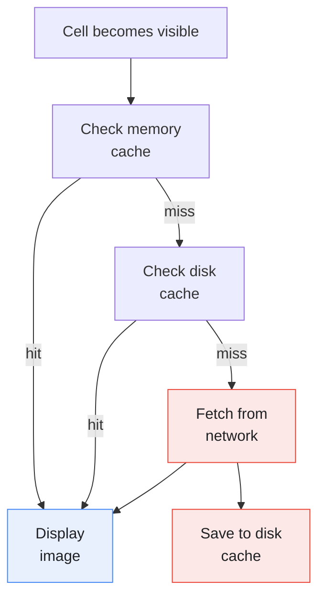

# Thumbnail Loading Feature

The Thumbnail Loading feature provides lazy image loading with caching for video thumbnails in the feed.

---

## Overview

<p align="center">
  
</p>

---

## Features

- **Lazy Loading** - Images load as cells become visible
- **Memory Cache** - Fast access to recently loaded images
- **Disk Cache** - Persistent storage for offline access
- **Shimmer Effect** - Loading placeholder animation
- **Fade Animation** - Smooth appearance when loaded
- **Request Cancellation** - Cancel loads for scrolled-past cells
- **Error Handling** - Retry mechanism for failed loads

---

## Architecture

### Protocol

**File:** `StreamingCore/StreamingCore/Video Image Feature/VideoImageDataLoader.swift`

```swift
public protocol VideoImageDataLoader {
    func loadImageData(from url: URL) throws -> Data
}
```

The Combine bridge (`typealias Publisher = AnyPublisher<Data, Error>`, `loadImageDataPublisher(from:)`, and the `caching(to:for:)` helper) lives in `StreamingCore/StreamingCore/Shared Combine/CombineHelpers.swift`, not in the protocol file.

### Cache Protocol

**File:** `StreamingCore/StreamingCore/Video Image Feature/VideoImageDataCache.swift`

```swift
public protocol VideoImageDataCache {
    func save(_ data: Data, for url: URL) throws
}
```

---

## Remote Loading

Remote fetches are performed by the video service, not a dedicated loader class. `VideoService.loadLocalImageWithRemoteFallback(url:)` tries the local disk cache first and, on failure, fetches over HTTP, validates the response, and writes the result back to the cache:

**File:** `StreamingCore/StreamingCorePlayback/VideoService.swift`

```swift
public func loadLocalImageWithRemoteFallback(url: URL) async throws -> Data {
    do {
        return try await loadLocalImage(url: url)
    } catch {
        return try await loadAndCacheRemoteImage(url: url)
    }
}
```

### Data Validation

**File:** `StreamingCore/StreamingCore/Video API/VideoImageDataMapper.swift`

```swift
public final class VideoImageDataMapper {
    public static func map(_ data: Data, from response: HTTPURLResponse) throws -> Data {
        guard response.isOK, !data.isEmpty else {
            throw Error.invalidData
        }
        return data
    }
}
```

---

## Caching Layer

### Local Image Data Loader

**File:** `StreamingCore/StreamingCore/Video Cache/LocalVideoImageDataLoader.swift`

```swift
public final class LocalVideoImageDataLoader {
    private let store: VideoImageDataStore

    public func loadImageData(from url: URL) throws -> Data {
        guard let data = try store.retrieve(dataForURL: url) else {
            throw Error.notFound
        }
        return data
    }

    public func save(_ data: Data, for url: URL) throws {
        try store.insert(data, for: url)
    }
}
```

### FileSystem Store

**File:** `StreamingCore/StreamingCore/Video Cache/Infrastructure/FileSystem/FileSystemVideoImageDataStore.swift`

```swift
public final class FileSystemVideoImageDataStore: VideoImageDataStore {
    private let storeURL: URL

    public func insert(_ data: Data, for url: URL) throws {
        let fileURL = cacheURL(for: url)
        try data.write(to: fileURL)
    }

    public func retrieve(dataForURL url: URL) throws -> Data? {
        let fileURL = cacheURL(for: url)
        return try? Data(contentsOf: fileURL)
    }

    private func cacheURL(for url: URL) -> URL {
        let filename = url.absoluteString.data(using: .utf8)!.base64EncodedString()
        return storeURL.appendingPathComponent(filename)
    }
}
```

---

## Caching on Success

There is no decorator or composite class. Local-with-remote-fallback is the `loadLocalImageWithRemoteFallback` flow shown above; caching-on-success is expressed either by the private `loadAndCacheRemoteImage` step in `VideoService` (which writes back through `LocalVideoImageDataLoader.save`) or, for Combine consumers, by the `caching(to:for:)` publisher helper:

**File:** `StreamingCore/StreamingCore/Shared Combine/CombineHelpers.swift`

```swift
public extension Publisher where Output == Data {
    func caching(to cache: VideoImageDataCache, for url: URL) -> AnyPublisher<Output, Failure> {
        handleEvents(receiveOutput: { data in
            try? cache.save(data, for: url)
        }).eraseToAnyPublisher()
    }
}
```

---

## Loading Flow



---

## UI Integration

### VideoCellController

The controller is delegate-driven, not Combine-driven. It holds a `VideoCellControllerDelegate` and asks it to load or cancel; the delegate (an `ImageDataPresentationAdapter`) drives the actual async request and reports back through the `ResourceView` / `ResourceLoadingView` / `ResourceErrorView` conformances. Shimmer is toggled via `videoImageContainer.isShimmering`, and the loaded image is set on `videoImageView`:

**File:** `StreamingCoreiOS/Video UI/Controllers/VideoCellController.swift`

```swift
public protocol VideoCellControllerDelegate {
    func didRequestImage()
    func didCancelImageRequest()
}

public final class VideoCellController: NSObject {
    private let viewModel: VideoViewModel
    private let delegate: VideoCellControllerDelegate
    private let selection: () -> Void
    private var cell: VideoCell?
}

extension VideoCellController: ResourceView, ResourceLoadingView, ResourceErrorView {
    public func display(_ viewModel: UIImage) {
        cell?.videoImageView.setImageAnimated(viewModel)
    }

    public func display(_ viewModel: ResourceLoadingViewModel) {
        cell?.videoImageContainer.isShimmering = viewModel.isLoading
    }

    public func display(_ viewModel: ResourceErrorViewModel) {
        cell?.videoImageRetryButton.isHidden = viewModel.message == nil
    }
}
```

### UITableViewDataSourcePrefetching

`ListViewController` is itself the prefetching conformer. It forwards each index path to the cell controller's `dataSourcePrefetching` (the `VideoCellController` conforms to `UITableViewDataSourcePrefetching`), which requests or cancels the image via the delegate:

**File:** `StreamingCoreiOS/Shared UI/Controllers/ListViewController.swift`

```swift
public func tableView(_ tableView: UITableView, prefetchRowsAt indexPaths: [IndexPath]) {
    indexPaths.forEach { indexPath in
        let dsp = cellController(at: indexPath)?.dataSourcePrefetching
        dsp?.tableView(tableView, prefetchRowsAt: [indexPath])
    }
}

public func tableView(_ tableView: UITableView, cancelPrefetchingForRowsAt indexPaths: [IndexPath]) {
    indexPaths.forEach { indexPath in
        let dsp = cellController(at: indexPath)?.dataSourcePrefetching
        dsp?.tableView?(tableView, cancelPrefetchingForRowsAt: [indexPath])
    }
}
```

---

## Animations

### Shimmer Effect

**File:** `StreamingCoreiOS/Video UI/Views/Helpers/UIView+Shimmering.swift`

```swift
extension UIView {
    func startShimmering() {
        let gradient = CAGradientLayer()
        gradient.colors = [
            UIColor.systemGray5.cgColor,
            UIColor.systemGray4.cgColor,
            UIColor.systemGray5.cgColor
        ]
        gradient.startPoint = CGPoint(x: 0, y: 0.5)
        gradient.endPoint = CGPoint(x: 1, y: 0.5)
        gradient.frame = bounds

        let animation = CABasicAnimation(keyPath: "locations")
        animation.fromValue = [-1.0, -0.5, 0.0]
        animation.toValue = [1.0, 1.5, 2.0]
        animation.duration = 1.5
        animation.repeatCount = .infinity

        gradient.add(animation, forKey: "shimmer")
        layer.addSublayer(gradient)
    }

    func stopShimmering() {
        layer.sublayers?.removeAll { $0.animation(forKey: "shimmer") != nil }
    }
}
```

### Fade-In Animation

**File:** `StreamingCoreiOS/Video UI/Views/Helpers/UIImageView+Animations.swift`

```swift
extension UIImageView {
    func setImageAnimated(_ image: UIImage?) {
        self.image = image

        guard image != nil else { return }

        alpha = 0
        UIView.animate(withDuration: 0.3) {
            self.alpha = 1
        }
    }
}
```

---

## Composition

The image loader is an `(URL) async throws -> Data` closure, wired in `SceneDelegate` straight from the video service and threaded through `VideosUIComposer` -> `VideosViewAdapter` (which builds an `ImageDataPresentationAdapter` per cell):

**File:** `Tattva/Tattva/SceneDelegate.swift`

```swift
VideosUIComposer.videosComposedWith(
    videoLoader: videoService.loadRemoteVideosWithLocalFallback,
    imageLoader: videoService.loadLocalImageWithRemoteFallback,
    selection: showVideoPlayer)
```

---

## Testing

### Remote Loader Tests

```swift
func test_loadImageData_deliversDataOn200Response() async throws {
    let (sut, client) = makeSUT()
    let imageData = anyImageData()

    client.complete(with: imageData)

    let result = try await sut.loadImageData(from: anyURL())
    XCTAssertEqual(result, imageData)
}
```

### Cache Tests

```swift
func test_load_deliversCachedDataOnCacheHit() async throws {
    let (sut, store) = makeSUT()
    let cachedData = anyImageData()
    store.stub(dataForURL: anyURL(), with: cachedData)

    let result = try await sut.loadImageData(from: anyURL())
    XCTAssertEqual(result, cachedData)
}
```

---

## tvOS Thumbnail Loading

The tvOS app has its own thumbnail path on a `UICollectionView` feed. `TVVideoCellController` holds the same `(@Sendable (URL) async throws -> Data)?` image-loader closure and loads posters into `TVVideoPosterCell.posterImageView` using async/await, cancelling in-flight work via `imageTask?.cancel()` and `Task.isCancelled`. There is no shimmer; the poster uses focus-driven scale and border styling instead.

**Files:** `Tattva/TattvaTV/TVVideoCellController.swift`, `TVVideoPosterCell.swift`

See [Apple TV](APPLE-TV.md) for the full tvOS surface.

---

## Related Documentation

- [Video Feed](VIDEO-FEED.md) - Feed integration
- [Offline Support](OFFLINE-SUPPORT.md) - Cache strategies
- [Apple TV](APPLE-TV.md) - tvOS feed and poster surface
- [Design Patterns](../DESIGN-PATTERNS.md) - Decorator pattern
