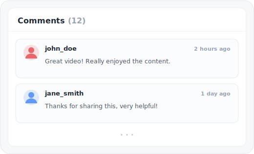
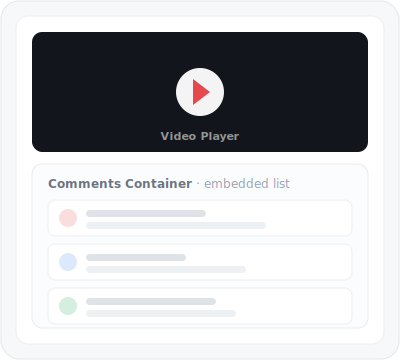

# Video Comments Feature

The Video Comments feature displays threaded comments for each video with pull-to-refresh and relative timestamp formatting.

---

## Overview

<p align="center">
  
</p>

---

## Features

- **Comment Display** - Show comments for each video
- **Relative Timestamps** - "2 hours ago", "1 day ago"
- **Pull-to-Refresh** - Refresh comments list
- **Loading States** - Skeleton loading while fetching
- **Error Handling** - Retry on failure

---

## Architecture

### Domain Model

**File:** `StreamingCore/StreamingCore/Video Comments Feature/VideoComment.swift`

```swift
public struct VideoComment: Equatable, Sendable {
    public let id: UUID
    public let message: String
    public let createdAt: Date
    public let username: String

    public init(id: UUID, message: String, createdAt: Date, username: String) {
        self.id = id
        self.message = message
        self.createdAt = createdAt
        self.username = username
    }
}
```

### API Endpoint

**File:** `StreamingCore/StreamingCore/Video Comments API/VideoCommentsEndpoint.swift`

```swift
public enum VideoCommentsEndpoint {
    case get(UUID)

    public func url(baseURL: URL) -> URL {
        switch self {
        case let .get(id):
            return baseURL.appendingPathComponent("/v1/videos/\(id)/comments")
        }
    }
}
```

### Data Mapping

**File:** `StreamingCore/StreamingCore/Video Comments API/VideoCommentsMapper.swift`

```swift
public final class VideoCommentsMapper {
    private struct Root: Decodable {
        private let items: [Item]

        var comments: [VideoComment] {
            items.map { VideoComment(
                id: $0.id,
                message: $0.message,
                createdAt: $0.created_at,
                username: $0.author.username
            )}
        }
    }

    public static func map(_ data: Data, from response: HTTPURLResponse) throws -> [VideoComment] {
        let decoder = JSONDecoder()
        decoder.dateDecodingStrategy = .iso8601

        guard isOK(response),
              let root = try? decoder.decode(Root.self, from: data) else {
            throw Error.invalidData
        }
        return root.comments
    }
}
```

---

## Presentation

### VideoCommentsPresenter

**File:** `StreamingCore/StreamingCore/Video Comments Presentation/VideoCommentsPresenter.swift`

`VideoCommentsPresenter`, `VideoCommentsViewModel`, and `VideoCommentViewModel` live in `StreamingCore` and are platform-agnostic - the iOS `VideoCommentCell` path and the tvOS `TVCommentsViewController`/`TVCommentCell` path share this same presentation layer.

Uses **Dependency Rejection** - calendar and locale as parameters, not injected:

```swift
public final class VideoCommentsPresenter {
    public static func map(
        _ comments: [VideoComment],
        currentDate: Date = Date(),
        calendar: Calendar = .current,
        locale: Locale = .current
    ) -> VideoCommentsViewModel {
        let formatter = RelativeDateTimeFormatter()
        formatter.calendar = calendar
        formatter.locale = locale

        return VideoCommentsViewModel(
            comments: comments.map { comment in
                VideoCommentViewModel(
                    message: comment.message,
                    date: formatter.localizedString(
                        for: comment.createdAt,
                        relativeTo: currentDate
                    ),
                    username: comment.username
                )
            }
        )
    }
}
```

### View Models

```swift
public struct VideoCommentsViewModel {
    public let comments: [VideoCommentViewModel]
}

public struct VideoCommentViewModel {
    public let message: String
    public let date: String      // "2 hours ago"
    public let username: String
}
```

---

## UI Components

### VideoCommentCell

**File:** `StreamingCoreiOS/Video Comments UI/Views/VideoCommentCell.swift`

```swift
public final class VideoCommentCell: UITableViewCell {
    public let usernameLabel: UILabel
    public let dateLabel: UILabel
    public let messageLabel: UILabel

    public func configure(with viewModel: VideoCommentViewModel) {
        usernameLabel.text = viewModel.username
        dateLabel.text = viewModel.date
        messageLabel.text = viewModel.message
    }
}
```

### VideoCommentCellController

**File:** `StreamingCoreiOS/Video Comments UI/Controllers/VideoCommentCellController.swift`

```swift
public final class VideoCommentCellController: NSObject {
    private let viewModel: VideoCommentViewModel

    public init(viewModel: VideoCommentViewModel) {
        self.viewModel = viewModel
    }

    public func view(in tableView: UITableView) -> UITableViewCell {
        let cell = tableView.dequeueReusableCell(
            withIdentifier: "VideoCommentCell"
        ) as! VideoCommentCell
        cell.configure(with: viewModel)
        return cell
    }
}
```

---

## Integration with Video Player

Comments are embedded below the video player in portrait. The container is hidden in landscape/fullscreen (constraints are only activated when `!isLandscape`):

<p align="center">
  
</p>

### VideoPlayerViewController Integration

`VideoPlayerViewController` accepts a pre-composed comments controller via `setCommentsController(_:)` and embeds it below the player (`embedCommentsController(_:)`, private):

```swift
public func setCommentsController(_ controller: UIViewController) {
    embeddedCommentsController = controller
    if isViewLoaded {
        embedCommentsController(controller)
    }
}
```

The comments controller is built and injected during composition (see below), not by the player itself.

---

## Composition

**File:** `Tattva/VideoCommentsUIComposer.swift`

```swift
@MainActor
public enum VideoCommentsUIComposer {
    private typealias CommentsPresentationAdapter = AsyncLoadResourcePresentationAdapter<[VideoComment], VideoCommentsViewAdapter>

    public static func commentsComposedWith(
        commentsLoader: @MainActor @escaping () async throws -> [VideoComment]
    ) -> ListViewController {
        let presentationAdapter = CommentsPresentationAdapter(loader: commentsLoader)

        let commentsController = makeCommentsViewController()
        commentsController.onRefresh = presentationAdapter.loadResource

        presentationAdapter.presenter = LoadResourcePresenter(
            resourceView: VideoCommentsViewAdapter(controller: commentsController),
            loadingView: WeakRefVirtualProxy(commentsController),
            errorView: WeakRefVirtualProxy(commentsController),
            mapper: { VideoCommentsPresenter.map($0) })

        return commentsController
    }

    private static func makeCommentsViewController() -> ListViewController {
        let bundle = Bundle(for: ListViewController.self)
        let storyboard = UIStoryboard(name: "VideoComments", bundle: bundle)
        let commentsController = storyboard.instantiateInitialViewController() as! ListViewController
        commentsController.title = VideoCommentsPresenter.title
        return commentsController
    }
}
```

The `videoId` is bound earlier, at the call site in `SceneDelegate.showVideoPlayer`, which passes `videoService.loadComments(for:)` as the loader and injects the composed controller into the player:

```swift
let commentsController = VideoCommentsUIComposer.commentsComposedWith(
    commentsLoader: videoService.loadComments(for: video))

let videoPlayerController = VideoPlayerUIComposer.videoPlayerComposedWith(
    video: video,
    player: player,
    commentsController: commentsController,
    analyticsLogger: analyticsLogger,
    structuredLogger: structuredLogger)
```

---

## API Response Format

```json
{
  "items": [
    {
      "id": "c7b3d8e0-5c6f-11e8-9c2d-fa7ae01bbebc",
      "message": "Great video! Really enjoyed the content.",
      "created_at": "2024-01-15T10:30:00Z",
      "author": {
        "username": "john_doe"
      }
    }
  ]
}
```

---

## Relative Date Formatting

| Time Difference | Display |
|-----------------|---------|
| < 1 minute | "just now" |
| 1-59 minutes | "X minutes ago" |
| 1-23 hours | "X hours ago" |
| 1-6 days | "X days ago" |
| 1-4 weeks | "X weeks ago" |
| > 1 month | "X months ago" |

```swift
let formatter = RelativeDateTimeFormatter()
formatter.unitsStyle = .full
formatter.localizedString(for: commentDate, relativeTo: Date())
```

---

## Testing

### Presenter Tests (Pure Function)

```swift
func test_map_formatsDateRelativeToCurrentDate() {
    let now = Date()
    let twoHoursAgo = now.addingTimeInterval(-7200)
    let comment = makeComment(createdAt: twoHoursAgo)

    let viewModel = VideoCommentsPresenter.map(
        [comment],
        currentDate: now
    )

    XCTAssertEqual(viewModel.comments[0].date, "2 hours ago")
}

func test_map_usesProvidedCalendarAndLocale() {
    let comment = makeComment()
    let spanishLocale = Locale(identifier: "es")

    let viewModel = VideoCommentsPresenter.map(
        [comment],
        locale: spanishLocale
    )

    // Verify Spanish localization
}
```

### Mapper Tests

```swift
func test_map_deliversCommentsOn200HTTPResponse() throws {
    let comment1 = makeComment(message: "Hello")
    let comment2 = makeComment(message: "World")
    let json = makeCommentsJSON([comment1.json, comment2.json])

    let result = try VideoCommentsMapper.map(
        json,
        from: HTTPURLResponse(statusCode: 200)
    )

    XCTAssertEqual(result, [comment1.model, comment2.model])
}
```

---

## tvOS

The tvOS app renders comments through a separate UI layer that reuses the shared `StreamingCore` presentation (see above):

- **`TVCommentsViewController`** - `UICollectionViewController` backed by an `NSDiffableDataSourceSnapshot`, with a loading `UIActivityIndicatorView`, an empty state (`"No comments yet"`), and a `ResourceErrorView` error state.
- **`TVCommentsUIComposer`** / **`TVCommentCell`** - composition and cell for the tvOS surface.
- Wired via `TVPlayerViewController`, which surfaces comments as an `AVPlayerViewController` info panel (`customInfoViewControllers`) alongside the player rather than below it.

**Files:** `Tattva/TattvaTV/TVCommentsViewController.swift`, `TVCommentsUIComposer.swift`, `TVCommentCell.swift`

See [Apple TV](APPLE-TV.md) for the full tvOS surface.

---

## Related Documentation

- [Video Playback](VIDEO-PLAYBACK.md) - Player integration
- [Dependency Rejection](../DEPENDENCY-REJECTION.md) - Pure presenter pattern
- [TDD](../TDD.md) - Testing strategies
