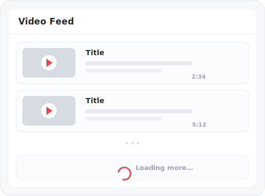
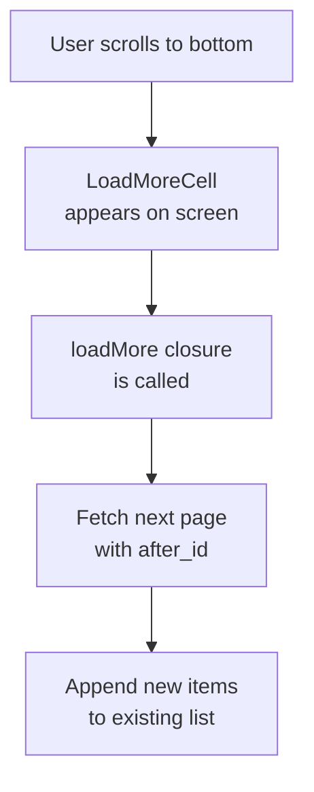
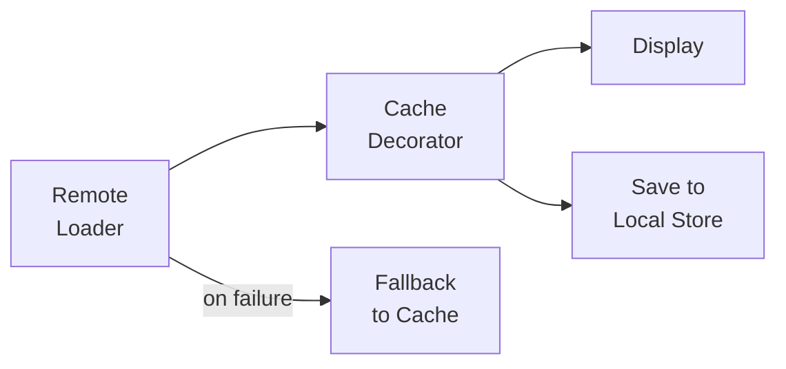

# Video Feed Feature

The Video Feed feature provides a paginated, cacheable list of videos with pull-to-refresh, infinite scroll, and offline support.

---

## Overview

<p align="center">
  
</p>

---

## Features

- **Paginated Loading** - Load videos in batches with cursor-based pagination
- **Pull-to-Refresh** - Refresh the feed by pulling down
- **Infinite Scroll** - Automatically load more when reaching the end
- **Lazy Image Loading** - Thumbnails load as cells become visible
- **Offline Support** - Cached videos available without network
- **Error Handling** - Retry mechanism for failed loads

---

## Architecture

### Domain Model

**File:** `StreamingCore/StreamingCore/Video Feature/Video.swift`

```swift
public struct Video: Hashable, Sendable {
    public let id: UUID
    public let title: String
    public let description: String?
    public let url: URL
    public let thumbnailURL: URL
    public let duration: TimeInterval

    public init(id: UUID,
                title: String,
                description: String? = nil,
                url: URL,
                thumbnailURL: URL,
                duration: TimeInterval) {
        self.id = id
        self.title = title
        self.description = description
        self.url = url
        self.thumbnailURL = thumbnailURL
        self.duration = duration
    }
}
```

### API Layer

**File:** `StreamingCore/StreamingCore/Video API/VideoEndpoint.swift`

```swift
public enum VideoEndpoint {
    case get(after: Video? = nil)

    public func url(baseURL: URL) -> URL {
        switch self {
        case let .get(video):
            var components = URLComponents()
            components.scheme = baseURL.scheme
            components.host = baseURL.host
            components.path = baseURL.path + "/v1/videos"
            components.queryItems = [
                URLQueryItem(name: "limit", value: "10"),
                video.map { URLQueryItem(name: "after_id", value: $0.id.uuidString) },
            ].compactMap { $0 }
            return components.url!
        }
    }
}
```

### Remote Loading

**File:** `StreamingCore/StreamingCore/Video API/RemoteVideoLoader.swift`

```swift
public final class RemoteVideoLoader: VideoLoader {
    private let client: HTTPClient
    private let url: URL

    public func load() async throws -> [Video] {
        let data: Data
        let response: HTTPURLResponse
        do {
            (data, response) = try await client.get(from: url)
        } catch {
            throw Error.connectivity
        }
        do {
            return try VideoItemsMapper.map(data, from: response)
        } catch {
            throw Error.invalidData
        }
    }
}
```

### Data Mapping

**File:** `StreamingCore/StreamingCore/Video API/VideoItemsMapper.swift`

```swift
public final class VideoItemsMapper {
    public static func map(_ data: Data, from response: HTTPURLResponse) throws -> [Video] {
        guard response.isOK,
              let root = try? JSONDecoder().decode(Root.self, from: data) else {
            throw Error.invalidData
        }
        return root.items
    }
}
```

---

## Pagination

### Paginated Wrapper

**File:** `StreamingCore/StreamingCore/Shared API/Paginated.swift`

```swift
public struct Paginated<Item: Sendable>: Sendable {
    public let items: [Item]
    public let loadMore: (@Sendable () async throws -> Self)?

    public init(items: [Item], loadMore: (@Sendable () async throws -> Self)? = nil) {
        self.items = items
        self.loadMore = loadMore
    }
}
```

### Load More Flow



---

## UI Components

### List View Controller

**File:** `StreamingCore/StreamingCoreiOS/Shared UI/Controllers/ListViewController.swift`

Generic list controller handling:
- Table view setup
- Pull-to-refresh
- Error display
- Loading states

### Video Cell

**File:** `StreamingCore/StreamingCoreiOS/Video UI/Views/VideoCell.swift`

Displays:
- Thumbnail image (lazy loaded)
- Video title
- Description
- Duration

### Video Cell Controller

**File:** `StreamingCore/StreamingCoreiOS/Video UI/Controllers/VideoCellController.swift`

```swift
public final class VideoCellController: NSObject {
    private let viewModel: VideoViewModel
    private let imageLoader: (URL) -> VideoImageDataLoader.Publisher
    private let selection: () -> Void

    public func view(in tableView: UITableView) -> UITableViewCell {
        let cell = tableView.dequeueReusableCell(withIdentifier: "VideoCell") as! VideoCell
        cell.titleLabel.text = viewModel.title
        cell.descriptionLabel.text = viewModel.description
        loadImage()
        return cell
    }
}
```

### Load More Cell

**File:** `StreamingCore/StreamingCoreiOS/Video UI/Views/LoadMoreCell.swift`

Triggers pagination when visible.

---

## tvOS Feed Surface

The video feed also ships on tvOS via the `StreamingVideoAppTV` target, reusing the same `StreamingCore` `VideoLoader` and `Paginated<Video>` pipeline behind a focus-based UICollectionView.

**Files:** `StreamingVideoApp/StreamingVideoAppTV/`

- `TVVideoFeedViewController.swift` - Collection view with `onRefresh` / `onLoadMore` pagination
- `TVVideoPosterCell.swift` - Poster cell for the tvOS grid
- `TVVideoCellController.swift` - Cell controller binding `VideoViewModel`
- `TVVideosUIComposer.swift` - Composes the feed with a paginated loader

Load-more pagination is covered by `TVVideoFeedPaginationTests` and `TVVideoFeedLoaderIntegrationTests`.

See [Apple TV](APPLE-TV.md) for the full tvOS surface.

---

## Caching Strategy

### Cache-First Loading



### Video Loader Cache Decorator

```swift
public final class VideoLoaderCacheDecorator: VideoLoader {
    private let decoratee: VideoLoader
    private let cache: VideoCache

    public func load() async throws -> [Video] {
        let videos = try await decoratee.load()
        try cache.save(videos)  // Cache on success
        return videos
    }
}
```

### Fallback Composite

```swift
public final class VideoLoaderWithFallbackComposite: VideoLoader {
    private let primary: VideoLoader
    private let fallback: VideoLoader

    public func load() async throws -> [Video] {
        do {
            return try await primary.load()
        } catch {
            return try await fallback.load()  // Use cache on failure
        }
    }
}
```

---

## Composition

**File:** `StreamingVideoApp/StreamingVideoApp/VideosUIComposer.swift`

```swift
@MainActor
public final class VideosUIComposer {
    private init() {}

    public static func videosComposedWith(
        videoLoader: @MainActor @escaping () async throws -> Paginated<Video>,
        imageLoader: @MainActor @escaping (URL) async throws -> Data,
        selection: @MainActor @escaping (Video) -> Void = { _ in }
    ) -> ListViewController {
        let presentationAdapter = AsyncLoadResourcePresentationAdapter(loader: videoLoader)

        let controller = makeVideosViewController()
        controller.onRefresh = presentationAdapter.loadResource

        presentationAdapter.presenter = LoadResourcePresenter(
            resourceView: VideosViewAdapter(
                controller: controller,
                imageLoader: imageLoader,
                selection: selection
            ),
            loadingView: WeakRefVirtualProxy(controller),
            errorView: WeakRefVirtualProxy(controller)
        )

        return controller
    }

    private static func makeVideosViewController() -> ListViewController {
        let bundle = Bundle(for: ListViewController.self)
        let storyboard = UIStoryboard(name: "Videos", bundle: bundle)
        let controller = storyboard.instantiateInitialViewController() as! ListViewController
        controller.title = VideosPresenter.title
        return controller
    }
}
```

---

## API Response Format

```json
{
  "videos": [
    {
      "id": "550e8400-e29b-41d4-a716-446655440000",
      "title": "Big Buck Bunny",
      "description": "A large rabbit deals with three bullying rodents.",
      "url": "https://example.com/video.mp4",
      "thumbnail_url": "https://example.com/thumbnail.jpg",
      "duration": 596
    }
  ]
}
```

---

## Error Handling

### Error Types

```swift
public enum RemoteVideoLoader.Error: Swift.Error {
    case connectivity  // Network failure
    case invalidData   // Parsing failure
}
```

### User Experience

| Error | UI Response |
|-------|-------------|
| Network failure | Show error view with retry button |
| Invalid data | Show error view with retry button |
| Empty response | Show empty state |

---

## Testing

### Unit Tests

```swift
func test_load_deliversVideosOn200HTTPResponseWithJSONItems() async throws {
    let (sut, client) = makeSUT()
    let video = makeVideo()

    client.complete(with: makeItemsJSON([video.json]))

    let result = try await sut.load()
    XCTAssertEqual(result, [video.model])
}

func test_load_deliversErrorOnClientError() async {
    let (sut, client) = makeSUT()

    client.complete(with: anyNSError())

    await assertThrows(try await sut.load())
}
```

### Integration Tests

```swift
func test_videosView_loadsAndDisplaysVideos() {
    let (sut, loader) = makeSUT()

    sut.simulateAppearance()
    loader.complete(with: [video1, video2])

    XCTAssertEqual(sut.numberOfRenderedVideos, 2)
}
```

---

## Related Documentation

- [Thumbnail Loading](THUMBNAIL-LOADING.md) - Image caching
- [Offline Support](OFFLINE-SUPPORT.md) - Cache strategies
- [Architecture](../ARCHITECTURE.md) - Layer boundaries
